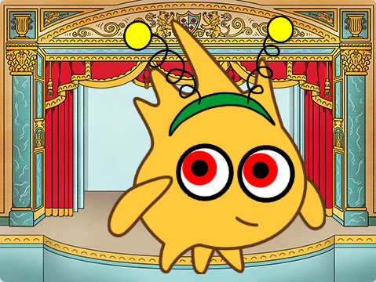

## المقدمة

في هذا المشروع ، ستقوم بتصميم وإنشاء شخصية عيون مضحكة متحركة. ستتبع عيون الشخصية الكبيرة المضحكة مؤشر الماوس لجلب الحيوية على شخصيتك.

** التصميم ** يعني تحديد الشكل الذي يبدو عليه المشروع واتخاذ القرارات بشأن ما يفعله. 

سوف تفعلها:
+ جعل مشروع مع **تفاعل المستخدم**
+ تميز الطابع الشخصي على مشروع مع تأثيرات الألوان والرسوم
+ تعرف على التصميم في الصناعة الرقمية

** المستخدم ** يعني الشخص الذي يستخدم المشروع (وليس فقط صنعه) ، و ** تفاعل المستخدم ** هو كيفية تفاعل المشروع مع قيام المستخدم بأشياء مثل تحريك الماوس والنقر على الشاشة. 

--- no-print ---

--- task ---

  

### جربها 

حرك الماوس (أو إذا كنت تستخدم جهازًا لوحيًا ، فحرك إصبعك) حول الشاشة وشاهد ما يحدث لعيون جوبو. ماذا يحدث عندما تتحرك بين عيني جوبو؟ 
  
حاول النقر فوق أجزاء مختلفة من المشروع لتخصيص المشروع.

** مشاهدة جوبو**: [انظر في الداخل] (https://scratch.mit.edu/projects/495141114/editor) {: target = "_blank"}

  <iframe allowtransparency="true" width="485" height="402" src="https://scratch.mit.edu/projects/embed/495141114/?autostart=false" frameborder="0"></iframe>

--- /task ---

### احصل على الإلهام

سوف تتخذ بعض قرارات التصميم لإنشاء شخصيتك. فكر في نوع شخصية العين المضحكة التي تريد صنعها.

--- task ---

استكشف هذه المشاريع النموذجية للحصول على مزيد من الأفكار:

**لا تأكل الدونات**: [انظر في الداخل](https://scratch.mit.edu/projects/495865093/editor){: target = "_ blank"}

  <iframe allowtransparency="true" width="485" height="402" src="https://scratch.mit.edu/projects/embed/495865093/?autostart=false" frameborder="0"></iframe>

**تحت سطح البحر**: [انظر في الداخل](https://scratch.mit.edu/projects/495866460/editor){: target = "_ blank"}

  <iframe allowtransparency="true" width="485" height="402" src="https://scratch.mit.edu/projects/embed/495866460/?autostart=false" frameborder="0"></iframe>

**سبورج**: [انظر في الداخل](https://scratch.mit.edu/projects/495865892/editor){: target = "_ blank"}

  <iframe allowtransparency="true" width="485" height="402" src="https://scratch.mit.edu/projects/embed/495865892/?autostart=false" frameborder="0"></iframe>

--- / مهمة --- --- / no-print ---

--- print-only ---

### احصل على الإلهام

سوف تتخذ بعض قرارات التصميم لإنشاء شخصيتك. فكر في نوع شخصية العين المضحكة التي تريد صنعها. للحصول على مزيد من الأفكار، **انظر في الداخل** مثال على المشاريع في استوديو Scratch "العيون السخيفة - أمثلة": https://scratch.mit.edu/studios/29029028

   

--- /print-only ---

 
