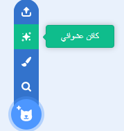
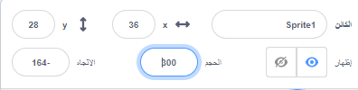

## شخصيتك

هل لديك فكرة عن شخصيتك؟ الآن ، يمكنك تجهيزه للعيون المضحكة!

! [شخصية كبيرة.] (images / character.png){:width="300px"}    

--- task ---

افتح [المشروع الابتدائي للعيون المضحكة](https://scratch.mit.edu/projects/582221984/editor){:target="_blank"}. سيتم فتح Scratch في علامة تبويب متصفح أخرى.

[[[working-offline]]]

--- /task ---

--- task ---

**اختر:** اختر كائنًا **أو** بإنشاء كائن بسيط خاص بك في محرر الرسام.

ليس عليك اختيار شخص أو حيوان. يمكنك اختيار شيء ، مثل الدونات.

[[[generic-scratch3-sprite-from-library]]]

[[[scratch3-backdrops-and-sprites-using-shapes]]]

--- collapse ---
---
title: احصل على كائن مفاجئ
---

لست متأكدا أي كائن تختار؟ اذهب إلى قائمة **اختر عشوائي او مفاجى** واختر **عشوائي** لإضافة كائن عشوائي إلى مشروعك.

--- /collapse ---

**نصيحة:** إذا قمت بإنشاء كائن خاص بك في محرر الرسام ، **لا تضف العيون بعد ، لأنها تحتاج إلى أن تكون نقوشًا متحركة منفصلة.**

--- /task ---

في الوقت الحالي ، ستكون شخصيتك أصغر بكثير من الشخصيات في أمثلة مشاريعنا. يمكنك جعل شخصيتك أكبر بحيث تملأ المزيد من الشاشة.

--- task ---

في جزء الكائن، قم بتغيير الرقم الموجود في **الحجم** إلى رقم من اختيارك.

{:width="500px"}

--- /task ---

أين تريد أن تعيش شخصيتك؟

--- task ---

**اختر:** اختر خلفية معقولة أو مضحكة.

[[[generic-scratch3-backdrop-from-library]]]

--- /task ---

--- save ---
