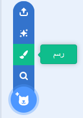
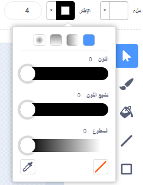
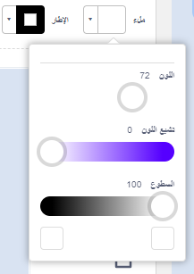
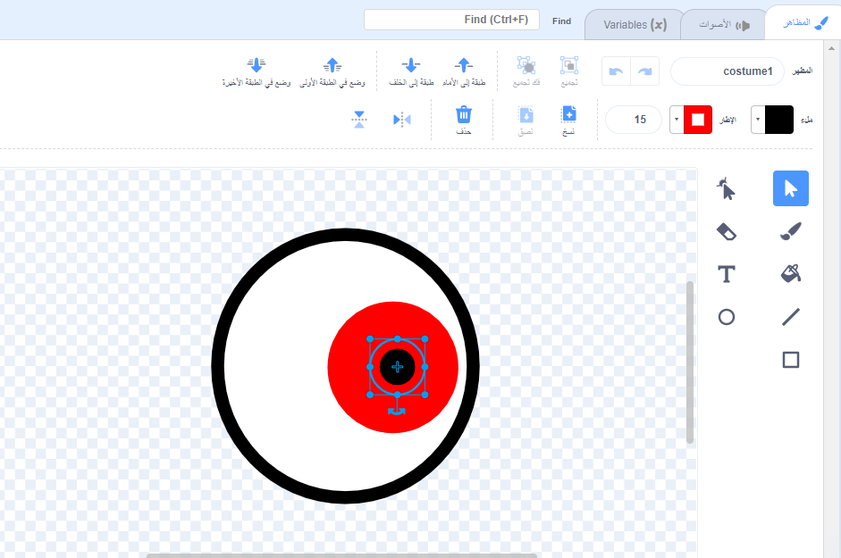
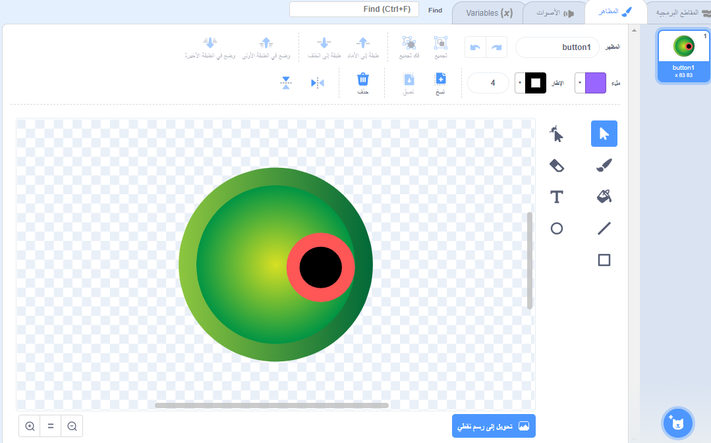
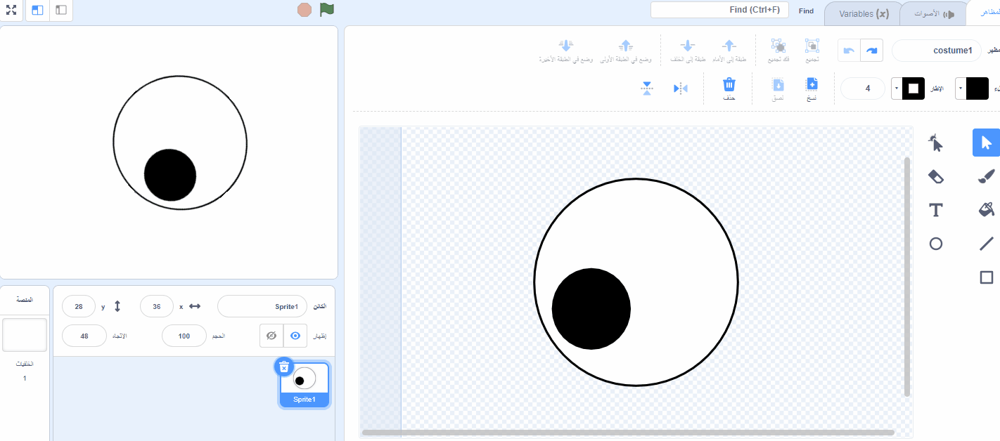
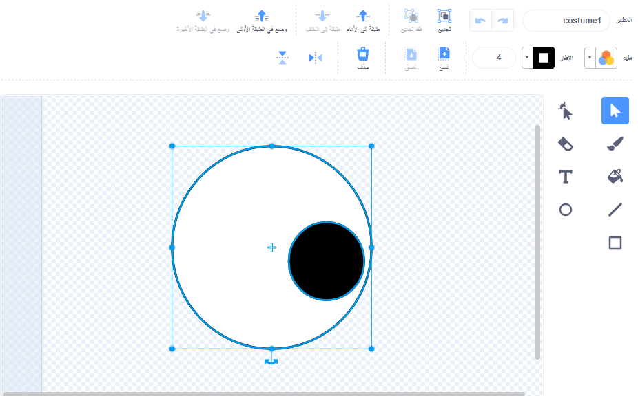
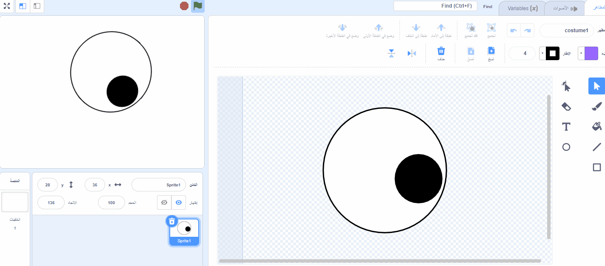

## جعل عيون مضحكة متحركة

<div style="display: flex; flex-wrap: wrap">
<div style="flex-basis: 200px; flex-grow: 1; margin-right: 15px;">
في هذه الخطوة ، ستجعل العيون المضحكة! يجب أن تكون كل عين كائنًا منفصلاً حتى تتمكن من التحرك بشكل منفصل.

إذا كنت بحاجة إلى مساعدة ، فراجع النصائح ** تصحيح الأخطاء ** في أسفل هذه الخطوة.
</div>
<div>

! [شخصية بعيون مضحكة.] (images / character-with-eyes.png)
{: width = "300px"}  

</div>
</div>

--- task ---

استخدم **رسم** لإنشاء كائن ****.



سيتم فتح محرر الرسام ، والذي سيسمح لك بإنشاء **مقلة العين** مظهر الكائن.

--- /task ---

من المهم حقًا أن:
- بؤبؤ العين والقزحية الملونة على الجانب الأيمن من **مقلة العين**
- مظهر **مقلة العين** في المركز

--- task ---

**اختر:** ارسم مقلة العين**أو** ابدأ من كائن دائري.

--- collapse ---
---
العنوان: ارسم مقلة العين في محرر الرسام
---

حدد أداة **الدائرة**

لرسم دائرة مثالية ، اضغط مع الاستمرار على مفتاح <kbd></kbd> على لوحة المفاتيح أثناء الرسم باستخدام أداة **دائرة ** إذا كنت تستخدم جهازًا لوحيًا ، فحاول الاقتراب من دائرة مثالية قدر الإمكان.

في هذا المثال ، قمنا بتعيين **الاطار** إلى الأسود و **ملء** من لون مقلة العين إلى الأبيض:


استخدم **ملء** و **الاطار** لاختيار الألوان. لجعل منزلق اللون الاسود **تشبع** و **السطوع من** إلى `0`. لجعل منزلق الأبيض **التشبع** إلى `0` و **السطوع** إلى `100`.

 

تأكد من أن مقلة العين في المنتصف - حركها بحيث يصطف الصليب الأزرق في المظهر مع التقاطع الرمادي في محرر الرسام.

ارسم دائرة مثالية أصغر وضعها على الجانب الأيمن من مقلة العين:



يمكنك أيضًا رسم دوائر داخل دوائر ، أو استخدام الألوان للحصول على تأثيرات مختلفة.

--- /collapse ---


--- collapse ---
---
العنوان: دور مظهراً مستديرًا إلى مقلة عين
---

هناك مظاهر في Scratch يمكنك تعديلها لتكوين عيون مضحكة لشخصيتك.

استخدم محرر الرسام لتغيير مظهر. يمكنك إضافة دوائر ، واختيار **ملء** ، أو إزالة أجزاء من المظهر لتحويله إلى عين مضحكة.

**نصيحة:** ستحتاج إلى توسيط **مقلة العين** في محرر الرسام بحيث يدور بسلاسة أثناء دورانه. استخدم علامة التقاطع لتوسيط المظهر. بؤبؤ العين والقزحية الملونة تحتاج إلى وضعه على الجانب الأيمن من المظهر بحيث **مقلة العين** يتبع مؤشر الماوس.




--- /collapse ---

--- /task ---

--- task ---

قم بتسمية الكائن الخاص بك `مقلة العين` في جزء الشخصية.


--- /task ---

--- task ---

اسحب كائن **مقلة العين** لوضعه على المنصة ، وقم بتغيير حجمه ليناسب شخصيتك.

--- /task ---

الآن ، اجعل مقلة العين تنظر إلى `مؤشر الماوس`{: class = "block3motion"}.

--- task ---

أضف نصًا إلى `اضبط نمط التدوير`{: class = "block3motion"} على `جميع أنحاء`{: class = "block3motion"} لجعل مقلة العين `باتجاه مؤشر الماوس`{: class = "block3motion"} `للأبد`{: class = "block3control"}.

--- collapse ---
---
العنوان: اجعل نقطة كائن تجاه مؤشر الماوس
---

```blocks3
when flag clicked
set rotation style [all around v]
forever
point towards (mouse-pointer v)
end
```

--- /collapse ---

--- /task ---


إذا كانت شخصيتك لها عين واحدة فقط ، فقد انتهيت.

--- task ---

بخلاف ذلك ، انقر بزر الماوس الأيمن (أو على جهاز لوحي ، انقر مع الاستمرار) على **مقلة العين** كائن في قائمة الكائن واختر **مضاعفة** لإنشاء المزيد من العيون المضحكة.

[[[scratch3-duplicate-sprite]]]

--- /task ---

--- task ---

**اختبار:** انقر فوق العلم الأخضر واختبر مشروعك. هل تتبع العيون المضحكة مؤشر الماوس أثناء تحريك الماوس؟

**نصيحة:** لست مضطرًا للاحتفاظ بمؤشر الماوس على المنصة. سوف تتبع العيون مؤشر الماوس الخاص بك بينما تستمر في البرمجة في Scratch.

--- /task ---

--- task ---

**تصحيح:** قد تجد بعض الأخطاء في مشروعك والتي تحتاج إلى إصلاحها. فيما يلي بعض الأخطاء الشائعة:

--- collapse ---
---
العنوان: العيون لا تتحرك
---

تأكد من أنك أضفت التعليمات البرمجية إلى **مقلة العين** كائنات و **نقرت على العلم الأخضر**. لن يتم تشغيل التعليمات البرمجية الخاص بك حتى تضغط على العلم الأخضر.

--- /collapse ---

--- collapse ---
---
العنوان: تشير او حركة العيون بعيدًا عن الماوس
---

في **مقلة العين** ، تحقق من أن بؤبؤ العين على الجانب الأيمن (بعد الصليب الأزرق في منتصف الكائن).

تحتوي كائنات **مقلة العين** `حول`{: class = "block3motion"} `نمط دوران`{: class = "block3motion"} ، حتى تتمكن من الدوران في أي اتجاه.

عندما **مقل العيون** تناوب على `نقطة نحو`{: فئة = "block3motion"} في `الماوس المؤشر`{: فئة = "block3motion"}، فإن بؤبؤ العين يكون الأقرب إلى مؤشر الماوس.





--- /collapse ---

--- collapse ---
---
العنوان: العيون تقفز حول المسرح
---

تأكد من أن مظاهر**مقلة العين** لتوسيط مظهرما ، اسحب المظهر بحيث يصطف الصليب الأزرق في المظهر مع علامة التقاطع الرمادية في محرر الرسام.




--- /collapse ---

--- collapse ---
---
العنوان: الشخصية أمام العينين
---

عندما تسحب كائنًا لوضعه على المنصة ، فإنه يتحرك أمام الكائنات الأخرى.

للحصول على **شخصيتك** الكائن إلى البقاء في `الخلف`{: فئة = "block3looks"}، الاستخدام:

```blocks3
when green flag clicked
forever
go to [back v] layer // behind all other sprites
```

--- /collapse ---

--- collapse ---
---
العنوان: تتبع الشخصية والعينان مؤشر الماوس
---

هل إضافة عيون والأزياء الخاصة بك **شخصية** بدلا من الأزياء للكائنات منفصلة؟ يمكنك إصلاح ذلك.

تتمثل إحدى طرق إصلاحه في تكرار **شخصية** ثم إعادة تسمية النسخة `مقلة العين`. ثم، حذف ازياء  **مقلة العين** من **الشخصية** شخصية، وحذف **شخصية** ازياء من **مقلة العين** شخصية. بعد ذلك ، يمكنك نسخ **مقلة العين** وتسمية النسخة `مقلة العين2`.

يجب أن يكون الرمز إلى `نقطة باتجاه`{: class = "block3motion"} `مؤشر الماوس`{: class = "block3motion"} على **Eyeball** sprites وليس على **شخصية** الكائن.

--- /collapse ---

--- collapse ---
---
العنوان: الشخصية تتبع مؤشر الماوس (والعينان لا)
---

تحتاج إلى إضافة `نقطة `{: class = "block3motion"} إلى كائنات**بؤبؤ العين** ، وليس **شخصية** الكائن الخاص بك!

لنسخ التعليمات البرمجية، يمكنك سحب التعليمة البرمجية من منطقة التعليمات البرمجية لـ**شخصيتك** إلى كائنات**بؤبؤ العين** في قائمة كائن.

ستحتاج أيضًا إلى حذف البرنامج النصي من **شخصية**الكائن  للقيام بذلك ، اسحب التعليمة البرمجية إلى قائمة المقاطع البرمجية.

--- /collapse ---

قد تجد خطأ غير مدرج هنا. هل يمكنك معرفة كيفية إصلاحه؟

نحن نحب أن نسمع عن أخطائك وكيفية إصلاحها. استخدم **إرسال ملاحظات** في أسفل هذه الصفحة وأخبرنا إذا وجدت خطأً مختلفًا في مشروعك.


--- /task ---

--- save ---
