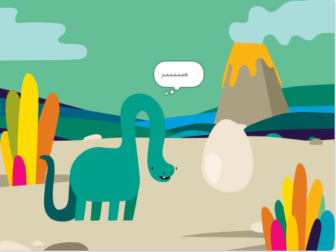

## ما التالي؟

إذا كنت تتبع مسار[مقدمة Scratch](https://projects.raspberrypi.org/en/pathways/scratch-intro) ، يمكنك الانتقال إلى [مشروع حيوي! الرسوم المتحركة](https://projects.raspberrypi.org/en/projects/surprise-animation) مشروع. في هذا المشروع ، ستقوم بعمل رسوم متحركة لقصة حيوية.

--- print-only ---

--- /print-only ---

--- no-print ---

اضغط على العلم الأخضر لمشاهدة الرسوم المتحركة:

  <iframe allowtransparency="true" width="485" height="402" src="https://scratch.mit.edu/projects/embed/495932563/?autostart=false" frameborder="0"></iframe>

--- /no-print ---

إذا كنت ترغب في الحصول على مزيد من المتعة في استكشاف Scratch ، فيمكنك تجربة أي من [هذه المشاريع](https://projects.raspberrypi.org/en/projects?software%5B%5D=scratch&curriculum%5B%5D=%201).

