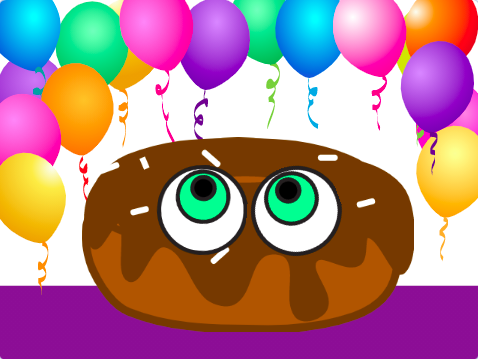
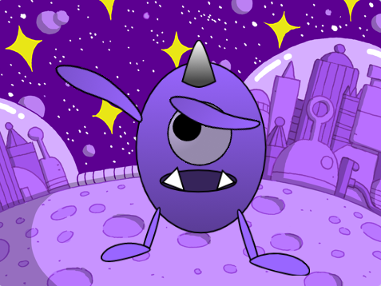

## Cyflwyniad

Yn y prosiect hwn, byddi di'n dylunio ac yn creu cymeriad llygad gwirion. Bydd llygaid mawr, gwirion y cymeriad yn dilyn pwyntydd y llygoden i ddod â dy gymeriad yn fyw.

Mae **Dylunio** yn golygu penderfynu ar y ffordd mae prosiect yn edrych a gwneud penderfyniadau am yr hyn mae'n ei wneud. 

Byddi di'n:
+ Creu prosiect gyda **rhyngweithio gan y defnyddiwr**
+ Personoli prosiect gydag effeithiau lliw a graffeg
+ Dysgu am ddylunio mewn gwneud digidol

Y **Defnyddiwr** yw'r person sy'n defnyddio'r prosiect (ddim y person sy'n ei greu), a **rhyngweithio gan y defnyddiwr** yw'r ffordd mae'r prosiect yn ymateb i'r defnyddiwr wrth iddo wneud pethau fel symud y llygoden a chlicio ar y sgrin. 

--- no-print ---

--- task ---

  

### Rho gynnig arni 

Symuda'r llygoden (neu os wyt ti'n defnyddio tabled, symuda dy fys) o amgylch y sgrin a gwylia beth sy'n digwydd i lygaid Gobo. Beth sy'n digwydd pan wyt ti'n symud rhwng llygaid Gobo? 
  
Ceisia glicio ar wahanol rannau o'r prosiect i addasu'r prosiect.

**Gobo yn gwylio**: [Gweld tu mewn](https://scratch.mit.edu/projects/627967816/editor){:target="_blank"}

  <iframe allowtransparency="true" width="485" height="402" src="https://scratch.mit.edu/projects/embed/627967816/?autostart=false" frameborder="0"></iframe>

--- /task ---

### Cael ysbrydoliaeth

Rwyt ti'n mynd i wneud rhai penderfyniadau dylunio i greu dy gymeriad. Meddylia pa fath o gymeriad llygad gwirion rwyt ti am ei greu.

--- task ---

Cymer olwg ar y prosiectau enghreifftiol hyn i gael mwy o syniadau:

**Paid bwyta'r doesen**: [Gweld tu mewn](https://scratch.mit.edu/projects/627968392/editor){:target="_blank"}

  <iframe allowtransparency="true" width="485" height="402" src="https://scratch.mit.edu/projects/embed/627968392/?autostart=false" frameborder="0"></iframe>

**Dan y môr**: [Gweld tu mewn](https://scratch.mit.edu/projects/627965282/editor){:target="_blank"}

  <iframe allowtransparency="true" width="485" height="402" src="https://scratch.mit.edu/projects/embed/627965282/?autostart=false" frameborder="0"></iframe>

**Sporg**: [Gweld tu mewn](https://scratch.mit.edu/projects/627966567/editor){:target="_blank"}

  <iframe allowtransparency="true" width="485" height="402" src="https://scratch.mit.edu/projects/embed/627966567/?autostart=false" frameborder="0"></iframe>

--- /task --- --- /no-print ---

--- print-only ---

### Cael ysbrydoliaeth

Rwyt ti'n mynd i wneud rhai penderfyniadau dylunio i greu dy gymeriad. Meddylia pa fath o gymeriad llygad gwirion rwyt ti am ei greu. I gael mwy o syniadau, **Cymer olwg y tu mewn i** brosiectau enghreifftiol yn stiwdio Scratch 'Silly eyes - Examples': https://scratch.mit.edu/studios/29029028

   

--- /print-only ---

 
