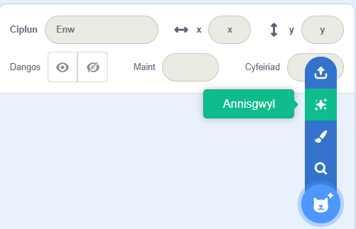
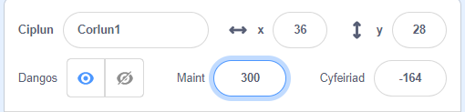

## Dy gymeriad

Oes gen ti syniad am dy gymeriad dy hun? Nawr, gallet ti ei baratoi ar gyfer llygaid gwirion!

{:width="300px"}    

--- task ---

Agora'r [prosiect cychwynnol Llygaid gwirion](https://scratch.mit.edu/projects/582221984/editor){:target="_blank"}. Bydd Scratch yn agor mewn tab arall ar y porwr.

[[[working-offline]]]

--- /task ---

--- task ---

**Dewis:** Dewisa gorlun **neu** greu dy gorlun syml dy hun yn y Golygydd paent.

Does dim rhaid i ti ddewis person neu anifail. Fe allet ti ddewis gwrthrych, fel y toesen.

[[[generic-scratch3-sprite-from-library]]]

[[[scratch3-backdrops-and-sprites-using-shapes]]]

--- collapse ---
---
teitl: Cael corlun annisgwyl
---

Ddim yn siŵr pa gorlun i'w ddewis? Cer i'r ddewislen **Dewiswch Gorlun** a dewis **Annisgwyl** i ychwanegu corlun annisgwyl i dy brosiect.

--- /collapse ---

**Awgrym:** Os wyt ti'n creu dy gorlun dy hun yn y Golygydd paent, **paid ag ychwanegu llygaid eto, oherwydd mae angen iddyn nhw fod yn gorluniau ar wahân.**

--- /task ---

Ar hyn o bryd, mae dy gymeriad yn llawer llai na'r cymeriadau yn ein prosiectau enghreifftiol. Galli di wneud dy gymeriad yn fwy fel ei fod yn llenwi mwy o'r sgrin.

--- task ---

Yng nghwarel y Corlun, newidia'r rhif yn y briodwedd **Maint** i rif o dy ddewis.

{:width="500px"}

--- /task ---

Ble wyt ti am i dy gymeriad fyw?

--- task ---

**Dewis:** Dewisa gefnlen sy'n gall neu'n wirion.

[[[generic-scratch3-backdrop-from-library]]]

--- /task ---

--- save ---
