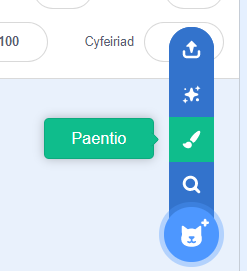
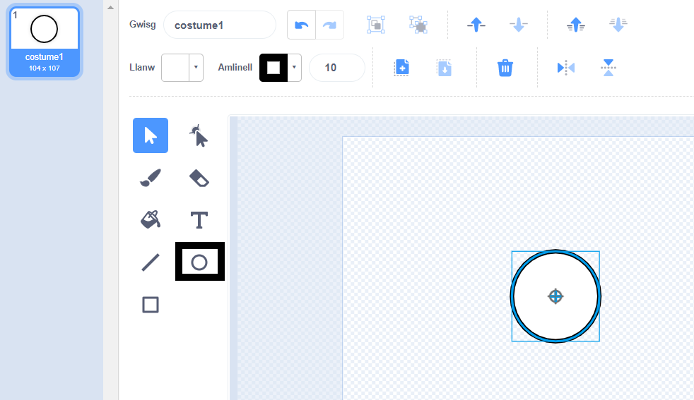
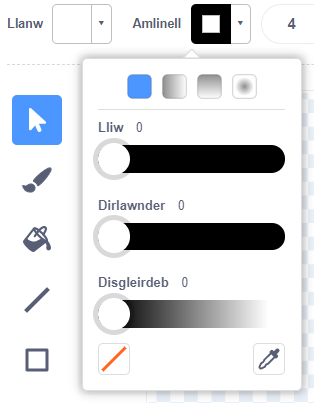
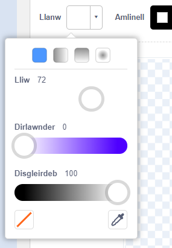
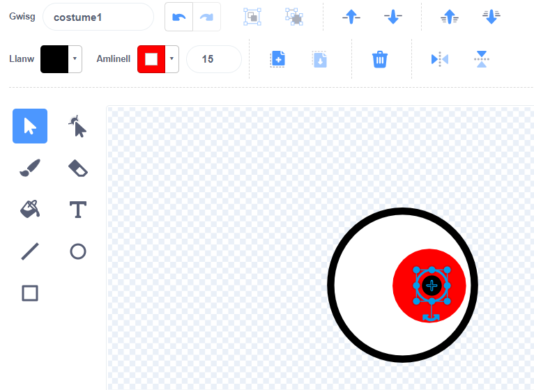
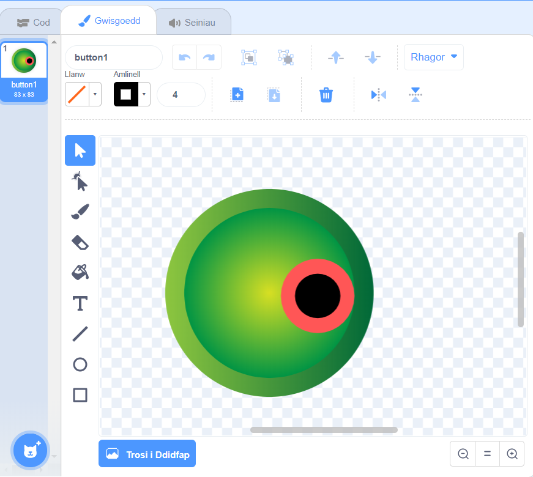
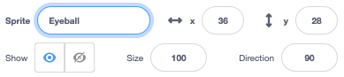
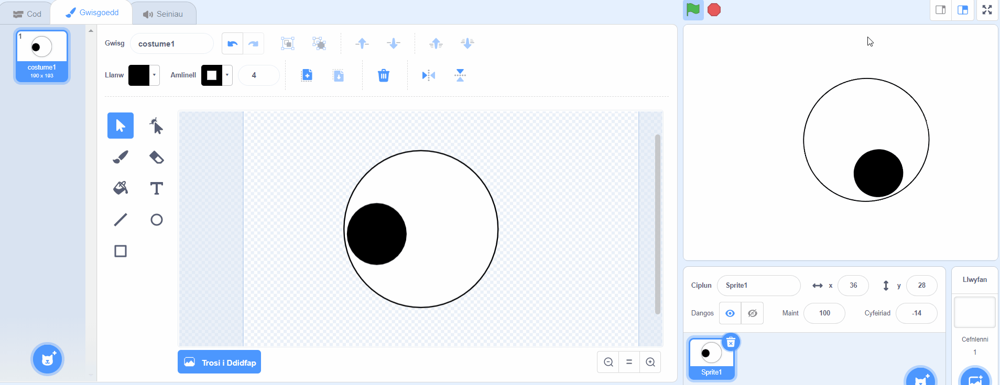
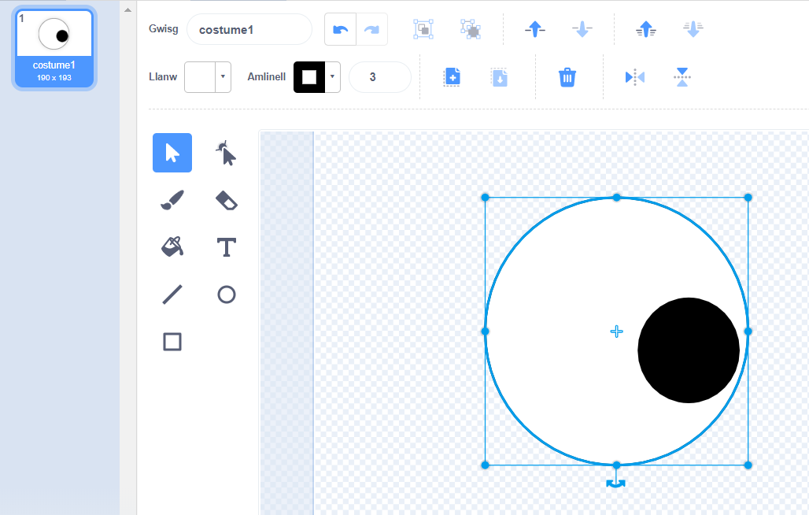
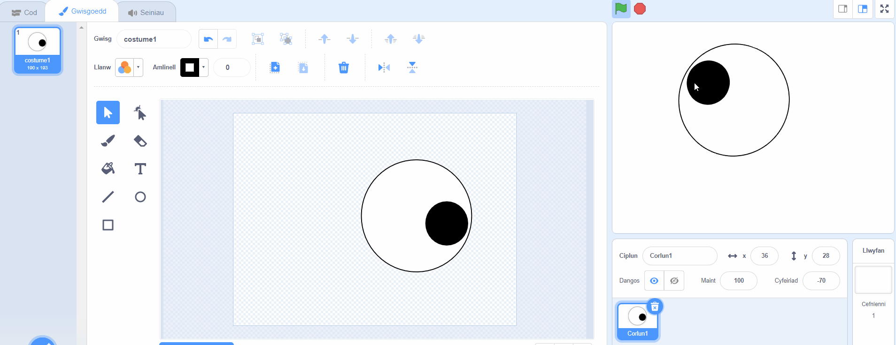

## Creu llygaid gwirion

<div style="display: flex; flex-wrap: wrap">
<div style="flex-basis: 200px; flex-grow: 1; margin-right: 15px;">
Yn y cam hwn, byddi di'n creu'r llygaid gwirion! Mae angen i bob llygad fod yn gorlun ar wahân fel ei fod yn gallu symud ar wahân.

Os oes angen help arnat ti, edrycha ar yr awgrymiadau yn y dasg **Difa chwilod** ar waelod y cam hwn.
</div>
<div>

{:width="300px"}  

</div>
</div>

--- task ---

Defnyddia'r dewis **Paent** i greu **corlun** newydd.



Bydd y Golygydd paent yn agor, fydd yn caniatáu i ti greu gwisg i dy gorlun **Eyeball**.

--- /task ---

Mae'n bwysig iawn:
- Bod canwyll du y llygaid a'r iris lliw yn wynebu ochr dde y wisg **Eyeball**
- Bod y wisg **Eyeball** wedi'i chanoli

--- task ---

**Dewis:** Tynna lun pelen llygad **neu** ddechrau o gorlun crwn.

--- collapse ---
---
title: Tynnu llun pelen llygad yn y golygydd Paent
---

Dewisa'r offeryn **Cylch**.

I dynnu llun cylch perffaith, pwysa a dal y fysell <kbd>Shift</kbd> ar y fysellwrdd wrth i ti dynnu llun gyda'r offeryn **Cylch**. Os wyt ti'n defnyddio tabled, ceisia fynd mor agos at gylch perffaith ag wyt ti'n gallu.

Yn yr enghraifft hon, rydyn ni'n gosod yr **Amlinell** i ddu a lliw **Llenwi** y belen llygad i wyn:



Defnyddia'r dewiswyr lliw **Llenwi** ac **Amlinell** i ddewis lliwiau. I wneud lliw du, llithra'r dewisiadau **Dirlawnder** a **Disgleirdeb** i `0`. I wneud lliw gwyn, llithra'r dewisiadau **Dirlawnder** i `0` a **Disgleirdeb** i `100`.

 

Gwna'n siŵr bod y belen llygad wedi'i chanoli - symuda hi fel bod y groes las yn y wisg yn cyd-fynd â'r groeslin lwyd yn y Golygydd paent.

Llunia gylch perffaith llai a'i osod ar ochr dde pelen y llygad:



Galli di hefyd dynnu cylchoedd y tu mewn i gylchoedd, neu ddefnyddio lliw, i gael effeithiau gwahanol.

--- /collapse ---


--- collapse ---
---
title: Troi gwisg gron yn belen llygad
---

Mae gwisgoedd yn Scratch y galli di eu golygu i greu llygaid gwirion i dy gymeriad.

Defnyddia'r Golygydd paent i newid gwisg. Fe allet ti ychwanegu cylchoedd, dewis lliw **Llenwi** gwahanol, neu dynnu rhannau o'r wisg i'w throi'n llygad gwirion.

**Awgrym:** Bydd angen i ti ganoli'r wisg **Eyeball** yn y Golygydd paent fel ei bod yn cylchdroi yn llyfn wrth iddi droi. Defnyddia'r groeslin i ganoli'r wisg. Mae angen gosod y canwyll llygad du a'r iris lliw ar ochr dde'r wisg fel bod yr **Eyeball** yn dilyn pwyntydd y llygoden.




--- /collapse ---

--- /task ---

--- task ---

Rhowch yr enw `Eyeball` i'ch corlun yn y cwarel Corlun.



--- /task ---

--- task ---

Llusga'r corlun **Eyeball** i'w osod ar y Llwyfan, a newid ei faint i gyd-fynd â dy gymeriad.

--- /task ---

Nawr, mae angen gwneud i'r belen llygad edrych at `bwyntydd y llygoden`{:class="block3motion"}.

--- task ---

Ychwanega sgript i `osod y steil cylchdroi`{:class="block3motion"} i `o amgylch`{:class="block3motion"} i wneud i'r belen llygad `bwyntio tuag at bwyntydd y llygoden`{:class="block3motion"} `am byth`{:class="block3control"}.

--- collapse ---
---
title: Gwneud i gorlun bwyntio tuag at bwyntydd y llygoden
---

```blocks3
when flag clicked
set rotation style [all around v]
forever
point towards (mouse-pointer v)
end
```

--- /collapse ---

--- /task ---


Os mai dim ond un llygad sydd gan dy gymeriad, yna rwyt ti wedi gorffen.

--- task ---

Fel arall, de-glicia (neu ar dabled, taro a dal) ar y corlun **Eyeball** yn y rhestr Corluniau a dewis **dyblygu** i greu mwy o lygaid gwirion.

[[[scratch3-duplicate-sprite]]]

--- /task ---

--- task ---

**Prawf:** Clicia ar y faner werdd a phrofi dy brosiect. Ydy'r llygaid gwirion yn dilyn pwyntydd dy lygoden wrth i ti symud y llygoden o gwmpas?

**Awgrym:** Does dim rhaid i ti gadw pwyntydd y llygoden ar y Llwyfan. Bydd y llygaid yn dilyn pwyntydd dy lygoden wrth i ti barhau i godio yn Scratch.

--- /task ---

--- task ---

**Difa chwilod:** Efallai bydd angen i ti drwsio chwilod yn dy brosiect. Dyma rai chwilod cyffredin:

--- collapse ---
---
title: Dydy'r llygaid ddim yn symud
---

Gwna'n siŵr dy fod wedi ychwanegu'r cod at y corluniau **Eyeball** ac wedi **clicio ar y faner werdd**. Fydd dy god ddim yn rhedeg nes i ti glicio ar y faner werdd.

--- /collapse ---

--- collapse ---
---
title: Mae'r llygaid yn pwyntio i ffwrdd o'r llygoden
---

Yn y gwisgoedd **Eyeball**, gwna'n siŵr bod canwyll y llygad ar yr ochr dde (heibio'r groes las yng nghanol y wisg).

Mae gan y corluniau **Eyeball** y `steil cylchdroi`{:class="block3motion"} `o amgylch`{:class="block3motion"}, fel bod modd iddyn nhw gylchdroi i unrhyw gyfeiriad.

Pan fydd **Peli'r llygad** yn cylchdroi i `bwyntio at`{:class="block3motion"} `bwyntydd y llygoden`{:class="block3motion"}, canhwyllau'r llygaid fydd agosaf at bwyntydd y llygoden.





--- /collapse ---

--- collapse ---
---
title: Mae'r llygaid yn neidio o amgylch y Llwyfan
---

Gwna'n siŵr bod y gwisgoedd **Eyeball** wedi'u canoli. I ganoli gwisg, llusga'r wisg fel bod y groes las yn y wisg yn cyd-fynd â'r groeslin lwyd yn y Golygydd paent.




--- /collapse ---

--- collapse ---
---
title: Mae'r cymeriad o flaen y llygaid
---

Pan wyt ti'n llusgo corlun i'w osod ar y Llwyfan, mae'n symud o flaen y corluniau eraill.

I gael dy **gymeriad** i aros yn y `cefn`{:class="block3looks"}, defnyddia:

```blocks3
when green flag clicked
forever
go to [back v] layer // y tu ôl i bob corlun arall
```

--- /collapse ---

--- collapse ---
---
title: Mae'r cymeriad a'r llygaid yn dilyn pwyntydd y llygoden
---

Wnes di ychwanegu'r llygaid fel gwisgoedd ar gyfer dy **gymeriad** yn lle fel gwisgoedd ar gyfer corluniau gwahanol? Galli di drwsio hynny.

Un ffordd o drwsio hyn yw dyblygu'r corlun **cymeriad** ac yna ailenwi'r copi yn `Eyeball`. Wedyn, dilea gwisgoedd **Eyeball** o'r corlun **cymeriad**, a dilea'r gwisgoedd **cymeriad** o'r corlun **Eyeball**. Yna, galli di ddyblygu'r corlun **Eyeball** a galw'r copi yn `Eyeball 2`.

Dylai'r cod i `bwyntio at`{:class="block3motion"} `bwyntydd y llygoden`{:class="block3motion"} fod ar y corluniau **Eyeball** ac nid ar y corlun **cymeriad**.

--- /collapse ---

--- collapse ---
---
title: Mae'r cymeriad yn dilyn pwyntydd y llygoden (ac dydy'r llygaid ddim yn gwneud hynny)
---

Mae angen i ti ychwangu'r cod `pwyntio at`{:class="block3motion"} i'r corluniau **Eyeball** unigol, nid i dy gorlun **cymeriad**!

I gopïo'r cod, galli di lusgo'r cod o ardal y Cod ar gyfer dy **gymeriad** i'r corluniau **Eyeball** yn rhestr y Corluniau.

Bydd angen i ti hefyd ddileu'r sgript o'r corlun **cymeriad**. I wneud hyn, llusga'r sgript i'r ddewislen Blociau.

--- /collapse ---

Efallai byddi di'n dod o hyd i chwilen sydd ddim wedi'i rhestru yma. Alli di weithio allan sut i'w drwsio?

Rydyn ni wrth ein bodd yn clywed am eich chwilod chi a sut gwnaethoch chi eu trwsio. Defnyddia'r botwm **Anfon adborth** ar waelod y dudalen hon a dyweda wrthym os wnes di ddod ar draws chwilen wahanol yn dy brosiect.


--- /task ---

--- save ---
