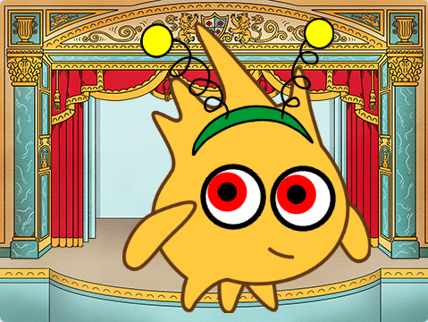

## Das wirst Du machen

Entwerfe und erstelle einen Charakter mit albernen Augen 👀. Die großen, albernen Augen der Figur folgen dem Mauszeiger und erwecken sie zum Leben.

Du wirst:

+ Ein Projekt machen, das Spaß macht
+ Eine eigene Figur erstellen
+ Dein Projekt mit **Figuren, Skripten und Schleifen** programmieren

--- no-print ---

### Abspielen ▶️

--- task ---

  

**Gobo beobachtet**: [Schau hinein](https://scratch.mit.edu/projects/495141114/editor){:target="_blank"}

Bewege die Maus (oder, wenn du ein Tablet verwendest, deine Finger) über die Bühne. 

Was passiert, wenn du dich zwischen Gobos Augen bewegst? 
  
Was passiert, wenn du auf verschiedene Teile des Projekts klickst?

  <iframe allowtransparency="true" width="485" height="402" src="https://scratch.mit.edu/projects/embed/495141114/?autostart=false" frameborder="0"></iframe>

--- /task ---

### Hole dir Ideen 💭

--- task ---

Probiere diese Beispielprojekte aus, um Ideen zu bekommen:

⭐ Teile dein fertiges Albernes-Augen-Projekt - mit etwas Glück wird es hier vorgestellt.

  <iframe allowtransparency="true" width="485" height="402" src="" frameborder="0"></iframe>

  <iframe allowtransparency="true" width="485" height="402" src="" frameborder="0"></iframe>

**⭐ Alberner Kugelfisch** (vorgestelltes Community-Projekt)

Klicke auf den Kugelfisch, die Mütze, den Schal, den Hintergrund und die Augäpfel:

  <iframe allowtransparency="true" width="485" height="402" src="https://scratch.mit.edu/projects/embed/772759744/?autostart=false" frameborder="0"></iframe>

**⭐ Alberner Torwarthandschuh von NinjaTR3R** (vorgestelltes Community-Projekt)

Klicke auf den Hintergrund und die Augäpfel:

  <iframe allowtransparency="true" width="485" height="402" src="https://scratch.mit.edu/projects/embed/877343292/?autostart=false" frameborder="0"></iframe>

--- /task ---

--- /no-print ---

--- print-only ---

### Hole dir Ideen 💭

Entwerfe und erstelle einen Charakter mit albernen Augen 👀. Die großen, albernen Augen der Figur folgen dem Mauszeiger und erwecken deine Figur zum Leben. Weitere Ideen findest du in Beispielprojekten im Scratch-Studio „Alberne Augen – Beispiele“ (**Schau hinein**): https://scratch.mit.edu/studios/29029028

  

--- /print-only ---

 
