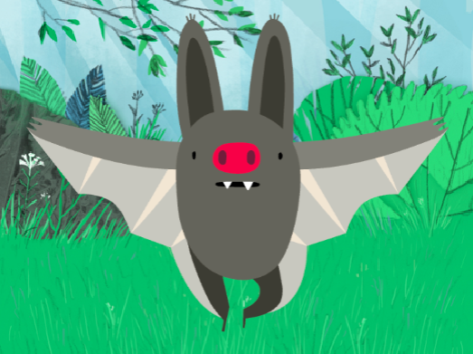
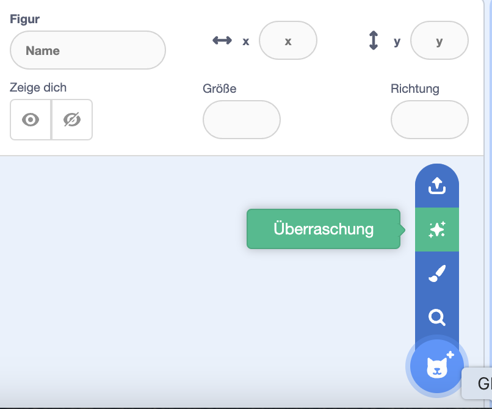
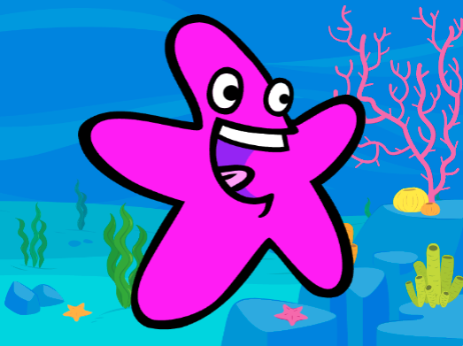

## Dein Charakter

Nutze deine Designfähigkeiten, um ein Charakter und einen passenden Hintergrund hinzuzufügen. 

{:width="300px"}    

**Design** bedeutet, Entscheidungen zu treffen über das Aussehen und die Funktion eines Projekts. 

### Öffne das Starterprojekt

--- task ---

Öffne das [Alberne Augen Starterprojekt](https://scratch.mit.edu/projects/582221984/editor){:target="_blank"}. Scratch wird in einem anderen Tab im Browser geöffnet.

[[[working-offline]]]

⏱️ Wenig Zeit? Du kannst mit einem der [Beispiele](https://scratch.mit.edu/studios/29029028){:target="_blank"} beginnen.

--- /task ---

### Wähle deine Figur und deinen Hintergrund

--- task ---

**Wähle:** Füge für dein Alberne Augen Projekt eine **Figur** und einen **Hintergrund** hinzu.

+ Wie sieht dein Charakter aus? Eine Person 🧜🏽‍♀️, ein Tier 🐶 oder ein Gegenstand 🧸.
+ Wo soll dein Charakter leben? Irgendwo vernünftig 🏠 albern 🎪.

[[[generic-scratch3-sprite-from-library]]]

[[[generic-scratch3-backdrop-from-library]]]

[[[scratch3-backdrops-and-sprites-using-shapes]]]

--- collapse ---
---
title: Hol dir eine Überraschungsfigur
---

Du bist dir nicht sicher, welche Figur du wählen sollst? Im Menü **Figur auswählen**, wähle die Option **Überraschung**, um deinem Projekt eine Überraschungsfigur hinzuzufügen.

--- /collapse ---

**Tipp:** Wenn du im Zeichnen-Editor deine eigene Figur erstellst, **füge noch keine Augen hinzu, da es sich dabei um separate Figuren handeln muss.**

--- /task ---

### Ändere die Größe deiner Figur

--- task ---

Ändere im Figurenbereich die Zahl in der Eigenschaft **Größe** in eine Zahl, mit der deine Figur die Bühne gut ausfüllt.

{:width="500px"}

--- /task ---

--- task ---

Schau auf die Bühne. Du wirst deinen großen Charakter und den ausgewählten Hintergrund sehen.

{:width="500px"}

--- /task ---
