## Mach alberne Augen

<div style="display: flex; flex-wrap: wrap">
<div style="flex-basis: 200px; flex-grow: 1; margin-right: 15px;">
Mach alberne Augen! Jedes Auge muss eine separate Figur sein, damit es sich separat bewegen kann.

</div>
<div>

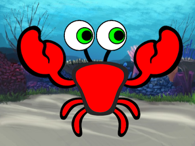
{:width="300px"}  

</div>
</div>

### Zeichne einen Augapfel

--- task ---

Verwende die Option **Malen**, um eine neue **Figur** zu erstellen.

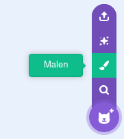

Der Zeichnen-Editor wird geöffnet und du kannst dort das **Augapfel**-Kostüm deiner Figur erstellen.

--- /task ---

Es ist wirklich wichtig, dass:
- Die schwarze Pupille und die farbige Iris zur rechten Seite des **Augapfel** Kostüms schauen
- Das **Augapfel**-Kostüm zentriert ist

--- task ---

**Wähle:** Zeichne einen Augapfel **oder** beginne mit einer runden Figur.

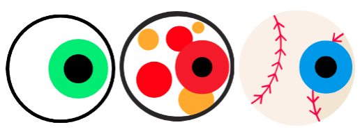

--- collapse ---
---
title: Zeichne einen Augapfel im Zeichnen-Editor
---

Wählen das Werkzeug **Kreis**.

Um einen perfekten Kreis zu zeichnen, halte die <kbd>Umschalttaste</kbd> auf der Tastatur gedrückt, während du mit dem Werkzeug **Kreis** zeichnest. Wenn du ein Tablet verwendest, versuche, einen möglichst perfekten Kreis zu zeichnen.

In diesem Beispiel setzen wir die **Randfarbe** auf Schwarz und die **Füllfarbe** des Augapfels auf Weiß:

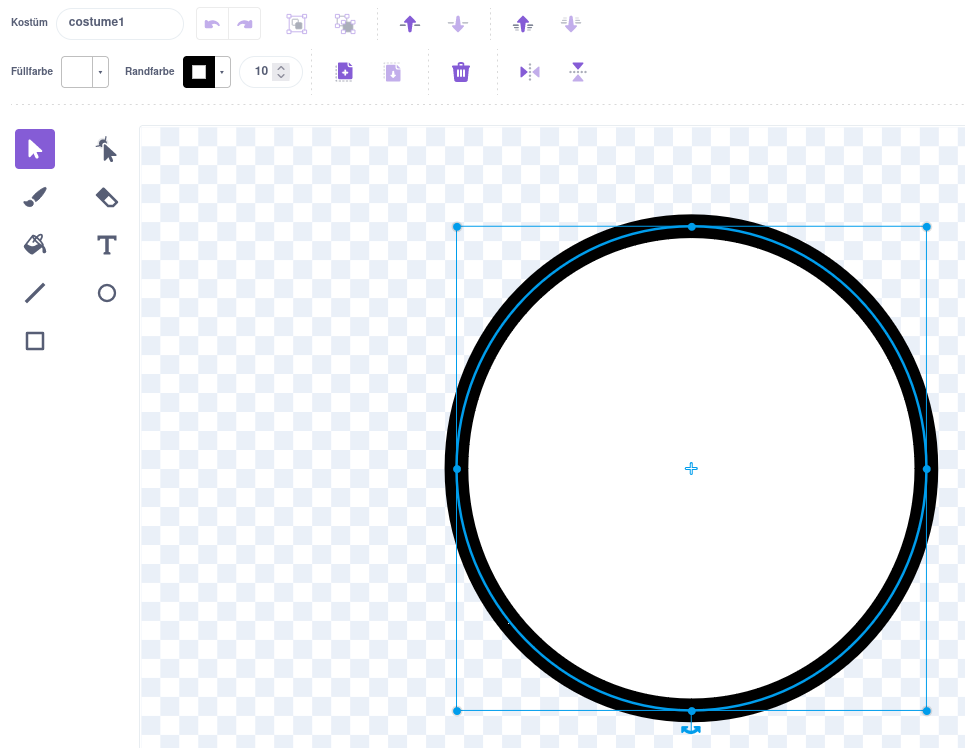

Nutze das Farbauswahlmenü für **Füllfarbe** und **Randfarbe**. Um Schwarz zu erzeugen, verschiebe die Werte **Sättigung** und **Helligkeit** auf `0`. Um Weiß zu erzeugen, schiebe die **Sättigung** auf `0` und die **Helligkeit** auf `100`.

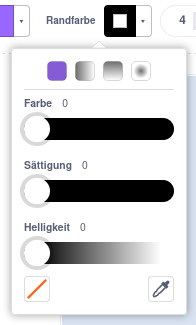 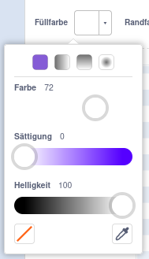

Stelle sicher, dass der Augapfel zentriert ist – verschiebe ihn so, dass das blaue Kreuz im Kostüm mit dem grauen Fadenkreuz im Zeichnen-Editor übereinstimmt.

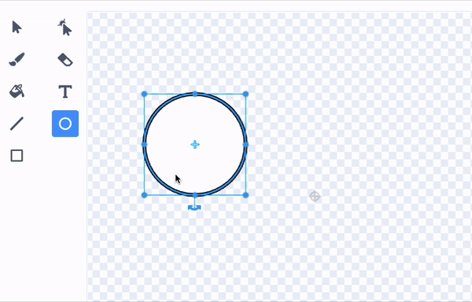

Zeichne einen kleineren perfekten Kreis und positioniere ihn auf der rechten Seite des Augapfels:

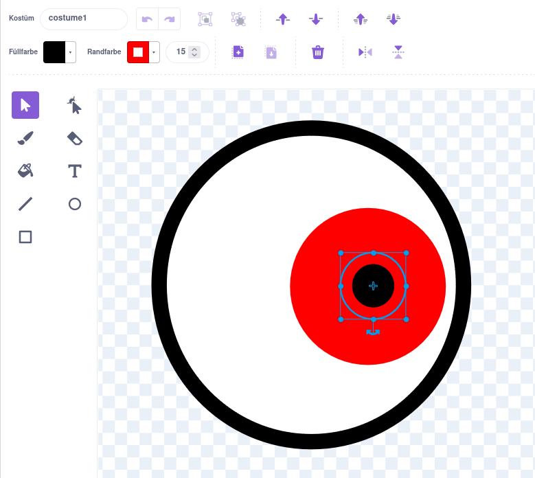

Du kannst auch Kreise in Kreise zeichnen oder Farbe verwenden, um unterschiedliche Effekte zu erzielen.

--- /collapse ---

--- collapse ---
---
title: Verwandle ein rundes Kostüm in einen Augapfel
---

In Scratch gibt es Kostüme, die du bearbeiten kannst um deiner Figur lustige Augen zu verpassen.

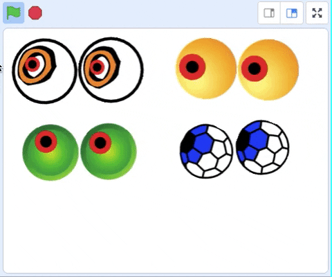

Klicke auf das Symbol **Wähle ein Kostüm**, um die Scratch-Kostümbibliothek anzuzeigen.

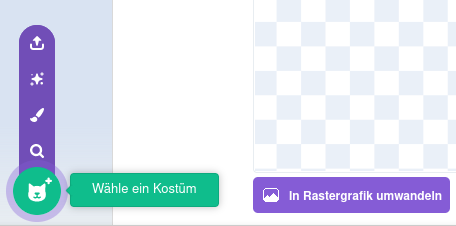

Klick auf das Kostüm, das du deiner Figur hinzufügen möchtest.

Verwende den Zeichnen-Editor, um das Kostüm zu ändern. Du könntest Kreise hinzufügen, eine andere **Füllfarbe** wählen oder Teile des Kostüms entfernen, um es in ein albernes Auge zu verwandeln.

Stelle sicher, dass der Augapfel zentriert ist – verschiebe ihn so, dass das blaue Kreuz im Kostüm mit dem grauen Fadenkreuz im Zeichnen-Editor übereinstimmt.

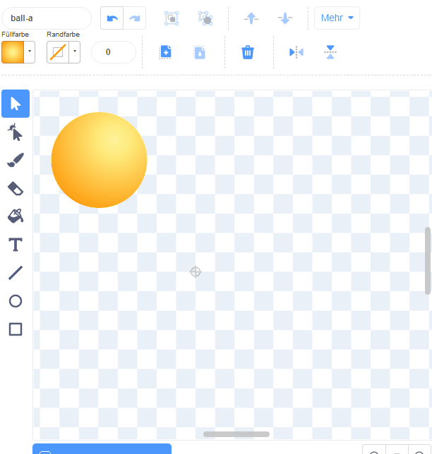

**Tipp:** Die schwarze Pupille und die farbige Iris müssen auf der rechten Seite des Kostüms positioniert werden, sodass der **Augapfel** dem Mauszeiger folgt.

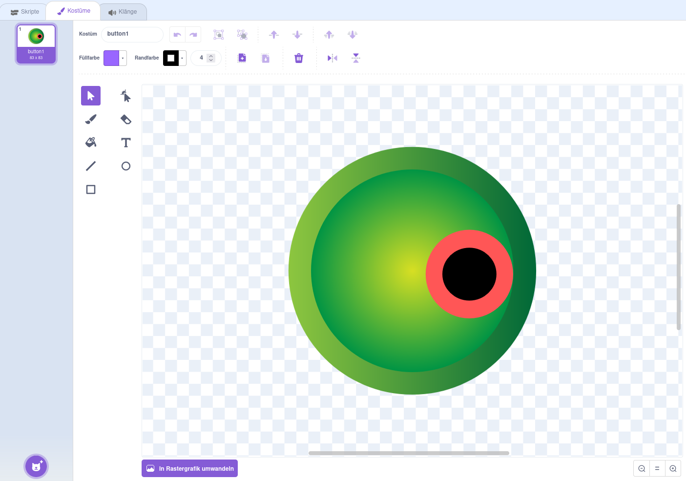

--- /collapse ---

--- /task ---

--- task ---

Gib deiner Figur im Figurenbereich den Namen `Augapfel`.

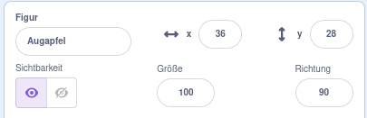

--- /task ---

--- task ---

Ziehe die Figur **Augapfel**, um sie auf der Bühne zu positionieren, und ändere ihre Größe, damit sie zu deiner Figur passt.

--- /task ---

Richte nun den Blick des Auges auf den `Mauszeiger`{:class="block3motion"}, damit der Benutzer mit deinem Projekt interagieren kann.

<p style="border-left: solid; border-width:10px; border-color: #0faeb0; background-color: aliceblue; padding: 10px;">
<span style="color: #0faeb0">**Benutzer**</span> oder <span style="color: #0faeb0">**Nutzer**</span> bezeichnet die Person, die das Projekt verwendet (nicht nur erstellt), und <span style="color: #0faeb0">**Benutzerinteraktion**</span> oder <span style="color: #0faeb0">**Nutzerinteraktion**</span> gibt an, wie das Projekt auf Aktionen des Benutzers reagiert, z. B. wenn dieser die Maus bewegt oder auf dem Bildschirm klickt. 
</p>

### Programmiere deinen Augapfel

--- task ---

Füge ein Skript hinzu und `setze Drehtyp`{:class="block3motion"} auf `rundherum`{:class="block3motion"}, damit der Augapfel `sich auf den Mauszeiger dreht`{:class="block3motion"}, und dies `fortlaufend wiederholt`{:class="block3control"}.

--- collapse ---
---
title: Drehe eine Figur zum Mauszeiger
---

```blocks3
when flag clicked
set rotation style [rundherum v]
forever
point towards (Mauszeiger v)
end
```

--- /collapse ---

--- /task ---

### Füge einen weiteren Augapfel hinzu

--- task ---

Um ein weiteres Auge hinzuzufügen, klicke mit der rechten Maustaste (oder tippe und halte auf einem Tablet) auf die Figur **Augapfel** in der Figurenliste und wähle **Duplizieren**.

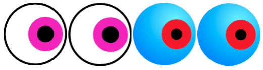

[[[scratch3-duplicate-sprite]]]

--- /task ---

### Teste deine albernen Augen

--- task ---

**Test:** Klicke auf die grüne Flagge, um dein Projekt zu testen. Folgen die albernen Augen deinem Mauszeiger, wenn du die Maus bewegst?

**Tipp:** Du musst den Mauszeiger nicht unbedingt auf der Bühne halten. Die Augen folgen deinem Mauszeiger, während du in Scratch weiter programmierst.

--- /task ---

--- task ---

**Debug:** Möglicherweise findest du in deinem Projekt einige Fehler, die du beheben könntest. Hier sind einige häufige Fehler:

--- collapse ---
---
title: Die Augen bewegen sich nicht
---

Stelle sicher, dass du den Code zu den **Augapfel** Figuren hinzugefügt und **auf die grüne Flagge** geklickt hast. Dein Code wird erst ausgeführt, wenn du auf die grüne Flagge klickst.

--- /collapse ---

--- collapse ---
---
title: Die Augen zeigen von der Maus weg
---

Überprüfe bei den **Augapfel** Kostümen, ob sich die Pupille auf der rechten Seite befindet (hinter dem blauen Kreuz in der Mitte des Kostüms).

Die **Augapfel** Figuren haben den `Drehtyp`{:class="block3motion"} `rundherum`{:class="block3motion"}, damit sie in jede Richtung rotieren können.

Wenn die **Augäpfel** sich `in die Richtung` des `Mauszeigers`{:class="block3motion"} drehen, sind die Pupillen dem Mauszeiger am nächsten.

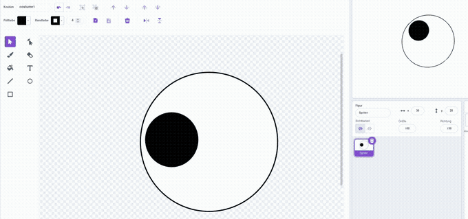

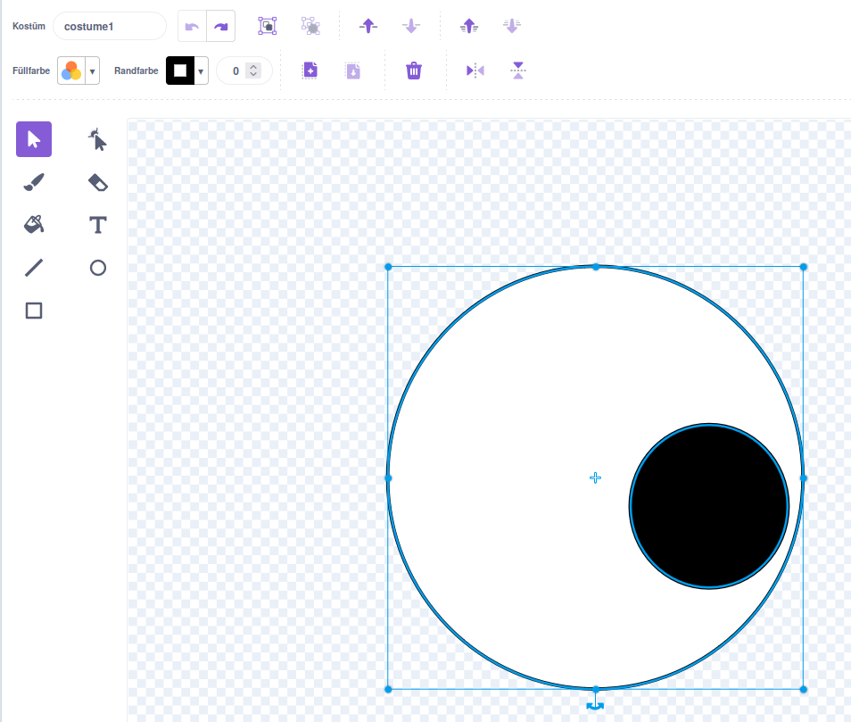

--- /collapse ---

--- collapse ---
---
title: Die Augen springen über die Bühne
---

Überprüfe, ob die **Augapfel** Kostüme zentriert sind. Um ein Kostüm zu zentrieren, ziehe das Kostüm so, dass das blaue Kreuz im Kostüm mit dem grauen Fadenkreuz im Zeichnen-Editor übereinstimmt.

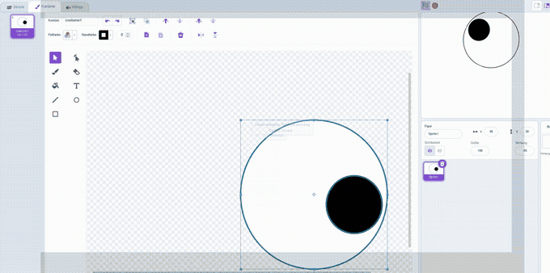


--- /collapse ---

--- collapse ---
---
title: Die Figur ist vor den Augen
---

Wenn du eine Figur ziehst, um es auf der Bühne zu positionieren, bewegt es sich vor die anderen Figuren.

So stellst du deine **Charakter**figur `hinten`{:class="block3looks"} an:

```blocks3
when green flag clicked
forever
go to [hinterster v] layer // hinter allen anderen Figuren
```

--- /collapse ---

--- collapse ---
---
title: Die Figur und die Augen folgen dem Mauszeiger
---

Hast du die Augen als Kostüme für deinen **-Charakter** hinzugefügt, anstatt als Kostüme für andere Figuren? Das kannst du beheben.

Eine Möglichkeit, das Problem zu beheben, besteht darin, die **Charakter**figur zu duplizieren und die Kopie dann in `Augapfel` umzubenennen. Lösche dann die **Augapfel** Kostüme aus der **Charakter**figur und lösche die **Charakter**kostüme aus der **Augapfel** Figur. Anschließend kannst du die **Augapfel** Figur duplizieren und die Kopie `Augapfel 2` nennen.

Der Code zum `drehe dich zu`{:class="block3motion"} `Mauszeiger`{:class="block3motion"} sollte auf den **Augapfel** Figuren sein und nicht auf der **Charakter**figur.

--- /collapse ---

--- collapse ---
---
title: Die Figur folgt dem Mauszeiger (die Augen jedoch nicht)
---

Du musst den `drehe dich zu`{:class="block3motion"} Code zu den einzelnen **Augapfel** Figuren hinzufügen, nicht zu deiner **Charakter**figur!

Um den Code zu kopieren, kannst du den Code aus dem Codebereich für deine **Charakter**figur auf die **Augapfel** Figuren in der Figurenliste ziehen.

Du musst auch das Skript aus der **Charakter**figur löschen. Ziehe dazu das Skript in das Blöckemenü.

--- /collapse ---

Möglicherweise findest du einen Fehler, der hier nicht aufgeführt ist. Kannst du herausfinden, wie du das Problem selbst beheben kannst?

Wir freuen uns, von deinen Fehlern zu hören und wie du sie behoben hast. Verwende die Schaltfläche **Feedback senden** unten auf dieser Seite und teile uns mit, ob du in deinem Projekt einen anderen Fehler gefunden hast.

--- /task ---
