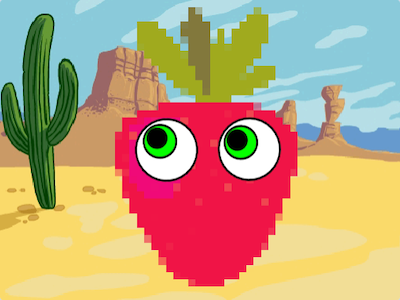
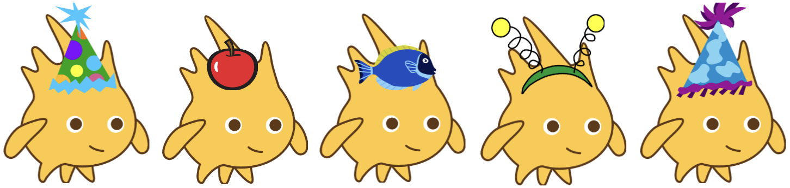

## Figureneffekte

<div style="display: flex; flex-wrap: wrap">
<div style="flex-basis: 200px; flex-grow: 1; margin-right: 15px;">
Du kannst es einrichten, dass deine **Charakter**figur und **alberne Augen** Figuren ihr `Aussehen`{:class="block3looks"} ändern, wenn du darauf klickst.
</div>
<div>

{:width="300px"}    

</div>
</div>

### Alberne Augen Effekte

--- task ---

Füge deiner **Augapfel** Figur einen `Wenn diese Figur angeklickt wird`{:class="block3events"} Block hinzu.

Kannst du herausfinden, welchen Codeblock du darunter einfügen musst, um die Augenfarbe deiner Figur zu ändern, wenn du auf die **Augapfel** Figur klickst?

--- collapse ---
---
title: Ändere Grafikeffekte, wenn auf die Figur geklickt wird
---

```blocks3
when this sprite clicked  
change [Farbe v] effect by (25)
```

--- /collapse ---

--- /task ---

--- task ---

Wenn beide Augäpfel den gleichen Effekt haben sollen, musst du dein Skript in die **Augapfel 2** Figur kopieren.

[[[scratch3-copy-code]]]

--- /task ---

### Charaktereffekte

--- task ---

Klicke in der Figurenliste auf deinen **Charakter** und dann auf die Registerkarte **Skripte**.

Füge dasselbe Skript hinzu, das du zum Ändern der Augenfarbe verwendet hast. Welche Grafikeffekte möchtest du für deinen **Charakter** ändern?

**Wähle:** Wähle einen Effekt im Dropdown-Menü im Block `ändere Effekt Farbe um`{:class="block3looks"}. Experimentiere mit den Zahlen und Effekten, bis du eine Änderung erzielst, die dir gefällt.

[[[scratch3-graphic-effects]]]

--- /task ---

### Ein Accessoire

Füge nun ein **Accessoire** hinzu, beispielsweise einen Hut, der sich ändert, wenn du darauf klickst – verwende den Block `wechsle zum nächsten Kostüm`{:class="block3looks"}.

--- task ---

**Wähle:** Füge ein Accessoire- oder Kostümwechsel deiner Wahl hinzu.



--- collapse ---
---
title: Lasse eine Figur ihr Kostüm wechseln, wenn du darauf klickst
---

**Gobo mit Kostümzubehör**: [Schau rein](https://scratch.mit.edu/projects/496334057/editor){:target="_blank"}
<div class="scratch-preview">
<iframe allowtransparency="true" width="485" height="402" src="https://scratch.mit.edu/projects/embed/496334057/?autostart=false" frameborder="0"></iframe>
</div>

Für einige Figuren steht bereits eine Kostümauswahl zur Verfügung.

Du kannst Code hinzufügen, um das Kostüm einer Figur zum nächsten Kostüm zu wechseln (`wechsle zum nächsten Kostüm`{:class="block3looks"}), wenn du auf die Figur klickst:

```blocks3
when this sprite clicked
next costume
```

--- /collapse ---

Wenn für deine Figur keine Kostümauswahl verfügbar ist oder du weitere hinzufügen möchtest, kannst du einer Figur ein beliebiges Kostüm hinzufügen.

[[[scratch3-add-costumes-to-a-sprite]]]

--- /task ---

--- task ---

**Test:** Arbeite an deinen Figuren, bis sie wie gewünscht interagieren.

**Tipp:** Probiere jeweils nur eine Änderung aus und teste, was sie bewirkt, damit du jede Änderung leicht erkennen und alles rückgängig machen kannst, was dir nicht gefällt.

--- /task ---

--- task ---

**Fehlersuche:**

Wenn du der falschen Figur Code hinzufügst, kannst du das beheben:

[[[scratch3-copy-code]]]

Bei Bedarf kannst du die Grafikeffekte zurücksetzen:

--- collapse ---
---
title: Ich möchte diese Grafikeffekte nicht
---

Um die Grafikeffekte jederzeit zurückzusetzen, klicke im Blockmenü `Aussehen`{:class="block3looks"} auf den Block `schalte Grafikeffekte aus`{:class="block3looks"}. Durch Klicken auf die grüne Flagge werden auch Grafikeffekte gelöscht.

```blocks3
clear graphic effects
```
--- /collapse ---

--- /task ---

--- task ---

**Test:** Teste dein Projekt erneut, aber diesmal im Vollbildmodus, damit du sehen kannst, wie es auf den Betrachter wirkt.

[[[scratch3-full-screen]]]

--- /task ---

<p style="border-left: solid; border-width:10px; border-color: #0faeb0; background-color: aliceblue; padding: 10px;">
Indem du dein Projekt im Vollbildmodus anzeigst, siehst du deine Arbeit aus der Perspektive eines Benutzers, der mit deinem Projekt spielt. **Benutzerinteraktion** oder **Nutzerinteraktion** ist bei der digitalen Erstellung wichtig. 
</p>


