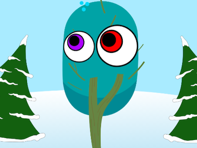

## Verbessere Dein Projekt

Wenn du Zeit hast, kannst du dein Projekt erweitern.

### Bühneneffekte hinzufügen

Lass dein Projekt etwas tun, wenn du auf die **Bühne** klickst.

{:width="300px"}
{:width="300px"}

--- task ---

Klick auf den Bühnenbereich und dann auf die Registerkarte **Skripte**, um Code zur **Bühne** hinzuzufügen.

**Wähle:** Wähle aus, was du ändern möchtest, wenn auf die **Bühne** geklickt wird.

--- collapse ---
---
title: Ändere Grafikeffekte, wenn auf die Bühne geklickt wird
---

```blocks3
when stage clicked
change [color v] effect by [25]
```

--- /collapse ---

--- collapse ---
---
title: Hintergrund wechseln, wenn auf die Bühne geklickt wird
---

```blocks3
when stage clicked
next backdrop
```

--- /collapse ---

--- /task ---

### Mehr hinzufügen

Du könntest auch hinzufügen:
- Weitere Körperteile
- Mehr Figuren mit albernen Augen
- Weitere Hintergründe
- Mehr Accessoires oder füge deinem Accessoire weitere Kostüme hinzu

Dieser **Sporg** Charakter hat auch Arme, die `sich zum Mauszeiger drehen`{:class="block3motion"}.
<div class="scratch-preview" style="margin-left: 15px;">
  <iframe allowtransparency="true" width="485" height="402" src="" frameborder="0"></iframe>
</div>

Wenn du andere Körperteile hinzufügst, musst du sie an dem Punkt zentrieren, von dem aus sie rotieren sollen. Beispielsweise würde ein Arm von der Schulter aus rotieren.

[[[scratch-crosshair]]]

### Hole dir Ideen

--- task ---

Jedes Projekt im Scratch-Studio [„Alberne Augen – Beispiele“](https://scratch.mit.edu/studios/29029028){:target="_blank"} hat einen Link **Schau hinein**, mit dem du das Projekt im Scratch-Editor öffnen und dir den Code ansehen kannst, um Ideen zu bekommen und zu sehen, wie das Projekt funktioniert.

--- /task ---

--- task ---

Wirf einen Blick auf unser Scratch-Studio [„Alberne Augen – Community“](https://scratch.mit.edu/studios/29120534){:target="_blank"}, um von Community-Mitgliedern erstellte Projekte anzuzeigen.

--- /task ---

--- task ---

Du kannst dir auch die Remixe für das [Alberne Augen Starter-Projekt](https://scratch.mit.edu/projects/582221984/remixes){:target="_blank"} ansehen, um zu sehen, was andere Ersteller gemacht haben.

--- /task ---

--- save ---
