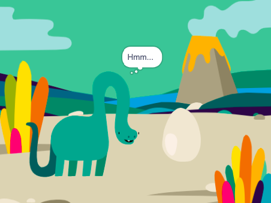

## Wie geht es weiter?

Wenn du dem Pfad [Einführung in Scratch](https://projects.raspberrypi.org/en/pathways/scratch-intro) folgst, kannst du mit dem Projekt [Überraschung! Animation](https://projects.raspberrypi.org/en/projects/surprise-animation) fortfahren. In diesem Projekt erstellst du eine Animation einer Geschichte mit einer Überraschung.

--- print-only ---

--- /print-only ---

--- no-print ---

Klicke auf die grüne Flagge, um die Animation anzusehen:

  <iframe allowtransparency="true" width="485" height="402" src="https://scratch.mit.edu/projects/embed/495932563/?autostart=false" frameborder="0"></iframe>

--- /no-print ---

Wenn du mehr Spaß beim Erkunden von Scratch haben willst, dann könntest du einige [dieser Projekte](https://projects.raspberrypi.org/en/projects?software%5B%5D=scratch&curriculum%5B%5D=%201) ausprobieren.

