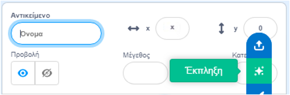
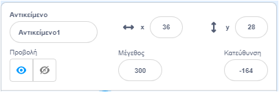

## Ο χαρακτήρας σου

Έχεις κάποια ιδέα για τον δικό σου χαρακτήρα; Τώρα, ετοιμάσου για αστεία μάτια!

! [Ένας μεγάλος χαρακτήρας.] (Images/character.png) {: width = "300px"}    

--- task ---

Ανοίξτε [το αρχικό έργο Αστεία μάτια](https://scratch.mit.edu/projects/582221984/editor){:target="_blank"}. Το Scratch θα ανοίξει σε νέα καρτέλα του φυλλομετρητή.

[[[working-offline]]]

--- /task ---

--- task ---

**Επίλεξε:** Επιλέξτε ένα Αντικείμενο**ή** δημιούργησε το δικό σου απλό sprite στον επεξεργαστή Ζωγραφική.

Δεν χρειάζεται να επιλέξεις ένα άτομο ή ένα ζώο. Θα μπορούσες να επιλέξεις ένα αντικείμενο, όπως το ντόνατ.

[[[generic-scratch3-sprite-from-library]]]

[[[scratch3-backdrops-and-sprites-using-shapes]]]

--- collapse ---
---
title: Πάρε ένα αντικείμενο Έκπληξη
---

Δεν είσαι σίγουρος/η ποιο αντικείμενο να επιλέξεις; Πήγαινε στο **Επιλέξτε ένα Αντικείμενο** και διάλεξε την επιλογή **Έκπληξη** για να προσθέσεις ένα αντικείμενο έκπληξη στο έργο σου.

--- /collapse ---

**Συμβουλή:** Εάν δημιουργήσεις το δικό σου αντικείμενο στον επεξεργαστή Ζωγραφική, **μην προσθέσεις ακόμη μάτια, επειδή πρέπει να είναι ξεχωριστά αντικείμενα.**

--- /task ---

Προς το παρόν, ο χαρακτήρας σου θα είναι πολύ μικρότερος από τους χαρακτήρες στα παραδείγματα των έργων μας. Μπορείς να κάνεις τον χαρακτήρα σου μεγαλύτερο ώστε να γεμίζει περισσότερο την οθόνη.

--- task ---

Στο παράθυρο Αντικείμενο, άλλαξε τον αριθμό στο **Μέγεθος** με έναν αριθμό της επιλογής σου.

{:width="500px"}

--- /task ---

Πού θέλεις να ζει ο χαρακτήρας σου;

--- task ---

**Επίλεξε:** Επίλεξε ένα υπόβαθρο που είναι λογικό ή αστείο.

[[[generic-scratch3-backdrop-from-library]]]

--- /task ---

--- save ---
