## Δημιούργησε αστεία μάτια

<div style="display: flex; flex-wrap: wrap">
<div style="flex-basis: 200px; flex-grow: 1; margin-right: 15px;">
Δημιούργησε τα αστεία μάτια! Κάθε μάτι πρέπει να είναι ένα ξεχωριστό αντικείμενο, ώστε να μπορεί να κινείται ξεχωριστά.

</div>
<div>

! [Ένας χαρακτήρας με αστεία μάτια.] (Εικόνες/χαρακτήρας-με-μάτια.png)
{: width = "300px"}  

</div>
</div>

### Σχεδίασε ένα βολβό του ματιού

--- task ---

Χρησιμοποίησε την επιλογή**Ζωγραφική** για να δημιουργήσεις ένα νέο **αντικείμενο**.

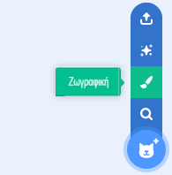

Θα ανοίξει ο επεξεργαστής Ζωγραφική, ο οποίος θα σου επιτρέψει να δημιουργήσεις το αντικείμενο **Μάτι**.

--- /task ---

Είναι πραγματικά σημαντικό ότι:
- Η μαύρη κόρη και η έγχρωμη ίριδα βλέπουν στη δεξιά πλευρά της ενδυμασίας **Μάτι**
- Η ενδυμασία **Μάτι** είναι κεντραρισμένη

--- task ---

**Επίλεξε:** Σχεδίασε ένα βολβό ματιού **ή** ξεκίνησε από ένα στρογγυλό αντικείμενο.


--- collapse ---
---
title: Σχεδίασε ένα βολβό ματιού στον επεξεργαστή Ζωγραφική
---

Επίλεξε το εργαλείο **Κύκλος**.

Για να σχεδιάσεις έναν τέλειο κύκλο, κράτησε παρατεταμένα το πλήκτρο <kbd>Shift</kbd> στο πληκτρολόγιο ενώ σχεδιάζεις με το εργαλείο **Κύκλος**. Εάν χρησιμοποιείς tablet, προσπάθησε να φτάσεις όσο το δυνατόν πιο κοντά σε έναν τέλειο κύκλο.

Σε αυτό το παράδειγμα, ορίζουμε το **Περίγραμμα** μαύρο και το **Γέμισμα** στο βολβό του ματιού λευκό:

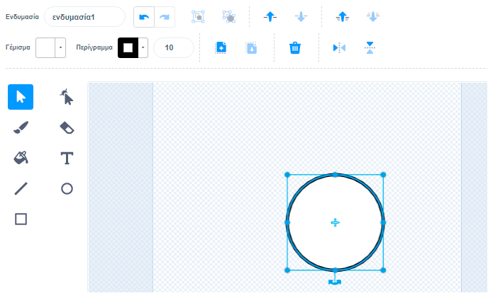

Χρησιμοποίησε το **Γέμισμα** και το **Περίγραμμα** για να επιλέξεις χρώματα. Για το μαύρο χρώμα, σύρε και τον **Κορεσμό** και την **Φωτεινότητα** στο `0`. Για το λευκό χρώμα, σύρε τον **Κορεσμό** στο`0` και την**Φωτεινότητα** στο`100`.

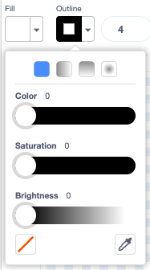 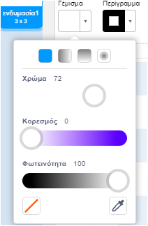

Βεβαιώσου ότι ο βολβός του ματιού είναι κεντραρισμένος - μετακίνησέ τον έτσι ώστε ο μπλε σταυρός στην ενδυμασία να ευθυγραμμίζεται με τον γκρι σταυρό στον επεξεργαστή Ζωγραφική.


Σχεδίασε έναν μικρότερο τέλειο κύκλο και τοποθέτησέ τον στη δεξιά πλευρά του βολβού του ματιού:

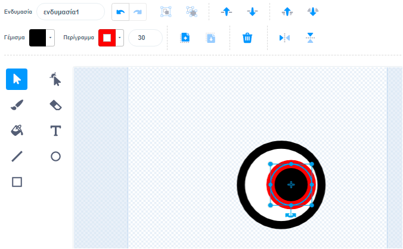

Μπορείς επίσης να σχεδιάσεις κύκλους μέσα σε κύκλους ή να χρησιμοποιήσεις χρώμα, για να έχεις διαφορετικά εφέ.

--- /collapse ---

--- collapse ---
---
title: Μετάτρεψε μια στρογγυλή ενδυμασία σε βολβό ματιών
---

Υπάρχουν ενδυμασίες στο Scratch που μπορείς να επεξεργαστείς για να κάνεις αστεία μάτια για τον χαρακτήρα σου.


Κάνε κλικ στο εικονίδιο **Επιλέξτε Ενδυμασία** για να δεις τις ενδυμασίες της βιβλιοθήκης Scratch.


Κάνε κλικ στην ενδυμασία που θέλεις να προσθέσεις στο αντικείμενό σου.

Χρησιμοποίησε τον επεξεργαστή Ζωγραφική για να αλλάξεις την ενδυμασία. Μπορείς να προσθέσεις κύκλους, να επιλέξεις ένα διαφορετικό **Γέμισμα** ή να αφαιρέσεις μέρη της ενδυμασίας για να το μετατρέψεις σε αστείο μάτι.

Βεβαιώσου ότι ο βολβός του ματιού είναι κεντραρισμένος - μετακίνησέ τον έτσι ώστε ο μπλε σταυρός στην ενδυμασία να ευθυγραμμίζεται με τον γκρι σταυρό στον επεξεργαστή Ζωγραφική.

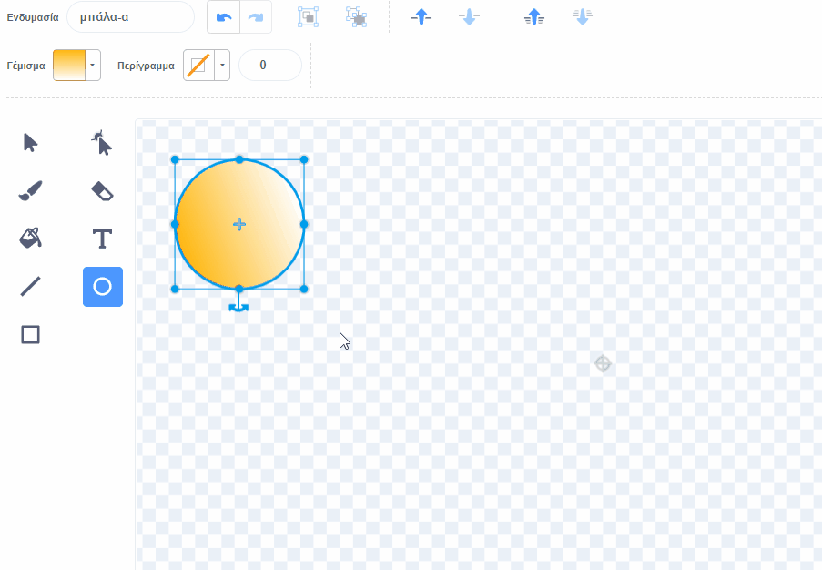

**Συμβουλή:** Η μαύρη κόρη και η έγχρωμη ίριδα πρέπει να τοποθετηθούν στη δεξιά πλευρά της φορεσιάς, έτσι ώστε το **Μάτι** να ακολουθεί τον δείκτη του ποντικιού.

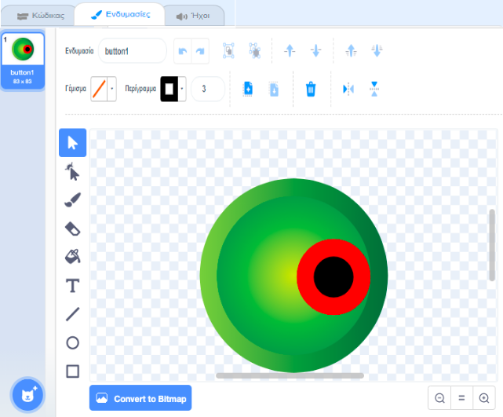

--- /collapse ---

--- /task ---

--- task ---

Ονόμασε το αντικείμενο`Μάτι` στο παράθυρο Αντικείμενο.

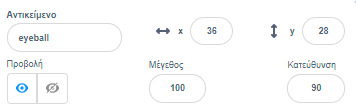

--- /task ---

--- task ---

Σύρε το **Μάτι** για να το τοποθετήσεις στη Σκηνή και άλλαξε το μέγεθός του για να ταιριάζει στον χαρακτήρα σου.

--- /task ---

Τώρα, κάνε το μάτι να κοιτάζει το `δείκτη του ποντικιού`{:class="block3motion"} έτσι ώστε ο χρήστης να μπορεί να αλληλεπιδράσει με το έργο σου.

<p style="border-left: solid; border-width:10px; border-color: #0faeb0; background-color: aliceblue; padding: 10px;">
<span style="color: #0faeb0">** Χρήστης (user)**</span> σημαίνει το άτομο που χρησιμοποιεί το έργο (όχι μόνο το δημιουργεί) και <span style="color: #0faeb0">** αλληλεπίδραση χρήστη **</span> είναι ο τρόπος με τον οποίο το έργο αντιδρά στον χρήστη που κάνει διάφορες ενέργειες όπως μετακίνηση του ποντικιού και κλικ στην οθόνη. 
</p>

### Προγραμμάτισε το μάτι σου

--- task ---

Πρόσθεσε ένα script στο `όρισε τρόπο περιστροφής`{: class = "block3motion"} σε `τριγύρω`{: class = "block3motion"} για να κάνεις τον βολβό του ματιού `σημείο προς τον δείκτη του ποντικιού`{: class = "block3motion"} `για πάντα`{: class = "block3control"}.

--- collapse ---
---
title: Κάνε ένα αντικείμενο να δείχνει προς τον δείκτη του ποντικιού
---

```blocks3
when flag clicked
set rotation style [all around v]
forever
point towards (mouse-pointer v)
end
```

--- /collapse ---

--- /task ---

### Πρόσθεσε άλλο ένα βολβό ματιού

--- task ---

Για να προσθεσεις κι άλλο μάτι, κάνε δεξί κλικ (ή σε ένα tablet, πάτησε παρατεταμένα) στο **Μάτι** στη λίστα αντικειμένων και επίλεξε **διπλασιασμός**.


[[[scratch3-duplicate-sprite]]]

--- /task ---

### Δοκίμασε τα αστεία μάτια σου

--- task ---

**Δοκιμή:** Κάνε κλικ στην πράσινη σημαία και δοκίμασε το έργο σου. Τα αστεία μάτια ακολουθούν τον δείκτη του ποντικιού σου καθώς κινείς το ποντίκι;

**Συμβουλή:** Δεν χρειάζεται να κρατάς τον δείκτη του ποντικιού στη Σκηνή. Τα μάτια θα ακολουθήσουν τον δείκτη του ποντικιού σου καθώς συνεχίζεις να γράφεις τον κώδικα στο Scratch.

--- /task ---

--- task ---

**Εντοπισμός σφαλμάτων:** Ενδέχεται να βρεις κάποια σφάλματα στο έργο σου που πρέπει να διορθώσεις. Εδώ είναι μερικά συνηθισμένα σφάλματα:

--- collapse ---
---
title: Τα μάτια δεν κινούνται
---

Βεβαιώσου ότι έχεις προσθέσει τον κώδικα στα αντικείμενα**Μάτι** και **κάνε κλικ στην πράσινη σημαία**. Ο κώδικας σου δεν θα εκτελεστεί μέχρι να κάνεις κλικ στην πράσινη σημαία.

--- /collapse ---

--- collapse ---
---
title: Τα μάτια δείχνουν μακριά από το ποντίκι
---

Στις ενδυμασίες **Μάτι**, βεβαιώσου ότι η κόρη είναι στη δεξιά πλευρά (πέρα από τον μπλε σταυρό στη μέση της ενδυμασίας).

Τα αντικείμενα **Μάτι** έχουν το `τριγύρω`{:class="block3motion"} `τρόπο περιστροφής`{:class="block3motion"}, ώστε να μπορούν να περιστρέφονται προς οποιαδήποτε κατεύθυνση.

Όταν τα **Μάτια** περιστρέφονται για να `δείξουν προς`{:class="block3motion"} τον `δείκτη του ποντικιού`{: class = "block3motion"}, οι μαθητές/τριες θα είναι πιο κοντά στον δείκτη του ποντικιού.

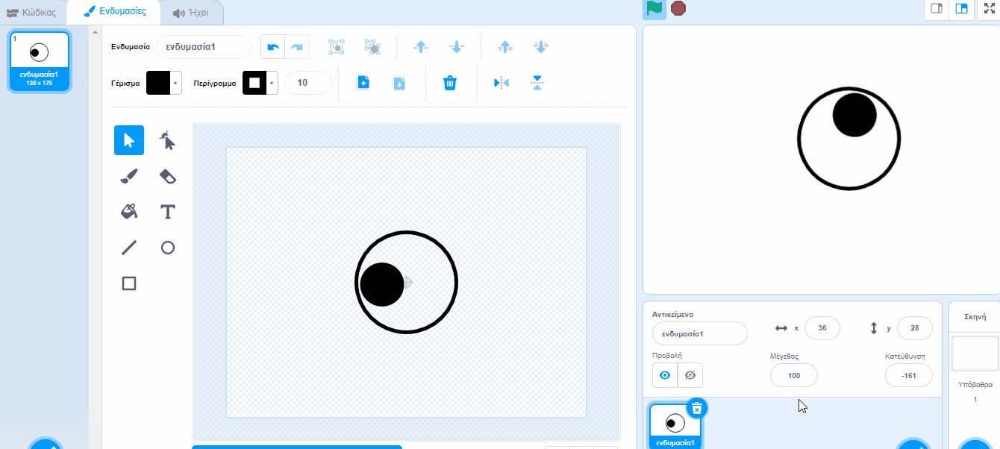

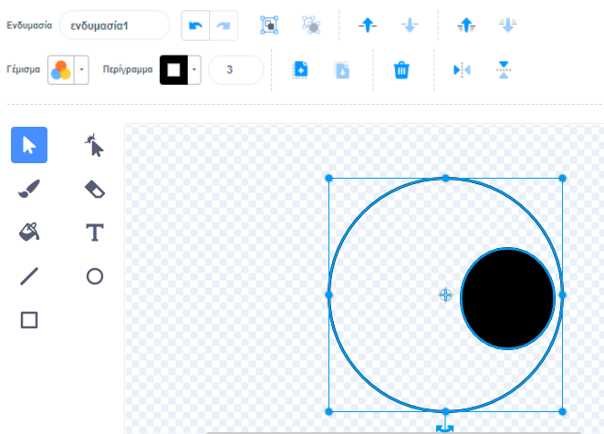

--- /collapse ---

--- collapse ---
---
title: Τα μάτια πηδάνε γύρω από τη Σκηνή
---

Έλεγξε ότι οι ενδυμασίες **Μάτι** είναι κεντραρισμένες. Για να κεντράρεις μια ενδυμασία, σύρε την ενδυμασία έτσι ώστε ο μπλε σταυρός στην ενδυμασία να ευθυγραμμιστεί με τον γκρι σταυρό στον επεξεργαστή Ζωγραφική.

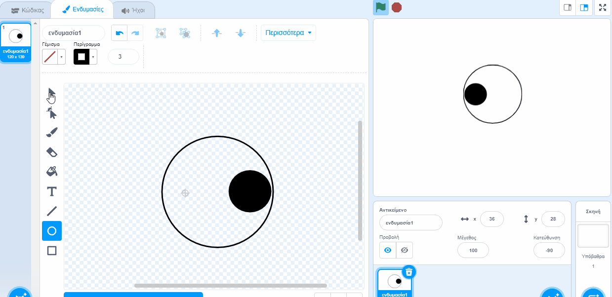


--- /collapse ---

--- collapse ---
---
title: Ο χαρακτήρας είναι μπροστά από τα μάτια
---

Όταν σύρεις ένα αντικείμενο για να το τοποθετήσεις στη Σκηνή, κινείται μπροστά από τα άλλα αντικείμενα.

Για να μετακινήσεις τον **χαρακτήρα** αντικείμενο για να μείνει `πίσω`{: class = "block3looks"}, χρησιμοποίησε:

```blocks3
when green flag clicked
forever
go to [back v] layer // behind all other sprites
```

--- /collapse ---

--- collapse ---
---
title: Ο χαρακτήρας και τα μάτια ακολουθούν τον δείκτη του ποντικιού
---

Μήπως πρόσθεσες τα μάτια σαν ενδυμασίες για τον **χαρακτήρα** αντί για ενδυμασίες για ξεχωριστά αντικείμενα; Μπορείς να το διορθώσεις αυτό.

Ένας τρόπος για να το διορθώσεις είναι να αντιγράψεις τον **χαρακτήρα** και στη συνέχεια να μετονομάσεις το αντίγραφο `Μάτι`. Στη συνέχεια, διάγραψε τις ενδυμασίες **Μάτι** από τον **χαρακτήρα** του αντικειμένου και διάγραψε τις ενδυμασίες του **χαρακτήρα** από το αντικείμενο**Μάτι**. Στη συνέχεια, μπορείς να διπλασιάσεις το **Μάτι** και να ονομάσεις το αντίγραφο `Μάτι 2`.

Ο κώδικας για να `δείχνει προς`{:class="block3motion"} τον`δείκτη ποντικιού`{:class="block3motion"} πρέπει να βρίσκεται στα αντικείμενα**Μάτι** και όχι στο αντικείμενο**χαρακτήρας**.

--- /collapse ---

--- collapse ---
---
title: Ο χαρακτήρας ακολουθεί τον δείκτη του ποντικιού (και τα μάτια όχι)
---

Πρέπει να προσθέσεις τον κώδικα `δείξε προς`{: class = "block3motion"} τα μεμονωμένα αντικείμενα**Μάτι**, όχι στο αντικείμενο **χαρακτήρα** σου!

Για να αντιγράψεις τον κώδικα, μπορείς να σύρεις τον κώδικα από την περιοχή Κώδικα για τον**χαρακτήρα** σου στα αντικείμενα **Μάτι** στη λίστα αντικειμένων.

Θα χρειαστεί επίσης να διαγράψεις το σενάριο από το αντικείμενο **χαρακτήρα**. Για να το κάνεις αυτό, σύρε το script στο μενού Μπλοκ.

--- /collapse ---

Πιθανόν να βρεις ένα σφάλμα που δεν αναφέρεται εδώ. Μπορείς να σκεφτείς πώς θα το λύσεις;

Μας αρέσει να μαθαίνουμε για τα σφάλματα που εντοπίζεις και πώς τα διορθώνεις. Χρησιμοποίησε το πλήκτρο **Αποστολή σχολίων** στο κάτω μέρος αυτής της σελίδας και πες μας αν εντόπισες κάποιο διαφορετικό σφάλμα στο έργο σου.

--- /task ---
