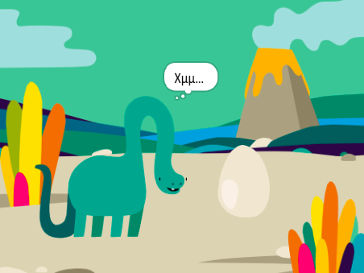

## Τι υπάρχει στη συνέχεια;

Εάν ακολουθείς το μονοπάτι [Εισαγωγή στο Scratch](https://projects.raspberrypi.org/el-GR/pathways/scratch-intro), μπορείς να προχωρήσεις στο έργο [Έκπληξη! έργο](https://projects.raspberrypi.org/el-GR/projects/surprise-animation) κινούμενων σχεδίων. Σε αυτό το έργο, θα κάνεις μια κινούμενη εικόνα μιας ιστορίας με μια έκπληξη.

--- print-only ---

--- /print-only ---

--- no-print ---

Κάνε κλικ στην πράσινη σημαία για να δεις την κινούμενη εικόνα:

  <iframe allowtransparency="true" width="485" height="402" src="https://scratch.mit.edu/projects/embed/633584548/?autostart=false" frameborder="0"></iframe>

--- /no-print ---

Εάν θέλεις να διασκεδάσεις περισσότερο εξερευνώντας το Scratch, τότε μπορείς να δοκιμάσεις [από αυτά τα έργα](https://projects.raspberrypi.org/el-GR/projects?software%5B%5D=scratch&curriculum%5B%5D=%201).

***
Το έργο αυτό μεταφράστηκε από τους εθελοντές:

Σταυρούλα Μισθού
Κυριακή Ιντζεΐδου
Κυπραίου Μαρία
Ευστάθιος Ιωσηφίδης

Χάρη στους εθελοντές, μπορούμε να δώσουμε σε ανθρώπους σε όλο τον κόσμο την ευκαιρία να μάθουν στη γλώσσα τους. Μπορείτε να μας βοηθήσετε να προσεγγίσουμε περισσότερους ανθρώπους μεταφράζοντας εθελοντικά - περισσότερες πληροφορίες στο [rpf.io/translate](https://rpf.io/translate).
