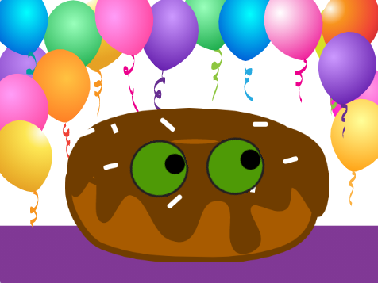

## Introduction

You will design and create a googly eye character. Googly eyes are silly large eyes, yours will follow the mouse pointer to bring your character to life.

Design means deciding on the way a project looks and making decisions about what it does. 

You will:
+ Make a project with **user interaction**
+ Personalize a project with colour and graphic effects
+ Learn about design in digital making 

"User" means the person using the project (not just making it), and User interaction is how the project reacts to the user doing things such as moving the mouse and clicking on the screen. 

--- no-print ---

--- task ---

  

### Try it 

Move the mouse (or your finger on a tablet) around the screen and watch what happens to Gobo's eyes.

What happens when you move between the Gobo's eyes? Try clicking on different parts to customise the scene.

**Gobo watching**: [See inside](https://scratch.mit.edu/projects/495141114/editor){:target="_blank"}

  <iframe allowtransparency="true" width="485" height="402" src="https://scratch.mit.edu/projects/embed/495141114/?autostart=false" frameborder="0"></iframe>

--- /task ---

Design means deciding on the way a project looks and making decisions about what it does. 

### Get inspiration 

You are going to make some design decisions to create your character. Think about what kind of googly eye character you want to make.

--- task ---

Explore these example projects to get more ideas:

**Don't eat donut**: [See inside](https://scratch.mit.edu/projects/495865093/editor){:target="_blank"}

  <iframe allowtransparency="true" width="485" height="402" src="https://scratch.mit.edu/projects/embed/495865093/?autostart=false" frameborder="0"></iframe>

**Under the sea**: [See inside](https://scratch.mit.edu/projects/495866460/editor){:target="_blank"}

  <iframe allowtransparency="true" width="485" height="402" src="https://scratch.mit.edu/projects/embed/495866460/?autostart=false" frameborder="0"></iframe>

**Sporg**: [See inside](https://scratch.mit.edu/projects/495865892/editor){:target="_blank"}

  <iframe allowtransparency="true" width="485" height="402" src="https://scratch.mit.edu/projects/embed/495865892/?autostart=false" frameborder="0"></iframe>

--- /task ---
--- /no-print ---

--- print-only ---

### Get inspiration 

You are going to make some design decisions to create your character. See inside example projects in [Scratch 1: Googly eye character - Examples](https://scratch.mit.edu/studios/29029028/){:target="_blank"} Scratch studio.

--- /print-only ---

 