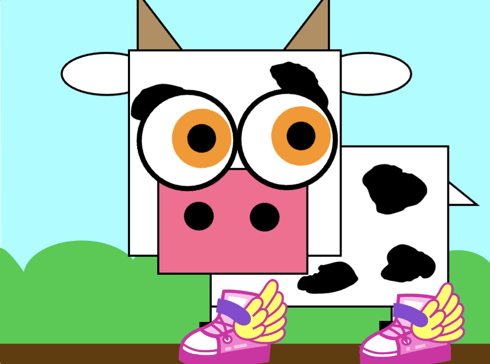

## You will make

In this project, you will design and create a silly eye character. The character's large, silly eyes will follow the mouse pointer to bring your character to life.

--- no-print ---

### Play &#9654;

--- task ---

  

**Gobo watching**: [See inside](https://scratch.mit.edu/projects/495141114/editor){:target="_blank"}

Move the mouse (or if you are using a tablet, move your finger) around the screen and watch what happens to Gobo's eyes. 

What happens when you move between Gobo's eyes? 
  
What happens when you click on different parts of the project?

  <iframe allowtransparency="true" width="485" height="402" src="https://scratch.mit.edu/projects/embed/495141114/?autostart=false" frameborder="0"></iframe>

--- /task ---

### Make it your own

**Design** means deciding on the way that a project looks and making decisions about what it does. 

You will:
+ Make a silly eyes project with **user interaction**
+ **Design** your project to make it yours!
+ Personalise your silly eyes project with **sprites, scripts and loops**

**User** means the person using the project (not just making it), and **user interaction** is how the project reacts to the user doing things such as moving the mouse and clicking on the screen. 

### Get inspiration 

Think about what kind of silly eye character you want to make.

--- task ---

Explore these example projects to get more ideas:

  <h3 class="c-project-panel__heading js-project-panel__toggle">
    
  </h3>

<strong>Don’t eat donut</strong>: <a href="https://scratch.mit.edu/projects/495865093/editor" target="_blank">See inside</a>

  <iframe allowtransparency="true" width="485" height="402" src="https://scratch.mit.edu/projects/embed/495865093/?autostart=false" frameborder="0"></iframe>

  
<strong>Cow with shoes</strong>: <a href="https://scratch.mit.edu/projects/723797674/editor" target="_blank">See inside</a>

  <iframe allowtransparency="true" width="485" height="402" src="https://scratch.mit.edu/projects/embed/723797674/?autostart=false" frameborder="0"></iframe>

  
<strong>Sporg</strong>: <a href="https://scratch.mit.edu/projects/495865892/editor" target="_blank">See inside</a>

  <iframe allowtransparency="true" width="485" height="402" src="https://scratch.mit.edu/projects/embed/495865892/?autostart=false" frameborder="0"></iframe>

--- hints ---

--- hint ---

**Don't eat donut**: [See inside](https://scratch.mit.edu/projects/495865093/editor){:target="_blank"}

  <iframe allowtransparency="true" width="485" height="402" src="https://scratch.mit.edu/projects/embed/495865093/?autostart=false" frameborder="0"></iframe>

--- /hint ---

--- hint ---

**Cow with shoes**: [See inside](https://scratch.mit.edu/projects/723797674/editor){:target="_blank"}

  <iframe allowtransparency="true" width="485" height="402" src="https://scratch.mit.edu/projects/embed/723797674/?autostart=false" frameborder="0"></iframe>

--- /hint ---

--- hint ---

**Sporg**: [See inside](https://scratch.mit.edu/projects/495865892/editor){:target="_blank"}

  <iframe allowtransparency="true" width="485" height="402" src="https://scratch.mit.edu/projects/embed/495865892/?autostart=false" frameborder="0"></iframe>

--- /hint ---

--- /hints ---

--- /task ---

### Featured community project

We love seeing the projects you create like the example below. 

At the end of this project you will be able to share your Silly eyes project for a chance of it being featured here.

--- task ---

**Purple monster**

Click on the purple monster and the eyeballs:

  <iframe allowtransparency="true" width="485" height="402" src="https://scratch.mit.edu/projects/embed/523223028/?autostart=false" frameborder="0"></iframe>

--- /task ---
--- /no-print ---

--- print-only ---

### Get inspiration 

You are going to make some design decisions to create your character. Think about what kind of silly eye character you want to make. To get more ideas, **See inside** example projects in the 'Silly eyes — Examples' Scratch studio: https://scratch.mit.edu/studios/29029028 

--- /print-only ---

 
