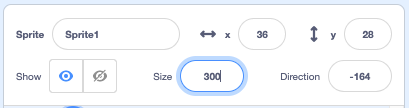

## Your character

Use your design skills to add a character sprite and suitable backdrop. 

{:width="300px"}    

**Design** means deciding on the way that a project looks and making decisions about what it does. 

### Open the starter project

--- task ---

Open the [Silly eyes starter project](https://scratch.mit.edu/projects/582221984/editor){:target="_blank"}. Scratch will open in another browser tab.

[[[working-offline]]]

--- /task ---

### Choose your sprite and backdrop

--- task ---

**Choose:** Add a **sprite** and a **backdrop** for your silly eyes project. 

+ What does your character look like? A person 🧜🏽‍♀️, animal 🐶 or object 🧸.
+ Where do you want your character to live? Somewhere sensible 🏠 or silly 🎪.

[[[generic-scratch3-sprite-from-library]]]

[[[generic-scratch3-backdrop-from-library]]]

[[[scratch3-backdrops-and-sprites-using-shapes]]]

--- collapse ---
---
title: Get a surprise sprite
---

Not sure which sprite to choose? Go to the **Choose a Sprite** menu and choose the **Surprise** option to add a surprise sprite to your project.

--- /collapse ---

**Tip:** If you create your own sprite in the Paint editor, **don't add eyes yet, because they need to be separate sprites.**

--- /task ---

### Resize your sprite

--- task ---

In the Sprite pane, change the number in the **Size** property to a number that makes your character fill the Stage. 

{:width="500px"}

--- /task ---

--- task ---

Look at the Stage. You will see your large character and chosen backdrop. 

{:width="500px"}

--- /task ---

--- save ---
