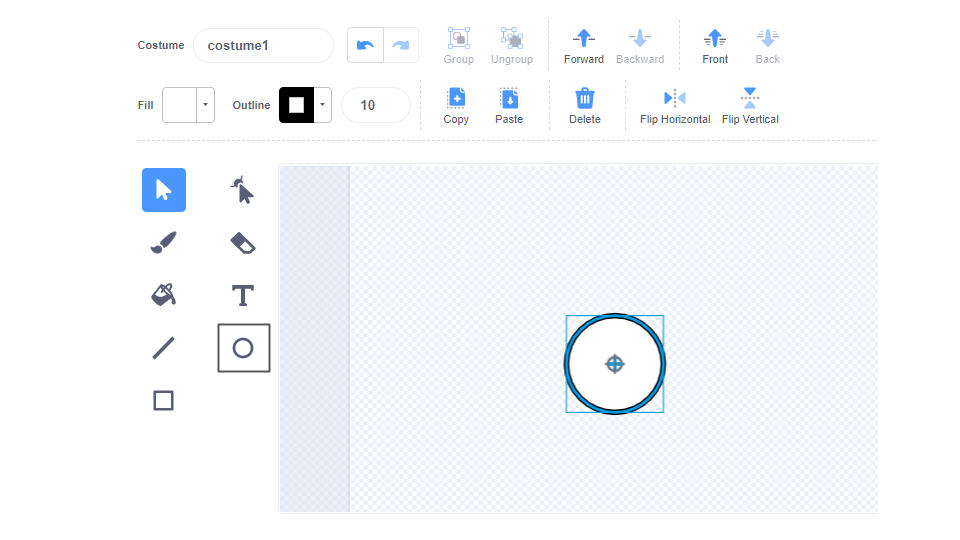
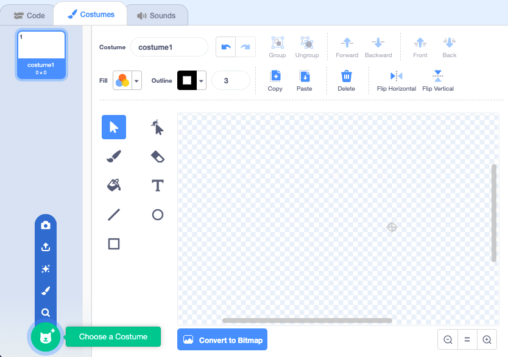

## Make silly eyes

<div style="display: flex; flex-wrap: wrap">
<div style="flex-basis: 200px; flex-grow: 1; margin-right: 15px;">
Make the silly eyes! Each eye needs to be a separate sprite so that it can move separately.

If you need help, look at the tips in the **Debug** task at the bottom of this step.
</div>
<div>


{:width="300px"}  

</div>
</div>

--- task ---

Use the **Paint** option to create a new **sprite**. 


The Paint editor will open, which will allow you to create your **Eyeball** sprite's costume.

--- /task ---

It is really important that:
- The black pupil and coloured iris face to the right-hand side of the **Eyeball** costume
- The **Eyeball** costume is centred

--- task ---

**Choose:** Draw an eyeball **or** start from a round sprite.

--- collapse ---
---
title: Draw an eyeball in the Paint editor
---

Select the **Circle** tool.

To draw a perfect circle, press and hold the <kbd>Shift</kbd> key on the keyboard while you draw with the **Circle** tool. If you are using a tablet, try to get as close to a perfect circle as you can.

In this example, we set the **Outline** to black and the **Fill** colour of the eyeball to white:



Use the **Fill** and **Outline** colour choosers to choose colours. To make black, slide both the **Saturation** and **Brightness** to `0`. To make white, slide the **Saturation** to `0` and the **Brightness** to `100`.


Make sure that the eyeball is centred — move it so that the blue cross in the costume lines up with the grey crosshair in the Paint editor.

Draw a smaller perfect circle and position it on the right-hand side of the eyeball:


You could also draw circles inside circles, or use colour, to get different effects.

--- /collapse ---


--- collapse ---
---
title: Turn a round costume into an eyeball
---

There are costumes in Scratch that you can edit to make silly eyes for your character. 

Click on the **Choose a Costume** icon to see the library Scratch costumes. 



Click on the costume you want to add to your sprite. 

Use the Paint editor to change a costume. You could add circles, choose a different **Fill** colour, or remove parts of the costume to turn it into a silly eye. 

Make sure that the eyeball is centred — move it so that the blue cross in the costume lines up with the grey crosshair in the Paint editor.

**Tip:** The black pupil and coloured iris need to be positioned on the right-hand side of the costume so that the **Eyeball** follows the mouse pointer.


--- /collapse ---

--- collapse ---

---
title: Reuse an eyeball costume from 🧩
---

The 🧩 sprite contains eyeballs that you can **reuse**.

Select the 🧩 sprite and click on Costumes then drag an eyeball costume to your Eyeball sprite in the Sprite pane. 


--- /collapse ---

--- /task ---

--- task ---

Name your sprite `Eyeball` in the Sprite pane.


--- /task ---

--- task ---

Drag the **Eyeball** sprite to position it on the Stage, and change its size to fit your character.

--- /task ---

Now, make the eyeball look at the `mouse-pointer`{:class="block3motion"} so that the user can interact with your project.

<p style="border-left: solid; border-width:10px; border-color: #0faeb0; background-color: aliceblue; padding: 10px;">
<span style="color: #0faeb0">**User**</span> means the person using the project (not just making it), and <span style="color: #0faeb0">**user interaction**</span> is how the project reacts to the user doing things such as moving the mouse and clicking on the screen. 
</p>

--- task ---

Add a script to `set the rotation style`{:class="block3motion"} to `all around`{:class="block3motion"} to make the eyeball `point towards the mouse pointer`{:class="block3motion"} `forever`{:class="block3control"}. 

--- collapse ---
---
title: Make a sprite point towards the mouse pointer
---

```blocks3
when flag clicked
set rotation style [all around v]
forever
point towards (mouse-pointer v)
end
```

--- /collapse ---

--- /task ---


If your character only has one eye, then you have finished. 

--- task ---

Otherwise, right-click (or on a tablet, tap and hold) on the **Eyeball** sprite in the Sprite list and choose **duplicate** to create more silly eyes.

[[[scratch3-duplicate-sprite]]]

--- /task ---

--- task ---

**Test:** Click on the green flag and test your project. Do the silly eyes follow your mouse pointer as you move the mouse around?

**Tip:** You don't have to keep the mouse pointer on the Stage. The eyes will follow your mouse pointer as you carry on coding in Scratch.

--- /task ---

--- task ---

**Debug:** You might find some bugs in your project that you need to fix. Here are some common bugs:

--- collapse ---
--- 
title: The eyes do not move
---

Make sure that you have added the code to the **Eyeball** sprites and **clicked on the green flag**. Your code will not run until you click on the green flag.

--- /collapse ---

--- collapse ---
--- 
title: The eyes point away from the mouse
---

In the **Eyeball** costumes, check that the pupil is on the right-hand side (past the blue cross in the middle of the costume). 

The **Eyeball** sprites have the `all around`{:class="block3motion"} `rotation style`{:class="block3motion"}, so they can rotate in any direction. 

When the **Eyeballs** rotate to `point towards`{:class="block3motion"} the `mouse-pointer`{:class="block3motion"}, the pupils will be closest to the mouse pointer. 


--- /collapse ---

--- collapse ---
--- 
title: The eyes jump around the Stage
---

Check that the **Eyeball** costumes are centred. To centre a costume, drag the costume so that the blue cross in the costume lines up with the grey crosshair in the Paint editor.


--- /collapse ---

--- collapse ---
--- 
title: The character is in front of the eyes
---

When you drag a sprite to position it on the Stage, it moves in front of the other sprites. 

To get your **character** sprite to stay at the `back`{:class="block3looks"}, use:

```blocks3
when green flag clicked
forever
go to [back v] layer // behind all other sprites
```

--- /collapse ---

--- collapse ---
---
title: The character and the eyes follow the mouse pointer
---

Did you add the eyes as costumes for your **character** instead of as costumes for separate sprites? You can fix that. 

One way to fix it is to duplicate the **character** sprite and then rename the copy `Eyeball`. Then, delete the **Eyeball** costumes from the **character** sprite, and delete the **character** costumes from the **Eyeball** sprite. Then, you can duplicate the **Eyeball** sprite and name the copy `Eyeball 2`.

The code to `point towards`{:class="block3motion"} the `mouse-pointer`{:class="block3motion"} should be on the **Eyeball** sprites and not the **character** sprite.

--- /collapse ---

--- collapse ---
---
title: The character follows the mouse pointer (and the eyes do not)
---

You need to add the `point towards`{:class="block3motion"} code to the individual **Eyeball** sprites, not your **character** sprite!

To copy the code, you can drag the code from the Code area for your **character** to the **Eyeball** sprites in the Sprite list. 

You will also need to delete the script from the **character** sprite. To do this, drag the script to the Blocks menu.

--- /collapse ---

You might find a bug that is not listed here. Can you work out how to fix it? 

We love hearing about your bugs and how you fixed them. Use the **Send feedback** button at the bottom of this page and tell us if you found a different bug in your project. 


--- /task ---

--- save ---
