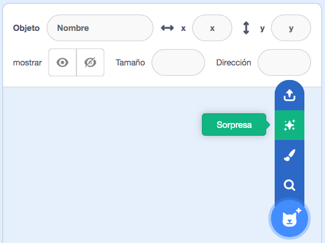
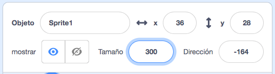

## Tu personaje

Usa tus habilidades de diseño para agregar un objeto de personaje y un fondo adecuado. 

{:width="300px"}    

** Diseño ** se refiere a decidir la apariencia de un proyecto y tomar decisiones sobre lo que hace. 

### Abre el proyecto inicial

--- task ---

Abre el proyecto inicial de [Ojos tontos](https://scratch.mit.edu/projects/582221984/editor){:target="_blank"}. Scratch se abrirá en otra pestaña del navegador.

[[[working-offline]]]

⏱️ ¿Poco tiempo? Puedes comenzar desde uno de los [ejemplos](https://scratch.mit.edu/studios/29029028){:target="_blank"}.

--- /task ---

### Elige tu objeto y tu fondo

--- task ---

**Elige:** Añadir un **objeto** y un **fondo** para tu proyecto de ojos tontos.

+ ¿Cómo es tu personaje? Una persona 🧜🏽‍♀️, animal 🐶 u objeto 🧸.
+ ¿Dónde quieres que viva tu personaje? En algún lugar sensato 🏠 o ridículo 🎪.

[[[generic-scratch3-sprite-from-library]]]

[[[generic-scratch3-backdrop-from-library]]]

[[[scratch3-backdrops-and-sprites-using-shapes]]]

--- collapse ---
---
title: Obtén un objeto sorpresa
---

¿No estás seguro sobre qué objeto elegir? Ve al menú **Elegir un objeto** y elige la opción **Sorpresa** para agregar un objeto sorpresa a tu proyecto.

--- /collapse ---

**Consejo:** Si creas tu propio objeto en el Editor de dibujo, **no le agregues ojos todavía, porque estos deben ser objetos separados.**

--- /task ---

### Cambia el tamaño de tu objeto

--- task ---

En el Panel de objetos, cambia el número en la propiedad **Tamaño** por un número de tu elección.

{:width="500px"}

--- /task ---

--- task ---

Mira el escenario. Verás a tu gran personaje y el fondo que elegiste.

{:width="500px"}

--- /task ---
