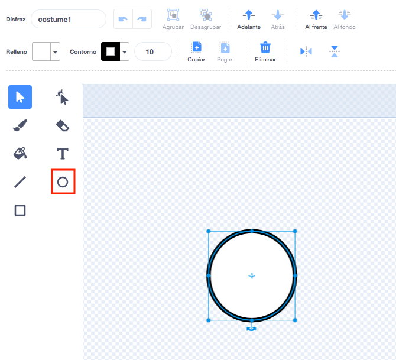
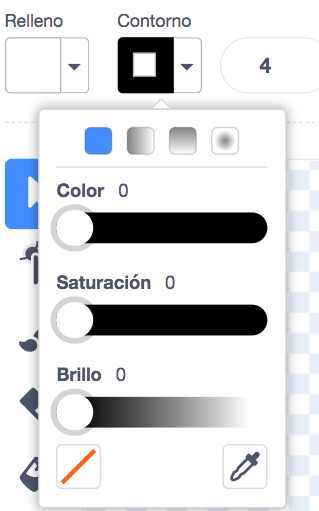
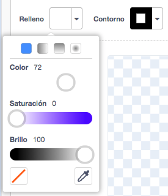
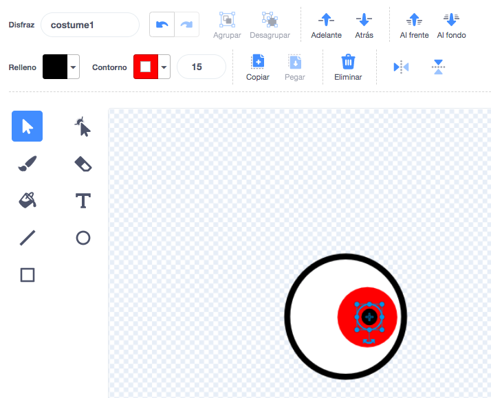
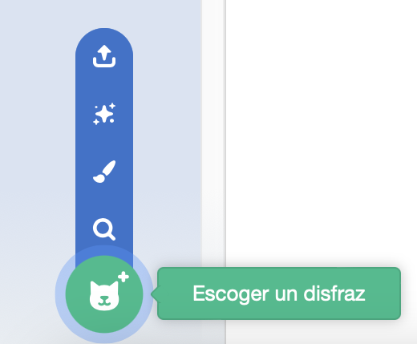
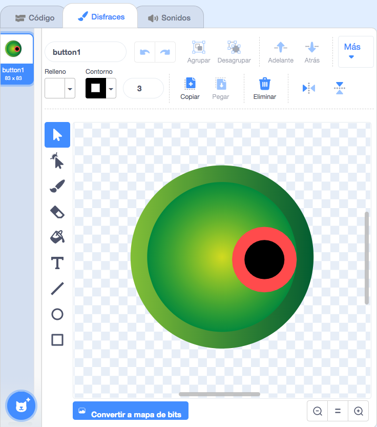
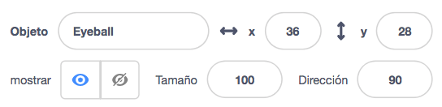
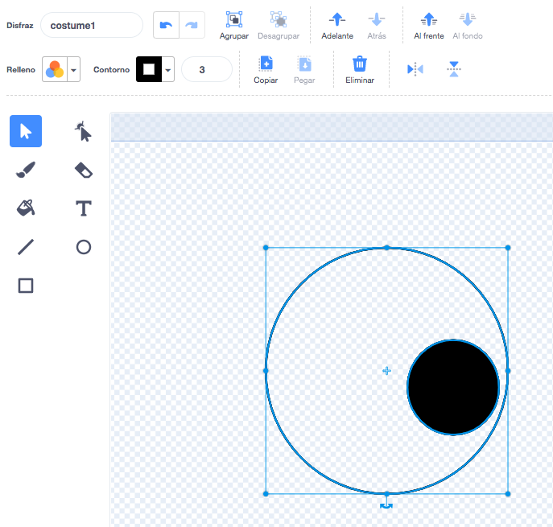
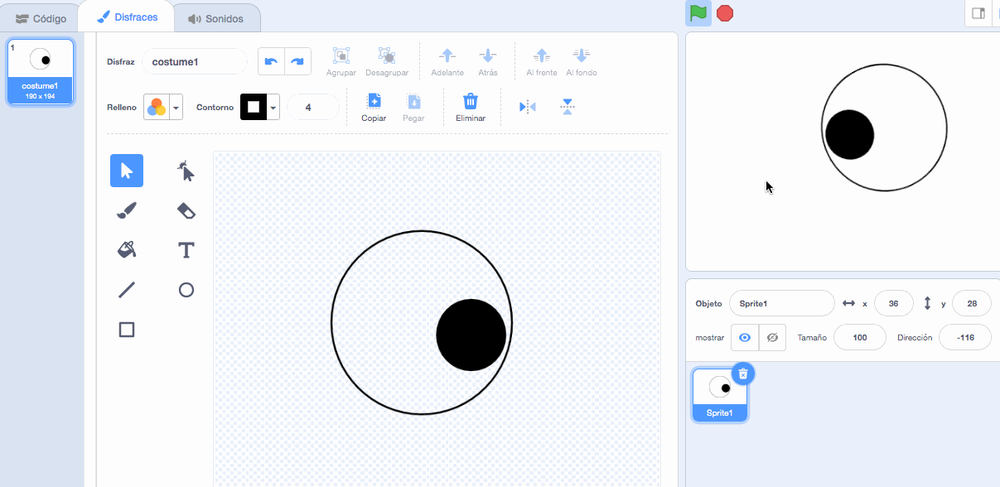

## Haz ojos tontos

<div style="display: flex; flex-wrap: wrap">
<div style="flex-basis: 200px; flex-grow: 1; margin-right: 15px;">
¡Haz los ojos tontos! Cada ojo debe ser un objeto separado para que pueda moverse independientemente.

</div>
<div>

{:width="300px"}  

</div>
</div>

### Dibuja un ojo

--- task ---

Utiliza la opción **Pintar** para crear un nuevo **objeto**.


Se abrirá el Editor de dibujo, lo que te permitirá crear el disfraz de **Globo ocular**.

--- /task ---

Es súper importante que:
- La pupila negra y el iris de color miren hacia el lado derecho del disfraz **Globo ocular**
- El **Globo ocular** esté centrado

--- task ---

**Elige:** Dibuja un globo ocular **o** empieza con un objeto redondo.


--- collapse ---
---
title: Dibuja un globo ocular en el Editor de dibujo
---

Selecciona la herramienta **Círculo**.

Para dibujar un círculo perfecto, mantén presionada la tecla <kbd>Mayúscula</kbd> en el teclado mientras dibujas con la herramienta **Círculo**. Si estás usando una tableta, trata de dibujar un círculo lo más perfecto que puedas.

En este ejemplo, estableceremos el **Contorno** en negro y el **Relleno** en blanco:



Usa los selectores de color de **Relleno** y **Contorno** para elegir colores. Para hacerlo negro, cambia tanto la **Saturación** como el **Brillo** a `0`. Para hacerlo blanco, cambia la **Saturación** a `0` y el **Brillo** a `100`.





Asegúrate de que el globo ocular esté centrado; muévelo de modo que la cruz azul del disfraz se alinee con la cruz gris en el Editor.


Dibuja un círculo perfecto más pequeño y colócalo en el lado derecho del globo ocular:



También puedes dibujar círculos dentro de círculos o usar colores para obtener diferentes efectos.

--- /collapse ---

--- collapse ---
---
title: Convierte un disfraz redondo en un globo ocular
---

Hay disfraces en Scratch que puedes editar para crear ojos tontos para tu personaje.


Haz clic en el icono **Elegir un disfraz** para ver la biblioteca de Scratch.



Haz clic en el disfraz que quieras agregar a tu objeto.

Usa el Editor de dibujo para cambiarlo. Puedes agregar círculos, elegir un color de **relleno** diferente o quitar partes del disfraz para convertirlo en un ojo tonto.

Asegúrate de que el globo ocular esté centrado; muévelo de modo que la cruz azul del disfraz se alinee con la cruz gris en el Editor.


**Consejo:** La pupila negra y el iris de color deben colocarse en la parte derecha del disfraz para que el **Globo ocular** siga al mouse.



--- /collapse ---

--- /task ---

--- task ---

Nombra tu objeto `Globo ocular` en el Panel de objetos.



--- /task ---

--- task ---

Arrastra el **Globo ocular** para colocarlo en el escenario y cambia su tamaño para que se ajuste a tu personaje.

--- /task ---

Ahora, haz que mire el `puntero del ratón`{:class="block3motion"} para que el usuario pueda interactuar con tu proyecto.

<p style="border-left: solid; border-width:10px; border-color: #0faeb0; background-color: aliceblue; padding: 10px;">
<span style="color: #0faeb0">**Usuario**</span> se refiere a la persona que usa el proyecto (no solo la que lo hace), e <span style="color: #0faeb0">**interacción del usuario**</span> es cómo el proyecto reacciona cuando el usuario hace cosas como mover el mouse y hacer clic en la pantalla. 
</p>

### Programa tu Ojo

--- task ---

Agrega un Script `fijar estilo de rotación`{:class="block3motion"} a `en todas las direcciones`{:class="block3motion"} para hacer que el globo ocular pueda `apuntar hacia puntero del ratón`{:class="block3motion"} `por siempre`{:class="block3control"}.

--- collapse ---
---
title: Haz que un objeto apunte hacia el puntero del ratón
---

```blocks3
when flag clicked
set rotation style [en todas las direcciones v]
forever
point towards (puntero del ratón v)
end
```

--- /collapse ---

--- /task ---

### Añade otro ojo

--- task ---

Para añadir otro ojo, haz clic derecho (o en una tablet, mantén presionado) en el objeto **Globo ocular** en la Lista de objetos y elije **duplicar**.


[[[scratch3-duplicate-sprite]]]

--- /task ---

### Prueba tus ojos tontos

--- task ---

**Prueba:** Haz clic en la bandera verde y prueba tu proyecto. ¿Los ojos tontos siguen el puntero de tu ratón cuando lo mueves?

**Consejo:** No es necesario que mantengas el puntero del ratón en el escenario. Los ojos seguirán el puntero del ratón mientras continúas codificando en Scratch.

--- /task ---

--- task ---

**Debug:** Es posible que encuentres algunos errores en tu proyecto que necesites corregir. A continuación, se muestran algunos errores comunes:

--- collapse ---
---
title: Los ojos no se mueven
---

Asegúrate de haber agregado el código a los objetos **Globo ocular** y hayas **presionado la bandera verde**. Tu código no se ejecutará hasta que hagas clic en la bandera verde.

--- /collapse ---

--- collapse ---
---
title: Los ojos apuntan lejos del ratón
---

Para los disfraces del **Globo ocular**, comprueba que la pupila esté al lado derecho (más allá de la cruz azul en el medio del disfraz).

Los objetos **Globo ocular** tienen `en todas las direcciones`{:class="block3motion"} como `estilo de rotación`{:class="block3motion"}, por lo que pueden rotar en cualquier dirección.

Cuando giran para `apuntar hacia`{:class="block3motion"} el `puntero del ratón`{:class="block3motion"}, las pupilas estarán más cerca.




--- /collapse ---

--- collapse ---
---
title: Los ojos saltan por el escenario
---

Comprueba que los disfraces de **Globo ocular** estén centrados. Para centrar un disfraz, arrástralo de modo que la cruz azul se alinee con la gris en el Editor de dibujo.




--- /collapse ---

--- collapse ---
---
title: El personaje está frente a los ojos
---

Cuando arrastras un objeto para colocarlo en el escenario, se mueve delante de los demás.

Para que tu objeto **personaje** se quede `al fondo`{:class="block3looks"}, usa:

```blocks3
when green flag clicked
forever
go to [back v] layer // detrás de todos los demás objetos
```

--- /collapse ---

--- collapse ---
---
title: El personaje y los ojos siguen el puntero del ratón
---

¿Agregaste ambos ojos como disfraces para tu **personaje** en lugar de como disfraces para objetos separados? Puedes solucionarlo.

Una forma de solucionarlo es duplicar tu objeto **personaje** y luego cambiar el nombre de la copia a `Globo ocular`. Luego, elimina los disfraces **Globo ocular** del objeto **personaje**, y elimina los disfraces **personaje** del objeto **Globo ocular**. Luego, puedes duplicar el objeto **Globo ocular** y nombrar la copia `Globo ocular 2`.

El código para `apuntar hacia`{:class="block3motion"} el `puntero del ratón`{:class="block3motion"} debe estar en los objetos para **Globo ocular** y no en el objeto **personaje**.

--- /collapse ---

--- collapse ---
---
title: El personaje sigue el puntero del ratón (pero los ojos no)
---

Necesitas añadir el código `apuntar hacia`{:class="block3motion"} a los objetos **Globo ocular**, no a tu **personaje**!

Para copiar el código, puedes arrastrarlo desde el área de Código para tu **personaje** a los objetos **Globo ocular** en la Lista de objetos.

También deberás eliminar el script del **personaje**. Para hacer esto, arrastra el script al menú de Bloques.

--- /collapse ---

Es posible que encuentres un error que no se incluye aquí. ¿Puedes averiguar cómo solucionarlo?

Nos encanta conocer tus errores y cómo los solucionaste. Usa el botón **Enviar comentarios** en la parte inferior de esta página y cuéntanos si encontraste uno distinto en tu proyecto.

--- /task ---
