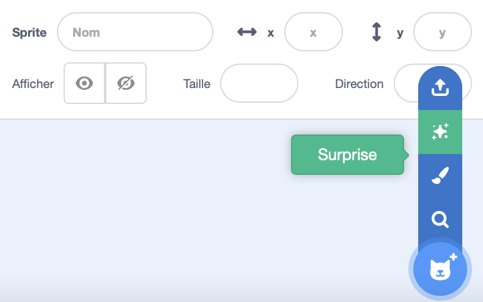
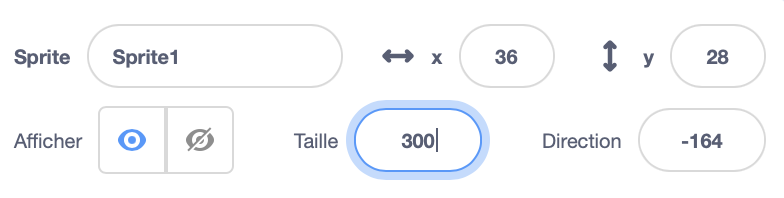

## Ton personnage

As-tu une idée de ton propre personnage ? Maintenant, tu peux le préparer pour les yeux idiots !

{:width="300px"}    

--- task ---

Open the [Silly eyes starter project](https://scratch.mit.edu/projects/582221984/editor){:target="_blank"}. Scratch s'ouvrira dans un autre onglet du navigateur.

[[[working-offline]]]

--- /task ---

--- task ---

**Choisis :** Choisis un sprite **ou** crée ton propre sprite simple dans l'éditeur de peinture.

Tu n'as pas à choisir une personne ou un animal. Tu peux choisir un objet, comme le donut.

[[[generic-scratch3-sprite-from-library]]]

[[[scratch3-backdrops-and-sprites-using-shapes]]]

--- collapse ---
---
title : Obtenir un sprite surprise
---

Tu ne sais pas quel sprite choisir ? Va dans le **Choisir un Sprite** et choisis l'option **Surprise** pour ajouter un sprite surprise dans ton projet.

--- /collapse ---

**Astuce :** Si tu crée ton propre sprite dans l'éditeur Paint, **n'ajoute pas encore des yeux, car ils doivent être des sprites séparés.**

--- /task ---

Pour le moment, ton personnage sera beaucoup plus petit que les personnages de nos exemples de projets. Tu peux agrandir ton personnage pour qu'il remplisse plus l'écran.

--- task ---

Dans le volet Sprite, remplace le nombre de la **Taille** par un nombre de ton choix.

{:width="500px"}

--- /task ---

Où veux-tu que ton personnage vive ?

--- task ---

**Choisir :** Choisis une toile de fond qui est raisonnable ou stupide.

[[[generic-scratch3-backdrop-from-library]]]

--- /task ---

--- save ---
