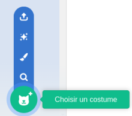
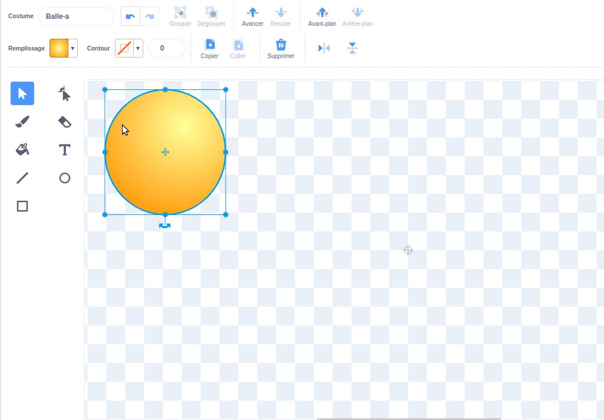

## Créer des yeux rigolos

<div style="display: flex; flex-wrap: wrap">
<div style="flex-basis: 200px; flex-grow: 1; margin-right: 15px;">
Crée des yeux rigolos ! Chaque œil doit être un sprite séparé afin qu'il puisse se déplacer séparément.

</div>
<div>


{:width="300px"}  

</div>
</div>

### Dessiner un globe oculaire

--- task ---

Utilise l'option **Peindre** pour créer un nouveau **sprite**.


L'éditeur de peinture s'ouvrira, ce qui te permettra de créer le costume du **globe oculaire**.

--- /task ---

Il est vraiment important que :
- La pupille noire et l'iris coloré se trouvent à droite du costume du **globe oculaire**
- Le **globe oculaire** soit centré

--- task ---

**Choisir :** Dessine un oeil **ou** commence à partir d'un sprite rond.


--- collapse ---
---
title: Dessiner un œil dans l'éditeur de peinture
---

Sélectionne l'outil **Cercle**.

Pour dessiner un cercle parfait, maintiens enfoncée la touche <kbd>majuscule</kbd> du clavier pendant que tu dessines avec l'outil **Cercle**. Si tu utilises une tablette, essaies de te rapprocher le plus possible d'un cercle parfait.

Dans cet exemple, nous définissons le **contour** sur noir et le **remplissage** du globe oculaire sur blanc :


Utilise les sélecteurs de couleur **remplissage** et **contour** pour choisir les couleurs. Pour faire du noir, fais glisser les curseurs **Saturation** et **Luminosité** à `0`. Pour faire du blanc, fais glisser le curseur **Saturation** à `0` et le curseur **Luminosité** à `100`.

 

Assure-toi que le globe oculaire est centré. Déplace-le de sorte que la croix bleue du costume s'aligne avec le réticule gris dans l'éditeur de peinture.


Dessine un cercle parfait plus petit et place-le sur le côté droit du globe oculaire :


Tu peux également dessiner des cercles à l'intérieur des cercles ou utiliser de la couleur pour obtenir différents effets.

--- /collapse ---

--- collapse ---
---
title: Transformer un costume rond en globe oculaire
---

Il existe des costumes dans Scratch que tu peux modifier pour créer des yeux rigolos pour ton personnage.


Clique sur l'icône **Choisir un costume** pour voir la bibliothèque de costumes Scratch.



Clique sur le costume que tu souhaites ajouter à ton sprite.

Utilise l'éditeur de peinture pour changer le costume. Tu peux ajouter des cercles, choisir une couleur de **remplissage** différente ou supprimer des parties du costume pour le transformer en œil rigolo.

Assure-toi que le globe oculaire est centré, déplace-le de sorte que la croix bleue du costume s'aligne avec le réticule gris dans l'éditeur de peinture.



**Astuce :** la pupille noire et l'iris coloré doivent être positionnés sur le côté droit du costume afin que le **globe oculaire** suive le pointeur de la souris.


--- /collapse ---

--- /task ---

--- task ---

Nomme ton sprite `globe oculaire` dans le panneau Sprite.


--- /task ---

--- task ---

Fais glisser le sprite **globe oculaire** pour le positionner sur la scène et modifie sa taille pour l'adapter à ton personnage.

--- /task ---

Maintenant, fais en sorte que le globe oculaire regarde le `pointeur de souris`{:class="block3motion"} pour que ton utilisateur puisse interagir avec ton projet.

<p style="border-left: solid; border-width:10px; border-color: #0faeb0; background-color: aliceblue; padding: 10px;">
<span style="color: #0faeb0">**Utilisateur**</span> désigne la personne qui utilise le projet (et pas seulement celle qui le réalise), et <span style="color: #0faeb0">**interaction de l'utilisateur**</span> est la façon dont le projet réagit aux actions de l'utilisateur, telles que déplacer la souris et cliquer sur l'écran. 
</p>

### Coder ton globe oculaire

--- task ---

Ajoute un script `fixer le sens de rotation`{:class="block3motion"} sur `360°`{:class="block3motion"} pour que le globe oculaire `s'oriente vers le pointeur de souris`{:class="block3motion"} `répéter indéfiniment`{:class="block3control"}.

--- collapse ---
---
title: Faire un sprite pointé vers le pointeur de la souris
---

```blocks3
when flag clicked
set rotation style [all around v]
forever
point towards (mouse-pointer v)
end
```

--- /collapse ---

--- /task ---

### Ajouter un autre globe oculaire

--- task ---

Pour ajouter un autre œil, fais un clic droit (ou sur une tablette, appuie et maintiens) sur le sprite **Globe oculaire** dans la liste Sprite et choisis **dupliquer**.


[[[scratch3-duplicate-sprite]]]

--- /task ---

### Tester tes yeux rigolos

--- task ---

**Test :** Clique sur le drapeau vert et teste ton projet. Les yeux rigolos suivent-ils le pointeur de ta souris lorsque tu déplaces la souris ?

**Astuce :** tu n'as pas besoin de laisser le pointeur de la souris sur la scène. Les yeux suivront le pointeur de ta souris pendant que tu continues à coder dans Scratch.

--- /task ---

--- task ---

**Débogage :** il est possible que tu trouves des bugs dans ton projet que tu dois corriger. Voici quelques bugs assez courants :

--- collapse ---
---
title: Les yeux ne bougent pas
---

Assure-toi d'avoir ajouté le code aux sprites **globe oculaire** et **quand le drapeau vert est cliqué**. Ton code ne s'exécutera pas tant que tu n'auras pas cliqué sur le drapeau vert.

--- /collapse ---

--- collapse ---
---
title: Les yeux pointent loin de la souris
---

Dans les costumes **globe oculaire**, vérifie que la pupille est du côté droit (au-delà de la croix bleue au milieu du costume).

Les sprites **globe oculaire** ont le `fixer le sens de rotation`{:class="block3motion"} sur `360°`{:class="block3motion"}, ils peuvent donc pivoter dans n'importe quelle direction.

Lorsque les **globes oculaires** tournent pour `pointer vers`{:class="block3motion"} le `pointeur de la souris`{:class="block3motion"}, les pupilles seront les plus proches du pointeur de la souris.


--- /collapse ---

--- collapse ---
---
title: Les yeux sautent sur la scène
---

Vérifie que les costumes **globe oculaire** sont centrés. Pour centrer un costume, fais glisser le costume de sorte que la croix bleue du costume s'aligne avec le réticule gris dans l'éditeur de peinture.


--- /collapse ---

--- collapse ---
---
title: Le personnage est devant les yeux
---

Lorsque tu fais glisser un sprite pour le positionner sur la scène, il se déplace devant les autres sprites.

Pour que ton sprite **personnage** reste à l'`arrière`{:class="block3looks"}, utilise :

```blocks3
when green flag clicked
forever
go to [back v] layer // derrière tous les autres sprites
```

--- /collapse ---

--- collapse ---
---
title: Le personnage et les yeux suivent le pointeur de la souris
---

As-tu ajouté les yeux comme costumes pour ton **personnage** au lieu de costumes pour des sprites séparés ? Tu peux corriger cela.

Une façon de résoudre ce problème est de dupliquer le sprite **personnage**, puis de renommer la copie `globe oculaire`. Ensuite, supprime les costumes **globe oculaire** du sprite **personnage** et supprime les costumes **personnage** du sprite **globe oculaire**. Ensuite, tu peux dupliquer le sprite **globe oculaire** et nommer la copie `globe oculaire 2`.

Le code `s'orienter vers`{:class="block3motion"} le `pointeur de souris`{:class="block3motion"} doit être sur le sprite **globe oculaire** et non sur le sprite **personnage**.

--- /collapse ---

--- collapse ---
---
title: Le personnage suit le pointeur de la souris (et pas les yeux)
---

Tu dois ajouter le code `s'orienter vers`{:class="block3motion"} aux sprites **globe oculaire** individuels, pas à ton sprite **personnage** !

Pour copier le code, tu peux faire glisser le code de la zone Code pour ton **personnage** vers les sprites **globe oculaire** dans la liste Sprite.

Tu dois également supprimer le script du sprite **personnage**. Pour ce faire, fais glisser le script vers le menu Blocs.

--- /collapse ---

Tu pourrais trouver un bug qui n'est pas répertorié ici. Peux-tu trouver comment le résoudre ?

Nous aimons avoir des nouvelles de tes bugs et de la façon dont tu les as corrigés. Utilise le bouton **Envoyer des commentaires** en bas de cette page et dis-nous si tu as trouvé un bug différent dans ton projet.

--- /task ---
