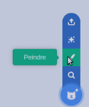
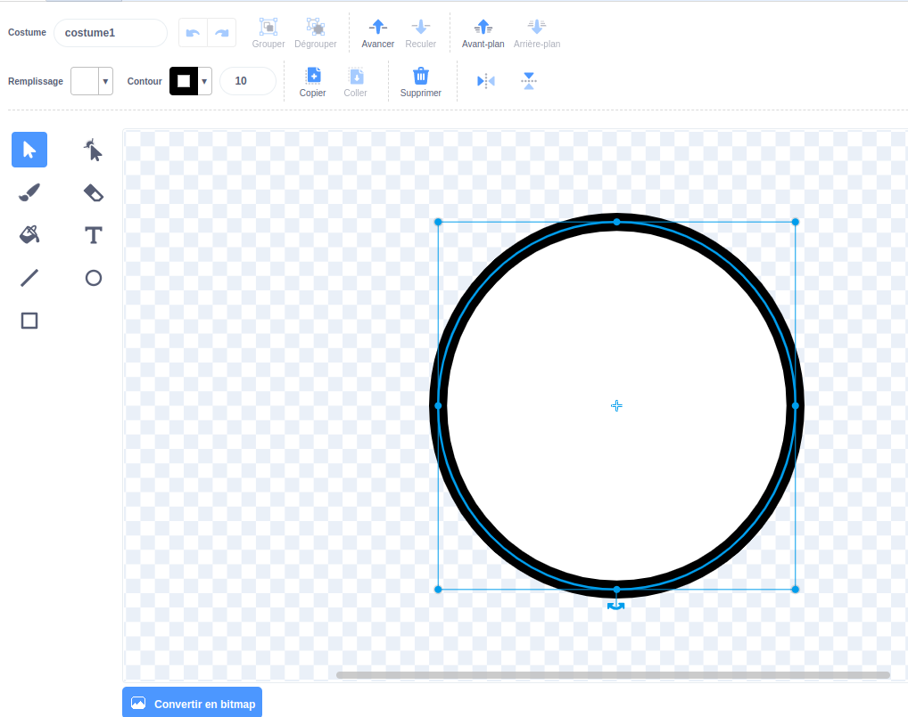
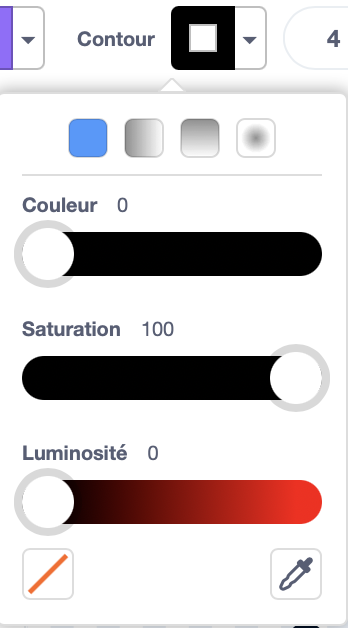
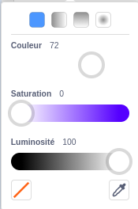
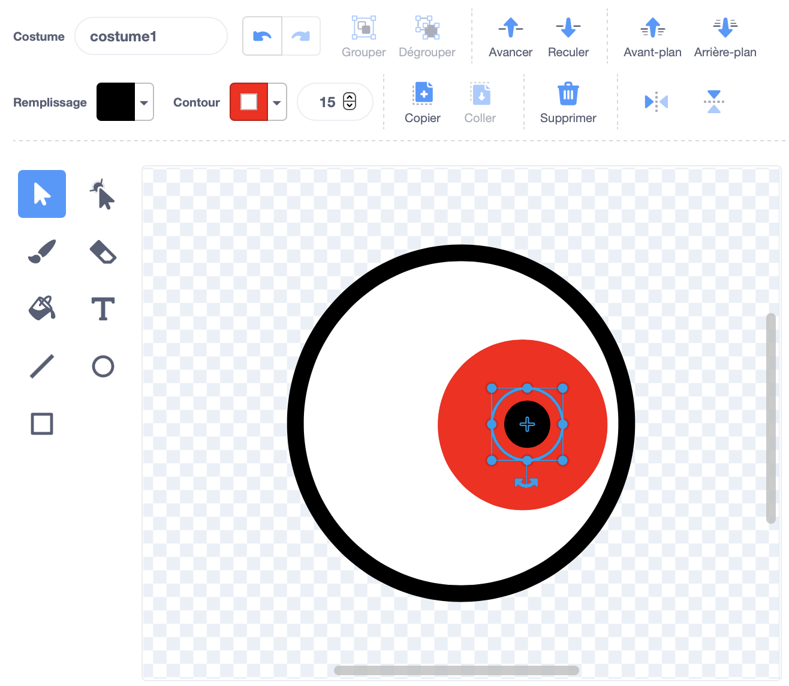
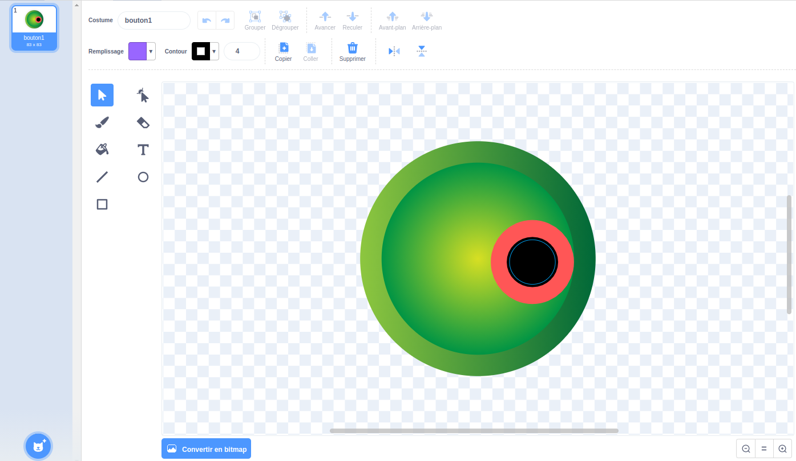
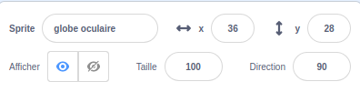
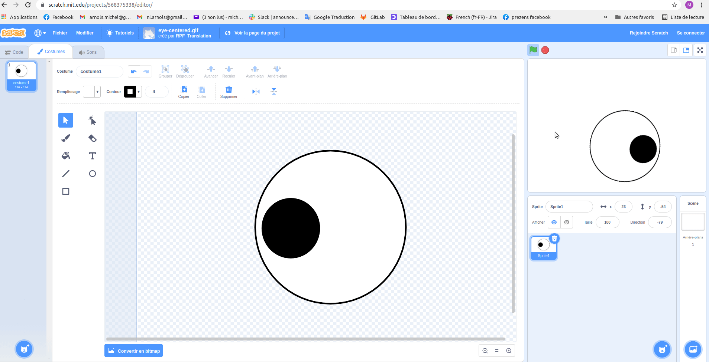
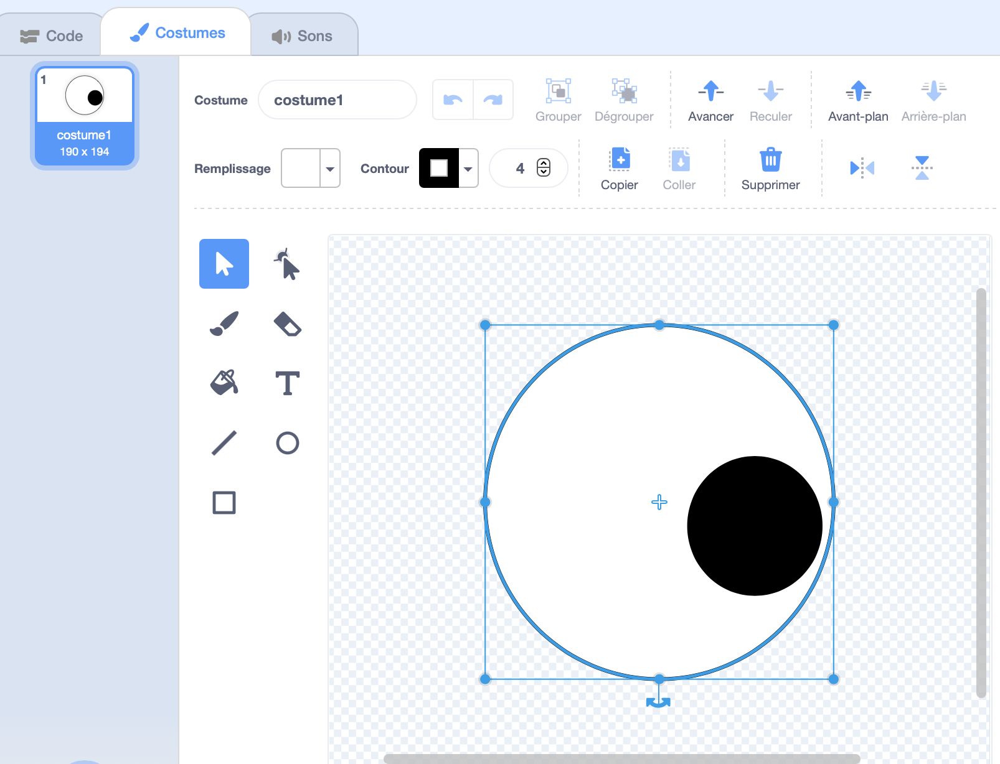
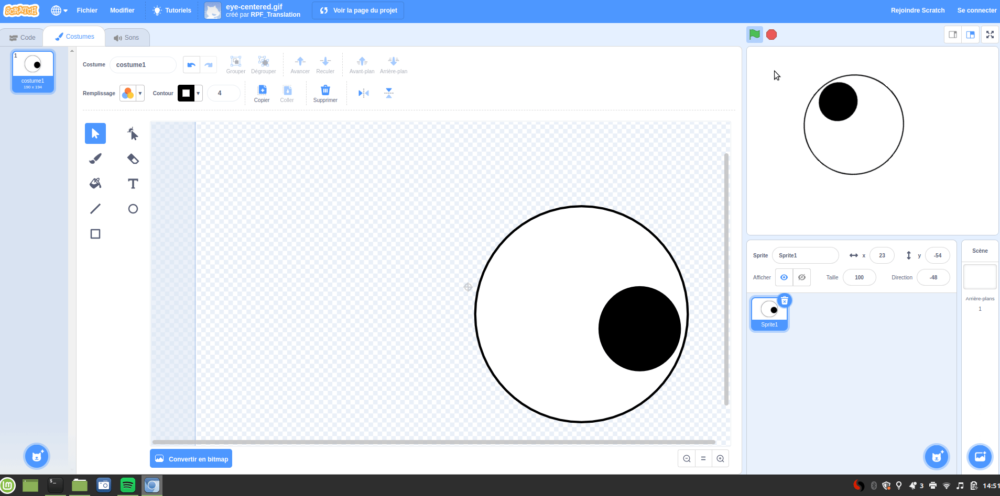

## Faire des yeux idiots

<div style="display: flex; flex-wrap: wrap">
<div style="flex-basis: 200px; flex-grow: 1; margin-right: 15px;">
Dans cette étape, tu feras les yeux idiots ! Chaque œil doit être un sprite séparé afin qu'il puisse se déplacer séparément.

Si tu as besoin d'aide, consulte les conseils de la tâche **Débogage** au bas de cette étape.
</div>
<div>


{:width="300px"}  

</div>
</div>

--- task ---

Utilise le **Peindre** pour créer un nouveau **sprite**.



L'éditeur de peinture s'ouvrira, ce qui te permettra de créer le costume de **globe oculaire**.

--- /task ---

Il est vraiment important que :
- La pupille noire et l'iris coloré fassent face à droite du costume **globe oculaire**
- Le **globe oculaire** soit centré

--- task ---

**Choisir :** Dessine un oeil **ou** commence à partir d'un sprite rond.

--- collapse ---
---
title : Dessine un oeil dans l'éditeur de peinture
---

Sélectionne l'outil **Cercle**.

Pour dessiner un cercle parfait, maintiens enfoncée la touche <kbd>majuscule</kbd> du clavier pendant que tu dessines avec l'outil **Cercle**. Si tu utilises une tablette, essaies de te rapprocher le plus possible d'un cercle parfait.

Dans cet exemple, nous définissons le **contour** sur noir et le **remplissage** du globe oculaire sur blanc :



Utilise les **remplissage** et **contour** pour choisir les couleurs. Pour faire du noir, faites glisser à la fois **Saturation** et **Luminosité** à `0`. Pour faire du blanc, fais glisser le **Saturation** à `0` et le **Luminosité** à `100`.

 

Assure-toi que le globe oculaire est centré – déplace-le de sorte que la croix bleue du costume s'aligne avec le réticule gris dans l'éditeur de peinture.

Dessine un cercle parfait plus petit et place-le sur le côté droit du globe oculaire :



Tu peux également dessiner des cercles à l'intérieur des cercles ou utiliser de la couleur pour obtenir différents effets.

--- /collapse ---


--- collapse ---
---
title : Transforme un costume rond en globe oculaire
---

Il existe des costumes dans Scratch que tu peux modifier pour faire des yeux idiots pour ton personnage.

Utilise l'éditeur de peinture pour changer un costume. Tu peux ajouter des cercles, choisir un **remplissage** différent ou supprimer des parties du costume pour le transformer en un œil idiot.

**Astuce :** Tu dois centrer le **globe oculaire** dans l'éditeur de peinture afin qu'il tourne en douceur lorsqu'il tourne. Utilise le réticule pour centrer le costume. La pupille noire et l'iris coloré doivent être positionnés sur le côté droit du costume afin que le **globe oculaire** suive le pointeur de la souris.




--- /collapse ---

--- /task ---

--- task ---

Nomme ton sprite `globe oculaire` dans le volet Sprite.



--- /task ---

--- task ---

Fais glisser le **globe oculaire** pour le positionner sur la scène et modifie sa taille pour l'adapter à ton personnage.

--- /task ---

Maintenant, fais en sorte que le globe oculaire regarde le `pointeur de souris`{:class="block3motion"}.

--- task ---

Ajoute un script à `fixer le sens de rotation`{:class="block3motion"} sur `gauche-droite`{:class="block3motion"} pour que le globe oculaire `s'orienter vers le pointeur de la souris`{:class="block3motion"} `répéter indéfiniment`{:class="block3control"}.

--- collapse ---
---
title: Faire un sprite pointé vers le pointeur de la souris
---

```blocks3
when flag clicked
set rotation style [all around v]
forever
point towards (mouse-pointer v)
end
```

--- /collapse ---

--- /task ---


Si ton personnage n'a qu'un œil, alors tu as terminé.

--- task ---

Sinon, fais un clic droit (ou sur une tablette, appuie et maintiens) sur le **globe oculaire** dans la liste Sprite et choisis **dupliquer** pour créer des yeux plus idiots.

[[[scratch3-duplicate-sprite]]]

--- /task ---

--- task ---

**Test :** Clique sur le drapeau vert et teste ton projet. Les yeux idiots suivent-ils le pointeur de ta souris lorsque tu déplaces la souris ?

**Astuce :** Tu n'as pas besoin de laisser le pointeur de la souris sur la scène. Les yeux suivront le pointeur de ta souris pendant que tu continues à coder dans Scratch.

--- /task ---

--- task ---

**Débogage :** Il est possible que tu trouves des bogues dans ton projet que tu dois corriger. Voici quelques bogues assez courants :

--- collapse ---
---
title : Les yeux ne bougent pas
---

Assure-toi d'avoir ajouté le code aux sprites **globe oculaire** et **quand le drapeau vert est cliqué**. Ton code ne s'exécutera pas tant que tu n'auras pas cliqué sur le drapeau vert.

--- /collapse ---

--- collapse ---
---
title : Les yeux pointent loin de la souris
---

Dans les **globe oculaire** , vérifie que la pupille est du côté droit (au-delà de la croix bleue au milieu du costume).

Les **globe oculaire** ont le `gauche-droit`{:class="block3motion"} `fixer le sens de rotation`{:class="block3motion"}, ils peuvent donc pivoter dans n'importe quelle direction.

Lorsque les **globes oculaires** tournent à `s'orienter vers`{:class="block3motion"} le `pointeur de souris`{:class="block3motion"}, les pupilles seront les plus proches du pointeur de la souris.





--- /collapse ---

--- collapse ---
---
title : Les yeux sautent sur la scène
---

Vérifie que les **globe oculaire** sont centrés. Pour centrer un costume, fais glisser le costume de sorte que la croix bleue du costume s'aligne avec le réticule gris dans l'éditeur de peinture.




--- /collapse ---

--- collapse ---
---
title : Le personnage est devant les yeux
---

Lorsque tu fais glisser une image-objet pour la positionner sur la scène, elle se déplace devant les autres images-objets.

Pour que ton sprite de **personnage** reste `derrière`{:class="block3looks"}, utilise :

```blocks3
when green flag clicked
forever
go to [back v] layer // behind all other sprites
```

--- /collapse ---

--- collapse ---
---
title : Le personnage et les yeux suivent le pointeur de la souris
---

As-tu ajouté les yeux comme costumes pour ton **personnage** au lieu de costumes pour des sprites séparés ? Tu peux corriger cela.

Une façon de résoudre ce problème est de dupliquer le **personnage** , puis de renommer la copie `globe oculaire`. Ensuite, supprime les costumes **globe oculaire** depuis les sprites **personnages** et supprime les costumes de **personnages** du sprite depuis le sprite **globe oculaire**. Ensuite, tu peux dupliquer le **globe oculaire** et nommer la copie `globe oculaire 2`.

Le code à `s'orienter vers`{:class="block3motion"} le `pointeur de souris`{:class="block3motion"} doit être sur le sprite ** globe oculaire** et non sur le sprite **personnage**.

--- /collapse ---

--- collapse ---
---
title : Le personnage suit le pointeur de la souris (et pas les yeux)
---

Tu dois ajouter le `s'orienter vers`{:class="block3motion"} aux sprites** globe oculaire** individuels, pas à ton sprite **personnage ** !

Pour copier le code, tu peux faire glisser le code de la zone Code pour ton **personnage** vers les sprites** globe oculaire** dans la liste Sprite.

Tu dois également supprimer le script du sprite **personnage**. Pour ce faire, fais glisser le script vers le menu Blocs.

--- /collapse ---

Tu pourrais trouver un bogue qui n'est pas répertorié ici. Peux-tu trouver comment le réparer?

Nous aimons avoir des nouvelles de tes bogues et de la façon dont tu les as corrigés. Utilise le bouton **Envoyer des commentaires** en bas de cette page et dis-nous si tu as trouvé un bogue différent dans ton projet.


--- /task ---

--- save ---
