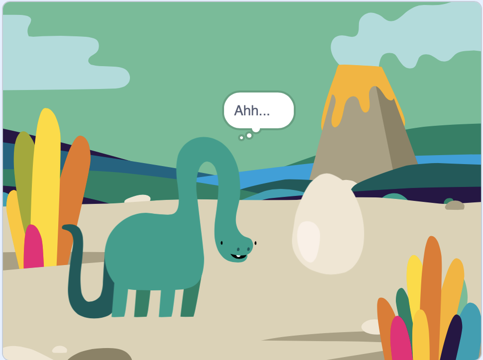

## Et ensuite ?

Si tu suis le [Introduction à Scratch](https://projects.raspberrypi.org/en/pathways/scratch-intro) , tu peux passer à [Surprise ! animation](https://projects.raspberrypi.org/en/projects/surprise-animation) projet. Dans ce projet, tu feras une animation d'une histoire avec une surprise.

--- print-only ---

--- /print-only ---

--- no-print ---

Clique sur le drapeau vert pour voir l'animation :

  <iframe allowtransparency="true" width="485" height="402" src="https://scratch.mit.edu/projects/embed/495932563/?autostart=false" frameborder="0"></iframe>

--- /no-print ---

Si tu veux t'amuser davantage à explorer Scratch, tu peux essayer l'un de [ces projets](https://projects.raspberrypi.org/en/projects?software%5B%5D=scratch&curriculum%5B%5D=%201).

