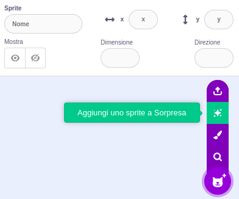
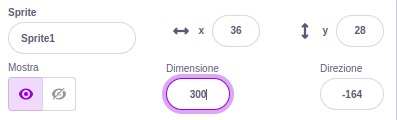
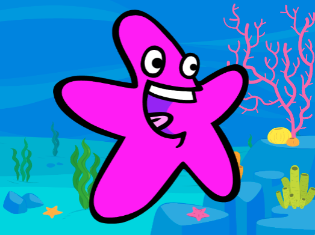

## Il tuo personaggio

Usa le tue capacità di progettista per aggiungere uno sprite al tuo personaggio e uno sfondo adatto. 

{:width="300px"}    

**Progettare** significa decidere l'aspetto di un progetto e prendere decisioni su ciò che fa. 

### Apri il progetto iniziale

--- task ---

Apri [il progetto iniziale Occhi buffi](https://scratch.mit.edu/projects/582221984/editor){:target="_blank"}. Scratch si aprirà in una nuova scheda del browser.

[[[working-offline]]]

⏱️ Hai poco tempo? Puoi iniziare da uno degli [esempi](https://scratch.mit.edu/studios/29029028){:target="_blank"}.

--- /task ---

### Scegli il tuo sprite e lo sfondo

--- task ---

**Scegli:** Aggiungi uno **sprite** e uno **sfondo** per il tuo progetto occhi buffi.

+ Che aspetto ha il tuo personaggio? Una persona 🧜🏽‍♀️, un animale 🐶 o un oggetto 🧸.
+ Dove vive il tuo personaggio? In un posto sensato 🏠 o buffo 🎪.

[[[generic-scratch3-sprite-from-library]]]

[[[generic-scratch3-backdrop-from-library]]]

[[[scratch3-backdrops-and-sprites-using-shapes]]]

--- collapse ---
---
title: Scegli uno sprite a sorpresa
---

Non sei sicuro di quale sprite scegliere? Vai al menu **Scegli uno Sprite** e scegli l'opzione **Aggiungi uno Sprite a Sorpresa** per aggiungere uno sprite a sorpresa al tuo progetto.

--- /collapse ---

**Suggerimento:** Se crei il tuo sprite nell'editor Paint, **non aggiungere ancora gli occhi, perché devono essere degli sprite separati.**

--- /task ---

### Ridimensiona il tuo sprite

--- task ---

Nel pannello degli Sprite, scegli un numero per la proprietà **Dimensione** che permetta al tuo personaggio di riempire lo Stage.

{:width="500px"}

--- /task ---

--- task ---

Guarda lo Stage. Vedrai il tuo personaggio grande e lo sfondo scelto.

{:width="500px"}

--- /task ---
