## Crea degli occhi buffi

<div style="display: flex; flex-wrap: wrap">
<div style="flex-basis: 200px; flex-grow: 1; margin-right: 15px;">
Crea degli occhi buffi! Ogni occhio deve essere uno sprite separato in modo che possa muoversi separatamente.

</div>
<div>


{:width="300px"}  

</div>
</div>

### Disegna un bulbo oculare

--- task ---

Usa lo strumento **Disegna** per creare un nuovo **sprite**.

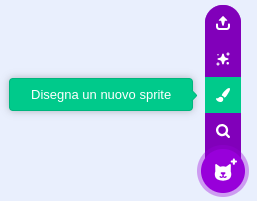

Si aprirà l'editor Paint, che ti permetterà di creare il costume dello sprite del tuo **bulbo oculare**.

--- /task ---

È molto importante che:
- La pupilla nera e l'iride colorata siano rivolte verso il lato destro del costume **bulbo oculare**
- Il costume **bulbo oculare** sia centrato

--- task ---

**Scegli:** Disegna un bulbo oculare **o** comincia da uno sprite rotondo.


--- collapse ---
---
title: Disegna un bulbo oculare con l'editor Paint
---

Seleziona lo strumento **Cerchio**.

Per disegnare un cerchio perfetto, tieni premuto il tasto <kbd>Shift</kbd> sulla tastiera mentre disegni con lo strumento **Cerchio**. Se usi un tablet, cerca di avvicinarti il più possibile a un cerchio perfetto.

In questo esempio, impostiamo **Contorno** su nero e il **Riempimento** del bulbo oculare su bianco:

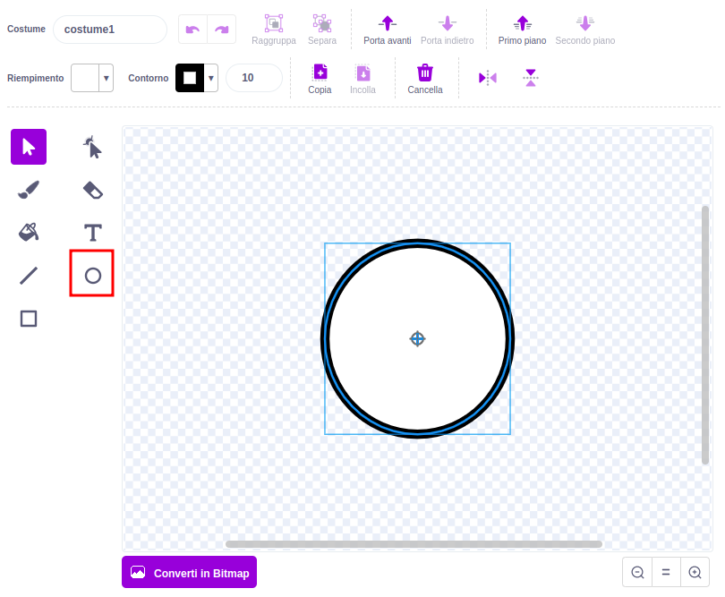

Utilizza i selettori colore **Riempimento** e **Contorno** per scegliere i colori. Per creare il nero, metti sia **Saturazione** che **Luminosità** a `0`. Per creare il bianco, metti **Saturazione** a `0` e **Luminosità** a `100`.

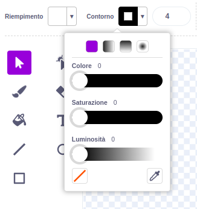 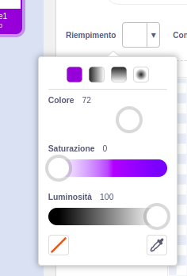

Assicurati che il bulbo oculare sia centrato - spostalo in modo che la croce blu nel costume si allinei con il mirino grigio nell'editor Paint.


Disegna un cerchio perfetto più piccolo e posizionalo sul lato destro del bulbo oculare:

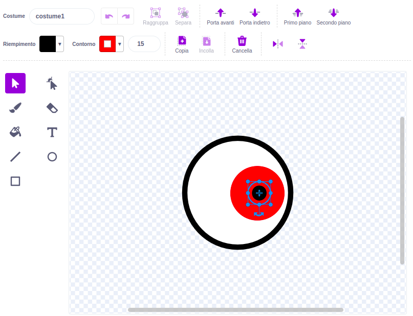

Potresti anche disegnare altri cerchi all'interno di cerchi o usare i colori per ottenere effetti diversi.

--- /collapse ---

--- collapse ---
---
title: Trasforma il tuo costume in un bulbo oculare
---

Ci sono costumi in Scratch che puoi modificare per creare occhi buffi per il tuo personaggio.


Clicca sull'icona **Scegli un Costume** per vedere la libreria dei costumi Scratch.

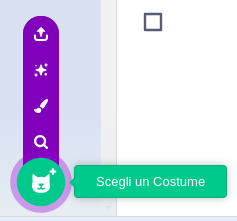

Clicca sul costume che vuoi aggiungere al tuo sprite.

Usa l'editor Paint per cambiare il costume. Potresti aggiungere cerchi, scegliere un colore **Riempimento** diverso o togliere parti del costume per trasformarlo in un occhio buffo.

Assicurati che il bulbo oculare sia centrato - spostalo in modo che la croce blu nel costume si allinei con il mirino grigio nell'editor Paint.

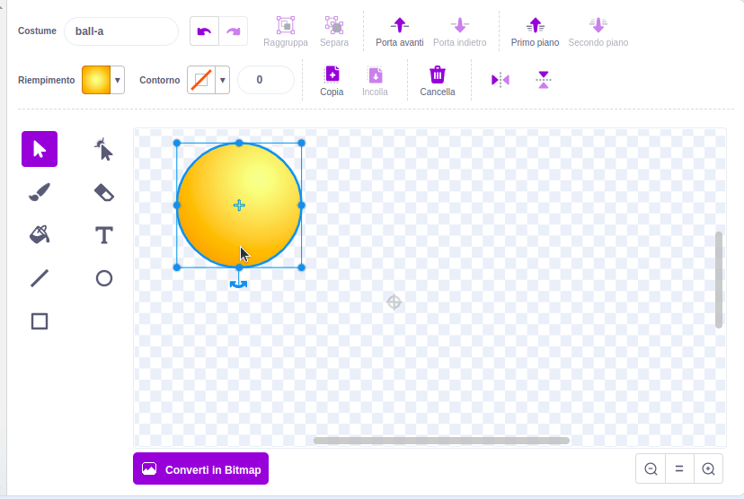

**Suggerimento:** La pupilla nera e l'iride colorata devono essere posizionate sul lato destro del costume in modo che il **Bulbo oculare** segua il puntatore del mouse.


--- /collapse ---

--- /task ---

--- task ---

Dai un nome al tuo sprite `Bulbo oculare` nel riquadro Sprite.

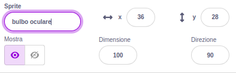

--- /task ---

--- task ---

Trascina lo sprite **Bulbo oculare** per posizionarlo sullo stage e modificarne le dimensioni per adattarlo al tuo personaggio.

--- /task ---

Ora, fai in modo che il bulbo oculare guardi il `puntatore del mouse`{:class="block3motion"}, così l'utente potrà interagire con il tuo progetto.

<p style="border-left: solid; border-width:10px; border-color: #0faeb0; background-color: aliceblue; padding: 10px;">
<span style="color: #0faeb0">**Utente**</span> (User) indica la persona che utilizza il progetto (non solo lo realizza) e <span style="color: #0faeb0">**Interazione dell'utente**</span> (User Interaction) è il modo in cui il progetto reagisce alle azioni dell'utente, ad esempio spostare il mouse e fare clic sullo schermo. 
</p>

### Scrivi il codice per il tuo bulbo oculare

--- task ---

Aggiungi uno script su `usa stile rotazione`{:class="block3motion"} su `può ruotare`{:class="block3motion"} per fare in modo che il bulbo oculare `punta verso puntatore del mouse`{:class="block3motion"} `per sempre`{:class="block3control"}.

--- collapse ---
---
title: Fai puntare uno sprite verso il puntatore del mouse
---

```blocks3
when flag clicked
set rotation style [all around v]
forever
point towards (mouse-pointer v)
end
```

--- /collapse ---

--- /task ---

### Aggiungi un altro bulbo oculare

--- task ---

Per aggiungere un altro occhio, fai clic con il pulsante destro del mouse (o su un tablet, tocca e tieni premuto) sullo sprite **Bulbo oculare** nell'elenco degli Sprite e scegli **duplica**.


[[[scratch3-duplicate-sprite]]]

--- /task ---

### Metti alla prova i tuoi occhi buffi

--- task ---

**Prova:** Clicca sulla bandierina verde e prova il tuo progetto. Gli occhi buffi seguono il puntatore del mouse mentre muovi il mouse?

**Suggerimento:** Non è necessario mantenere il puntatore del mouse sullo stage. Gli occhi seguiranno il puntatore del tuo mouse mentre continui a programmare in Scratch.

--- /task ---

--- task ---

**Debug:** Potresti trovare alcuni bug nel tuo progetto che devi correggere. Ecco alcuni bug comuni:

--- collapse ---
---
title: Gli occhi non si muovono
---

Assicurati di aver aggiunto il codice agli sprite **Bulbo oculare** e di ** aver cliccato sulla bandierina verde**. Il tuo codice non verrà eseguito finché non fai clic sulla bandierina verde.

--- /collapse ---

--- collapse ---
---
title: Gli occhi puntano lontano dal mouse
---

Nei costumi **Bulbo oculare**, controlla che la pupilla sia sul lato destro (oltre la croce blu al centro del costume).

Gli sprite **Bulbo oculare** hanno lo `stile di rotazione`{:class="block3motion"} `può ruotare`{:class="block3motion"}, quindi possono ruotare in qualsiasi direzione.

Quando i **bulbi oculari** ruotano per `puntare verso`{:class="block3motion"} il `puntatore del mouse`{:class="block3motion"}, le pupille saranno più vicine al puntatore del mouse.

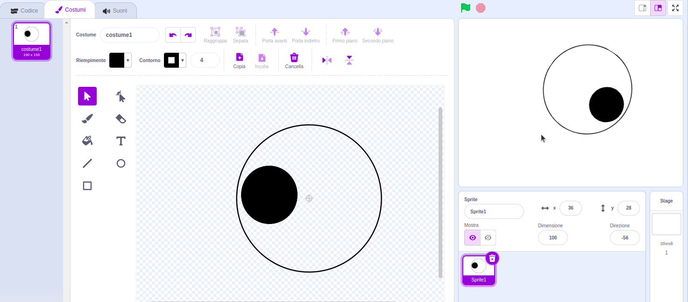

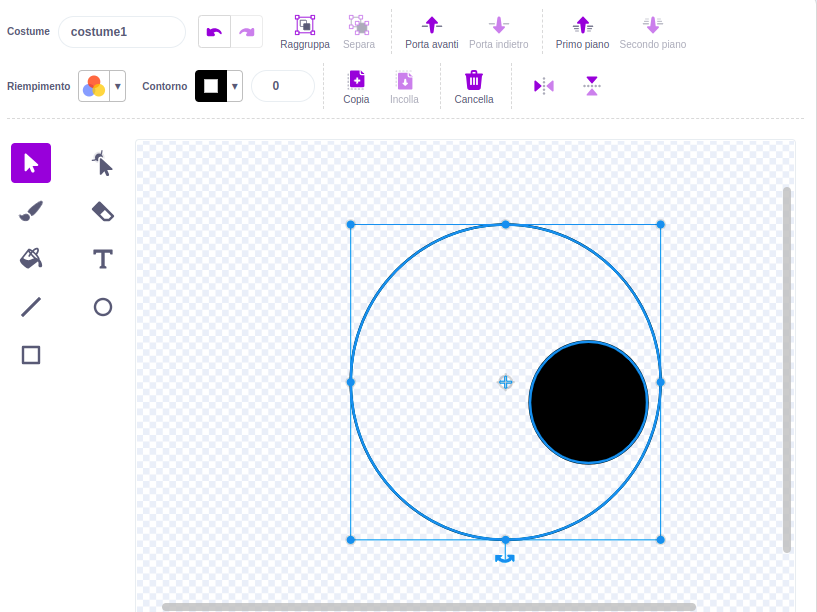

--- /collapse ---

--- collapse ---
---
title: Gli occhi saltellano intorno allo Stage
---

Controlla che i costumi del **bulbo oculare** siano centrati. Per centrare un costume, trascina il costume in modo che la croce blu nel costume si allinei con il mirino grigio nell'editor Paint.

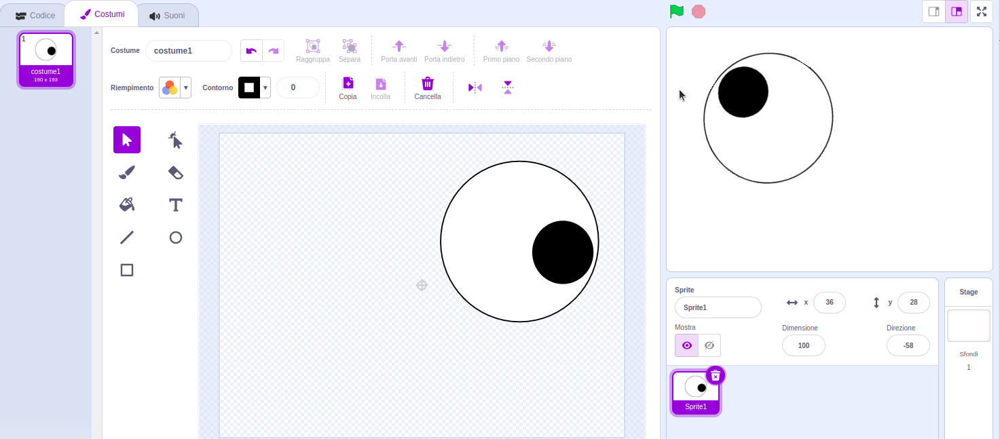


--- /collapse ---

--- collapse ---
---
title: Il personaggio è davanti agli occhi
---

Quando trascini uno sprite per posizionarlo sullo Stage, si sposta davanti agli altri sprite.

Per fare in modo che il tuo sprite **personaggio** rimanga al `in secondo piano`{:class="block3looks"}, usa:

```blocks3
when green flag clicked
forever
go to [back v] layer // behind all other sprites
```

--- /collapse ---

--- collapse ---
---
title: Il personaggio e gli occhi seguono il puntatore del mouse
---

Hai aggiunto gli occhi come costumi per il tuo **personaggio** invece che come costumi per sprite singoli? Puoi sistemarlo.

Un modo per sistemarlo è duplicare lo sprite del **personaggio** e poi rinominare la copia in`Bulbo oculare`. Poi, elimina i costumi **bulbo oculare** dallo sprite del **personaggio** ed elimina i costumi del **personaggio** dallo sprite **Bulbo oculare**. Poi, puoi duplicare lo sprite **Bulbo oculare** e nominare la copia `Bulbo oculare 2`.

Il codice per `puntare verso`{:class="block3motion"} il `puntatore del mouse`{:class="block3motion"} dovrebbe essere sugli sprite **Bulbo oculare** e non sullo sprite del **personaggio**.

--- /collapse ---

--- collapse ---
---
title: Il personaggio segue il puntatore del mouse (e gli occhi no)
---

Devi aggiungere il codice `punta verso`{:class="block3motion"} ai singoli sprite **Bulbo oculare**, non al tuo sprite del **personaggio**!

Per copiare il codice, puoi trascinare il codice dall'area Codice del tuo **personaggio** agli sprite **bulbo oculare** nell'elenco Sprite.

Dovrai anche eliminare lo script dallo sprite del **personaggio**. Per farlo, trascina lo script nel menu dei blocchi.

--- /collapse ---

Potresti trovare un bug che non è elencato qui. Puoi capire come risolverlo?

Adoriamo saperne di più sui tuoi bug e su come li hai risolti. Utilizza il pulsante **Invia feedback** in fondo a questa pagina e comunicaci se hai trovato un bug diverso nel tuo progetto.

--- /task ---
