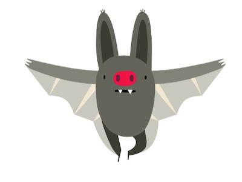
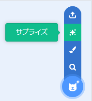
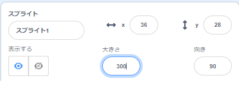

## あなたのキャラクター

あなたの想像力を働かせて、キャラクタースプライトと背景を追加しましょう。 

{:width="300px"}    

**デザイン**とは、プロジェクトの見た目と動きを決めることです。 

### スタータープロジェクトを開きましょう

--- task ---

[おかしな目のスタータープロジェクト](https://scratch.mit.edu/projects/582221984/editor){:target="_blank"}を開きます。 Scratchはブラウザの別のタブで開きます。

[[[working-offline]]]

ゆっくりやる時間がないですか？ 忙しい人向けにプロジェクトの[例](https://scratch.mit.edu/studios/29029028){:target="_blank"}を用意しました。

--- /task ---

### スプライトと背景を選びましょう

--- task ---

**選択します:** 愚かな目プロジェクトに **スプライト** と **背景** を追加します。

+ あなたは、あなたのキャラクターについてのアイディアを持っていますか？ 人🧜🏽‍♀️や動物🐶、物🧸でもいいです。
+ キャラクターをどこに住まわせたいですか？ おしゃれな場所や、逆に変な場所でもいいかもしれません。

[[[generic-scratch3-sprite-from-library]]]

[[[generic-scratch3-backdrop-from-library]]]

[[[scratch3-backdrops-and-sprites-using-shapes]]]

--- collapse ---
---
title: サプライズスプライトを入手
---

どのスプライトを選択すればよいかわからない場合は？ **スプライトを選ぶ** メニューに移動し、 **サプライズ** オプションを選択して、プロジェクトにサプライズスプライトを追加します。

--- /collapse ---

**選択：** スプライトを選択 **または** ペイントエディタで簡単なスプライトを作成します。

--- /task ---

### スプライトの大きさを変更

--- task ---

[スプライト] ペインで、[ **サイズ** プロパティの数値を任意の数値に変更します。

{:width="500px"}

--- /task ---

--- task ---

ステージを見ると、 大きなキャラクターと背景が選ばれていることを確認できると思います。

{:width="500px"}

--- /task ---
