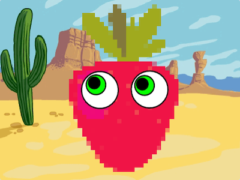

## スプライト効果

<div style="display: flex; flex-wrap: wrap">
<div style="flex-basis: 200px; flex-grow: 1; margin-right: 15px;">
**キャラクター**スプライトと**おかしな目**スプライトをクリックすると、それらの `見た目` {:class=" block3looks "}を変更できます。
</div>
<div>

{:width="300px"}    

</div>
</div>

### おかしな目の効果

--- task ---

追加 `このスプライトがクリックされたとき`{:class="block3events"}ブロックを **目玉** スプライトに追加します。

**目玉** スプライトをクリックしたときに、スプライトの目の色を変更するために下に配置するコードブロックを理解できますか？

--- collapse ---
---
title: スプライトがクリックされたらグラフィック効果を変更する
---

```blocks3
when this sprite clicked  
change [color v] effect by (25)
```

--- /collapse ---

--- /task ---

--- task ---

両方の目玉に同じ効果を持たせたい場合は、スクリプトを **目玉2** スプライトにコピーする必要があります。

[[[scratch3-copy-code]]]

--- /task ---

### キャラクター効果

--- task ---

スプライトリストで**キャラクター** スプライトをクリックしてから、[ **コード**] タブをクリックします。

目の色を変更するために使用したのと同じスクリプトを追加します。 **キャラクター**に対してどのグラフィック効果を変更しますか？

**選択：** `[色v]の効果を(0)にする`{:class="block3looks"}ブロック内のドロップダウンメニューで効果を選択します。 好きな変更ができるまで、数字を試してみてください。

[[[scratch3-graphic-effects]]]

--- /task ---

### アクセサリー

次に、帽子など、クリックすると変化する **アクセサリ**を追加します。 ー `次のコスチュームにする`{:class="block3looks"}ブロックを使用します。

--- task ---

**選択：** 好みのアクセサリーの変化またはコスチュームの変化を追加します。


--- collapse ---
---
title: クリックしたときにスプライトのコスチュームを変える
---
<div class="scratch-preview">
<iframe allowtransparency="true" width="485" height="402" src="" frameborder="0"></iframe>
</div>

一部のスプライトにはすでにコスチュームの選択肢があります。

スプライトをクリックしたときにスプライトのコスチュームを `次のコスチューム`{:class="block3looks"}に変更するコードを追加できます。

```blocks3
when this sprite clicked
next costume
```

--- /collapse ---

スプライトにコスチュームの選択肢がない場合、またはさらに追加したい場合は、スプライトに任意のコスチュームを追加できます。

[[[scratch3-add-costumes-to-a-sprite]]]

--- /task ---

--- task ---

**テスト:** スプライトが希望どおりに変化するまで、スプライトの設定をします。

**ヒント:** 一度に1つの変更を試し、それがどうなるかをテストします。変更したところを簡単に見つけて、気に入らない場合に元に戻すことができるようにするためです。

--- /task ---

--- task ---

**デバッグ：**

間違ったスプライトにコードを追加した場合、以下のように問題を修正できます。

[[[scratch3-copy-code]]]

必要に応じて、グラフィック効果をリセットできます。

--- collapse ---
---
title: これらのグラフィック効果は必要ありません
---

グラフィック効果をリセットするには、いつでも、 `見た目`{:class="block3looks"}ブロックメニューの `画像効果をなくす`{:class="block3looks"}ブロックをクリックします。 緑の旗をクリックしても、グラフィック効果をクリアできます。

```blocks3
clear graphic effects
```
--- /collapse ---

--- /task ---

--- task ---

**テスト:** プロジェクトをもう一度テストしますが、今回は全画面表示にして、プロジェクトを見ている人にどのように表示されるかを確認します。

[[[scratch3-full-screen]]]

--- /task ---

<p style="border-left: solid; border-width:10px; border-color: #0faeb0; background-color: aliceblue; padding: 10px;">
プロジェクトを全画面表示にすることで、作成したものをプロジェクトで遊んでいるユーザーの視点から見ることができます。 **ユーザー インタラクション**は、デジタル工作において重要です。 
</p>


