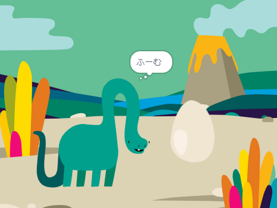

## 次は何をしますか？

[スクラッチ入門](https://projects.raspberrypi.org/ja-JP/pathways/scratch-intro) 経路をたどっている場合は [サプライズ! アニメーション](https://projects.raspberrypi.org/en/projects/surprise-animation) プロジェクトに進むことができます。 このプロジェクトでは、驚きのストーリーのアニメーションを作成します。 

--- print-only ---

--- /print-only ---

--- no-print ---

アニメーションを見るには、緑色の旗をクリックしてください。

  <iframe allowtransparency="true" width="485" height="402" src="https://scratch.mit.edu/projects/embed/495932563/?autostart=false" frameborder="0"></iframe>

--- /no-print ---

スクラッチをより探索してみたい場合は、 [これらのプロジェクト](https://projects.raspberrypi.org/ja-JP/projects?software%5B%5D=scratch&curriculum%5B%5D=%201)のいずれか試してみることができます。

***
このプロジェクトは以下のボランティアによって翻訳されました。

東 文彦
大野 雅利

ボランティアのおかげで、世界中の人々に母国語で学ぶ機会を与えることができます。翻訳を引き受けていただくことで、より多くの人々に手を差し伸べることができます。詳しくは [rpf.io/translate](https://rpf.io/translate) をご覧ください。
