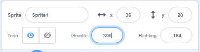

## Jouw personage

Heb je een idee voor je eigen personage? Nu kun je het klaarmaken voor maffe ogen!

{:width="300px"}    

--- task ---

Open het [Maffe ogen startproject](https://scratch.mit.edu/projects/582221984/editor){:target="_blank"}. Scratch wordt in een nieuw browsertabblad geopend.

[[[working-offline]]]

--- /task ---

--- task ---

**Kies:** Kies een sprite **of** maak je eigen eenvoudige sprite in de Paint-editor.

Je hoeft geen persoon of dier te kiezen. Je zou een voorwerp kunnen kiezen, zoals de donut.

[[[generic-scratch3-sprite-from-library]]]

[[[scratch3-backdrops-and-sprites-using-shapes]]]

--- collapse ---
---
title: Krijg een verrassingssprite
---

Weet je niet zeker welke sprite je moet kiezen? Ga naar het **Kies een sprite** menu en kies de **Verrassing** om een verrassingssprite aan je project toe te voegen.

--- /collapse ---

**Tip:** Als je je eigen sprite maakt in de Paint-editor, **voeg dan nog geen ogen toe, omdat het aparte sprites moeten zijn.**

--- /task ---

Op dit moment zal je personage veel kleiner zijn dan de personages in onze voorbeeldprojecten. Je kunt je personage groter maken zodat het meer van het scherm vult.

--- task ---

Wijzig in het Sprite-paneel het getal in het **Grootte**-veld in een getal naar keuze.

{:width="500px"}

--- /task ---

Waar wil je dat je personage woont?

--- task ---

**Kies:** Kies een achtergrond die verstandig of maf is.

[[[generic-scratch3-backdrop-from-library]]]

--- /task ---

--- save ---
