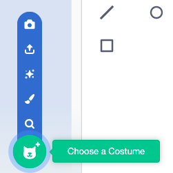
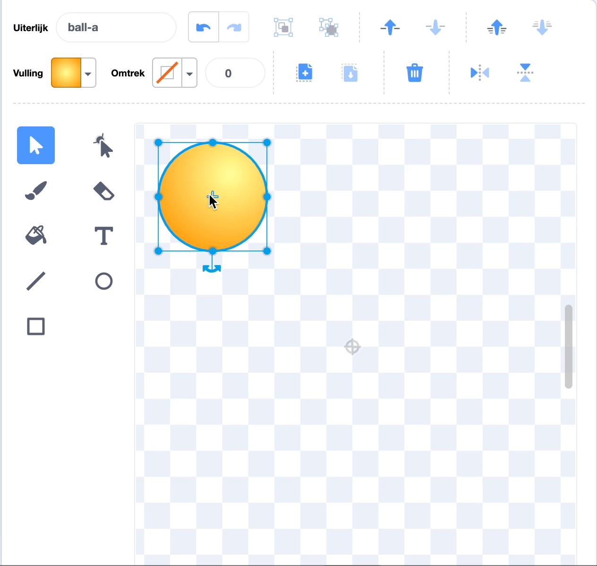

## Maak maffe ogen

<div style="display: flex; flex-wrap: wrap">
<div style="flex-basis: 200px; flex-grow: 1; margin-right: 15px;">
Maak de maffe ogen! Elk oog moet een afzonderlijke sprite zijn, zodat het afzonderlijk kan bewegen.

</div>
<div>


{:width="300px"}  

</div>
</div>

### Teken een oogbol

--- task ---

Gebruik de **Teken** optie om een nieuwe **sprite** te maken.


De Teken-editor wordt geopend, waarmee je jouw **Oogbol** sprite kunt maken.

--- /task ---

Het is echt belangrijk dat:
- De zwarte pupil en de gekleurde iris aan de rechterkant staan van het **Oogbol** uiterlijk
- Het **Oogbol** uiterlijk is gecentreerd

--- task ---

**Kies:** Teken een oogbol **of** start vanuit een ronde sprite.


--- collapse ---
---
title: Teken een oogbol in de Teken-editor
---

Selecteer het **Cirkel**-gereedschap.

Om een perfecte cirkel te tekenen, houd je de <kbd>Shift</kbd> op het toetsenbord ingedrukt terwijl je tekent met het **Cirkel**-gereedschap. Als je een tablet gebruikt, probeer dan zo dicht mogelijk bij een perfecte cirkel te komen.

In dit voorbeeld stellen we de **Omtrek** op zwart en de **Vulling**-kleur van de oogbol op wit:


Gebruik de **Vulling**- en **Omtrek** kleurkiezers om kleuren te kiezen. Om zwart te maken, schuif je zowel **Verzadiging** als **Helderheid** naar `0`. Om wit te maken, schuif je de **Verzadiging** naar `0` en de **Helderheid** naar `100`.

 

Zorg ervoor dat de oogbol gecentreerd is - verplaats hem zodat het blauwe kruis in het uiterlijk uitgelijnd is met het grijze dradenkruis in de Teken-editor.


Teken een kleinere perfecte cirkel en plaats deze aan de rechterkant van de oogbol:


Je kunt ook cirkels binnen cirkels tekenen of kleur gebruiken om verschillende effecten te krijgen.

--- /collapse ---

--- collapse ---
---
title: Verander een rond uiterlijk in een oogbol
---

Er zijn uiterlijken in Scratch die je kunt bewerken om maffe ogen voor je personage te maken.


Klik op het pictogram **Kies een uiterlijk** om de bibliotheek met Scratch uiterlijken te zien.



Klik op het uiterlijk dat je aan je sprite wilt toevoegen.

Gebruik de Teken-editor om een uiterlijk te wijzigen. Je kunt cirkels toevoegen, een andere **Vulling**-kleur kiezen of delen van het uiterlijk verwijderen om er een maf oog van te maken.

Zorg ervoor dat de oogbol gecentreerd is - verplaats hem zodat het blauwe kruis in het uiterlijk uitgelijnd is met het grijze dradenkruis in de Teken-editor.



**Tip:** De zwarte pupil en gekleurde iris moeten aan de rechterkant van het uiterlijk worden geplaatst, zodat de **Oogbol** de muisaanwijzer volgt.


--- /collapse ---

--- /task ---

--- task ---

Noem je sprite `Oogbol` in het Sprite-paneel.


--- /task ---

--- task ---

Sleep de **Oogbol**-sprite om deze op het werkgebied te plaatsen en wijzig de grootte zodat deze bij jouw personage past.

--- /task ---

Laat de oogbol nu naar de `muisaanwijzer`{:class="block3motion"} kijken.

<p style="border-left: solid; border-width:10px; border-color: #0faeb0; background-color: aliceblue; padding: 10px;">
<span style="color: #0faeb0">**Gebruiker**</span> betekent de persoon die het project gebruikt (niet alleen om het te maken), en <span style="color: #0faeb0">**gebruikersinteractie**</span> is hoe het project reageert als de gebruiker dingen doet zoals het bewegen van de muis en klikken op het scherm. 
</p>

### Codeer je oogbol

--- task ---

Voeg een script toe om `maak de draaistijl`{:class="block3motion"} in te stellen op `helemaal rond`{:class="block3motion"} om de oogbol `naar de muisaanwijzer`{:class="block3motion"} te laten wijzen `voor altijd herhaald`{:class="block3control"}.

--- collapse ---
---
title: Laat een sprite naar de muisaanwijzer wijzen
---

```blocks3
wanneer op de groene vlag wordt geklikt
maak draaistijl [helemaal rond v]
herhaal
richt naar (muiswijzer v)
einde
```

--- /collapse ---

--- /task ---

### Voeg nog een oogbol toe

--- task ---

Om nog een oog toe te voegen, klik je met de rechtermuisknop (of tik je op een tablet) op de sprite **Oogbol** in de Sprite-lijst en kies je **dupliceren**.


[[[scratch3-duplicate-sprite]]]

--- /task ---

### Test je maffe ogen

--- task ---

**Test:** Klik op de groene vlag en test jouw project. Volgen de maffe ogen je muisaanwijzer terwijl je de muis beweegt?

**Tip:** Je hoeft de muisaanwijzer niet op het speelveld te houden. De ogen zullen jouw muisaanwijzer volgen terwijl je doorgaat met coderen in Scratch.

--- /task ---

--- task ---

**Fouten oplossen:** Mogelijk vind je enkele fouten in jouw project die je moet oplossen. Hier zijn enkele veelvoorkomende fouten:

--- collapse ---
---
title: De ogen bewegen niet
---

Zorg ervoor dat je de code hebt toegevoegd aan de **Oogbol**-sprites en **op de groene vlag hebt geklikt**. Je code wordt pas uitgevoerd als je op de groene vlag klikt.

--- /collapse ---

--- collapse ---
---
title: De ogen wijzen weg van de muis
---

Controleer in de **Oogbol** uiterlijken of de pupil zich aan de rechterkant bevindt (voorbij het blauwe kruis in het midden van het uiterlijk).

De **Oogbol** sprites hebben de `helemal rond`{:class="block3motion"} `draaistijl`{:class="block3motion"}, zodat ze in elke richting kunnen draaien.

Wanneer de **Oogbollen** draaien naar `wijzen in de richting van`{:class="block3motion"} de `muisaanwijzer`{:class="block3motion"}, dan zullen de pupillen zich het dichtst bij de muisaanwijzer bevinden.


--- /collapse ---

--- collapse ---
---
title: De ogen springen over het speelveld
---

Controleer of de **Oogbol** uiterlijken gecentreerd zijn. Om een uiterlijk te centreren, sleep je het uiterlijk zo dat het blauwe kruis in het uiterlijk op één lijn ligt met het grijze dradenkruis in de Teken-editor.


--- /collapse ---

--- collapse ---
---
title: Het personage staat voor de ogen
---

Wanneer je een sprite sleept om deze in het speelveld te plaatsen, zal deze voor de andere sprites komen te staan.

Om ervoor te zorgen dat je sprite van je **personage** `achteraan`{:class="block3looks"} blijft, gebruik je:

```blocks3
wanneer op de groene vlag geklikt wordt
herhaal
ga naar laag [achtergrondv] // achter alle andere sprites
```

--- /collapse ---

--- collapse ---
---
title: Het personage en de ogen volgen de muisaanwijzer
---

Heb je de ogen toegevoegd als uiterlijken voor je **personage** in plaats van als uiterlijken voor afzonderlijke sprites? Je kunt dat oplossen.

Een manier om dit op te lossen is door het **personage** te dupliceren en vervolgens de kopie `Oogbol` te noemen. Verwijder vervolgens de **Oogbol**-uiterlijken van de **personage** sprite en verwijder de **personage** uiterlijken van de **Oogbol** sprite. Vervolgens kun je de **Oogbol** dupliceren en de kopie `Oogbol 2`noemen.

De code voor `richt naar`{:class="block3motion"} de `muisaanwijzer`{:class="block3motion"} moet op de **Oogbol** sprites staan en niet de **personage** sprite.

--- /collapse ---

--- collapse ---
---
title: Het personage volgt de muisaanwijzer (en de ogen niet)
---

Je moet de `richt naar`{:class="block3motion"} code toevoegen aan de individuele **Oogbol** sprites, niet je **personage** sprite!

Om de code te kopiëren, kun je de code van het Code-gebied van je **personage** naar de **Oogbol** sprites in de Sprite-lijst slepen.

Je moet ook het script van de **personage** sprite verwijderen. Sleep hiervoor het script naar het Blokkenmenu.

--- /collapse ---

Mogelijk vind je een fout die hier niet wordt vermeld. Kun je erachter komen hoe je het kunt oplossen?

We horen graag over je fouten en hoe je ze hebt opgelost. Gebruik de **Feedback verzenden** knop onderaan deze pagina en vertel ons of je een andere fout in je project hebt gevonden.

--- /task ---
