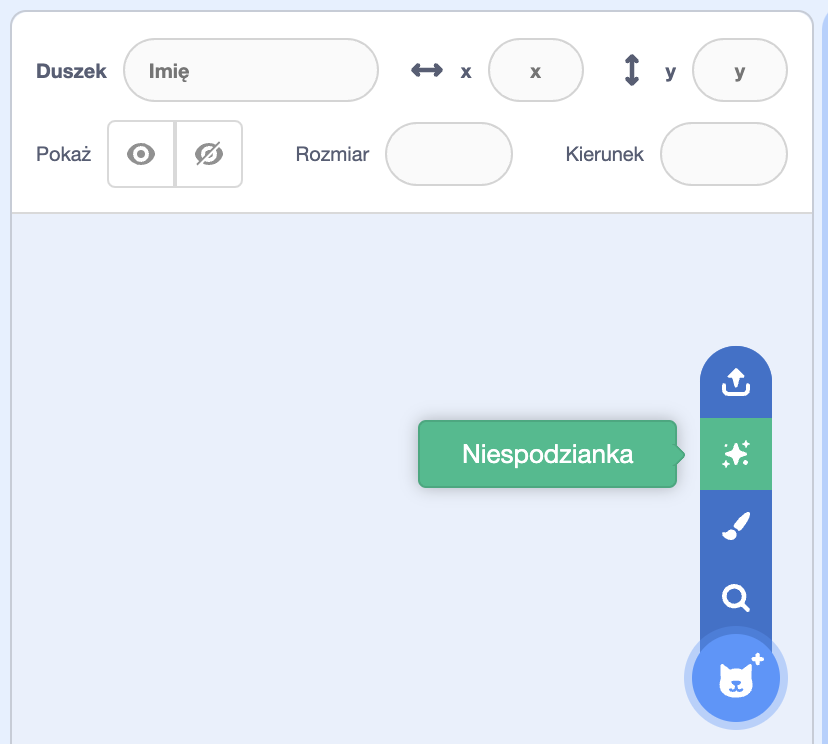
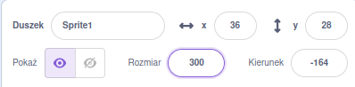

## Twoja postać

Wykorzystaj swoje umiejętności projektowania, aby dodać duszka postaci i odpowiednie tło. 

{:width="300px"}    

**Projektowanie** oznacza decydowanie o tym, jak projekt ma wyglądać oraz o tym, jak ma działać. 

### Otwórz projekt startowy

--- task ---

Otwórz [projekt startowy Głupkowate oczy](https://scratch.mit.edu/projects/582221984/editor){:target="_blank"}. Scratch otworzy się w nowej karcie przeglądarki.

[[[working-offline]]]

⏱️ Mało czasu? Możesz zacząć od jednego z [przykładów](https://scratch.mit.edu/studios/29029028){:target="_blank"}.

--- /task ---

### Wybierz duszka i tło

--- task ---

**Wybierz:** Dodaj **duszka** i **tło** do swojego projektu.

+ Jak wygląda Twoja postać? Osoba 🧜🏽‍♀️, zwierzę 🐶 a może przedmiot 🧸.
+ Gdzie chcesz, aby Twoja postać mieszkała? W sensownym miejscu 🏠 a może w śmiesznym 🎪.

[[[generic-scratch3-sprite-from-library]]]

[[[generic-scratch3-backdrop-from-library]]]

[[[scratch3-backdrops-and-sprites-using-shapes]]]

--- collapse ---
---
title: Duszek-niespodzianka
---

Nie wiesz, którego duszka wybrać? Przejdź do menu **Wybierz duszka** i wybierz opcję **Niespodzianka**, aby dodać duszka-niespodziankę do swojego projektu.

--- /collapse ---

**Wskazówka:** Jeśli tworzysz własnego duszka w edytorze Malowania, **nie dodawaj jeszcze oczu, ponieważ muszą to być oddzielne duszki.**

--- /task ---

### Zmień rozmiar duszka

--- task ---

W panelu duszka zmień liczbę we właściwości **Rozmiar** na liczbę, która sprawi, że Twoja postać wypełni scenę.

{:width="500px"}

--- /task ---

--- task ---

Spójrz na scenę. Zobaczysz swoją dużą postać i wybrane tło.

{:width="500px"}

--- /task ---
