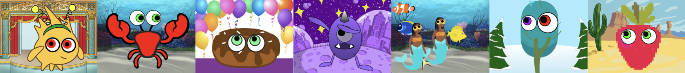

## Introdução

Neste projeto, você projetará e criará um personagem com olho de bobo. Os olhos grandes e bobos do personagem seguirão o ponteiro do mouse para dar vida ao seu personagem.

**Design ** significa decidir a aparência de um projeto e tomar decisões sobre o que ele faz. 

Você deve:
+ Faça um projeto com **interação do usuário**
+ Personalize um projeto com cores e efeitos gráficos
+ Aprenda sobre design em criação digital

** Usuário ** significa a pessoa que está usando o projeto (não apenas fazendo), e ** interação do usuário ** é como o projeto reage ao usuário ao fazer coisas como mover o mouse e clicar na tela. 

--- no-print ---

--- task ---

  

### Experimente 

Mova o mouse (ou mova o dedo se estiver usando um tablet) pela tela e observe o que acontece com os olhos do Gobo. O que acontece quando você move o mouse ou os dedos - se estiver usando o tablet - entre os olhos de Gobo? 
  
Experimente clicar em diferentes partes do projeto para personalizá-lo.

** Gobo assistindo **: [Veja dentro] (https://scratch.mit.edu/projects/495141114/editor) {: target = "_blank"}

  <iframe allowtransparency="true" width="485" height="402" src="https://scratch.mit.edu/projects/embed/495141114/?autostart=false" frameborder="0"></iframe>

--- /task ---

### Inspire-se

Você vai tomar algumas decisões de design para criar seu personagem. Pense no tipo de personagem de olho bobo que você deseja fazer.

--- task ---

Explore estes projetos de exemplo para obter ideia para o seu livro:

**Não coma rosquinha**: [Veja dentro de](https://scratch.mit.edu/projects/495865093/editor){: target = "_ blank"}

  <iframe allowtransparency="true" width="485" height="402" src="https://scratch.mit.edu/projects/embed/495865093/?autostart=false" frameborder="0"></iframe>

**Sob o mar**: [Veja interior](https://scratch.mit.edu/projects/495866460/editor){: target="_ blank"}

  <iframe allowtransparency="true" width="485" height="402" src="https://scratch.mit.edu/projects/embed/495866460/?autostart=false" frameborder="0"></iframe>

**Sporg**: [See inside](https://scratch.mit.edu/projects/495865892/editor){:target="_blank"}

  <iframe allowtransparency="true" width="485" height="402" src="https://scratch.mit.edu/projects/embed/495865892/?autostart=false" frameborder="0"></iframe>

--- /task--- --- /no-print ---

--- print-only ---

### Inspire-se

Você vai tomar algumas decisões de design para criar seu personagem. Pense no tipo de personagem de olho bobo que você deseja fazer. Para obter mais ideias **Veja exemplos** de projetos de "Olhos bobos - Exemplos do Scratch estúdio: https://scratch.mit.edu/studios/29029028

   

--- /print-only ---

 
