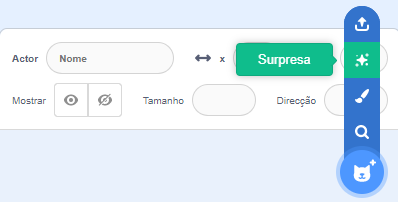
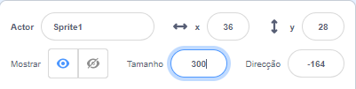

## Seu personagem

Você tem uma ideia sobre seu próprio personagem? Agora, você pode prepará-lo para olhos bobos!

{:width="300px"}    

--- task ---

Abra o [projeto inicial Olhos bobos](https://scratch.mit.edu/projects/582221984/editor){:target="_blank"}. O Scratch será aberto em outra aba do navegador.

[[[working-offline]]]

--- /task ---

--- task ---

**Escolha:** Escolha um ator **ou** crie simplesmente o seu próprio ator no editor de pintura.

Você não precisa escolher uma pessoa ou animal. Você pode escolher um objeto, como a rosquinha.

[[[generic-scratch3-sprite-from-library]]]

[[[scratch3-backdrops-and-sprites-using-shapes]]]

--- collapse ---
---
title: Obtenha um ator surpresa
---

Não tem certeza de qual ator escolher? Vá para o **Escolher um ator** e escolha a opção **Surpresa** para adicionar um ator surpresa ao seu projeto.

--- /collapse ---

**Dica:** Se você criar seu próprio ator no editor de pintura, **não adicione olhos ainda, porque eles precisam ser atores separados.**

--- /task ---

No momento, seu personagem será muito menor do que os personagens de nossos projetos de exemplo. Você pode tornar seu personagem maior para que preencha mais a tela.

--- task ---

No painel do ator, altere o número em **Tamanho** para um número de sua escolha.

{:width="500px"}

--- /task ---

Onde você quer que seu personagem viva?

--- task ---

**Escolha:** Escolha um cenário que seja sensato ou bobo.

[[[generic-scratch3-backdrop-from-library]]]

--- /task ---

--- save ---
