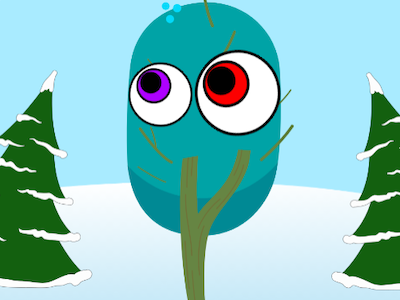

## Efeitos do palco

<div style="display: flex; flex-wrap: wrap">
<div style="flex-basis: 200px; flex-grow: 1; margin-right: 15px;">
Você também pode fazer com que o projeto faça algo clicando no **Palco**.
</div>
<div>

{:width="300px"} 
{:width="300px"}  

</div>
</div>

--- task ---

Clique no painel Palco e, em seguida, na guia **Código** para adicionar o código ao **Palco**.

**Escolha:** Escolha o que deseja alterar quando o **Palco** for clicado.

--- collapse ---
---
title: Alterar os efeitos gráficos quando o ator é clicado
---

```blocks3
when stage clicked
change [color v] effect by [25]
```

--- /collapse ---

--- collapse ---
---
title: Alternar pano de fundo quando o Palco for clicado
---

```blocks3
when stage clicked
next backdrop
```

--- /collapse ---

--- /task ---

--- task ---

**Teste:** Clique no **Palco** e verifique se o pano de fundo muda ou se os efeitos gráficos mudam.

--- /task ---

--- task ---

**Teste:** Teste seu projeto novamente, mas desta vez, torne-o em tela inteira para que você possa ver como ele aparecerá para alguém olhando para ele.

[[[scratch3-full-screen]]]

--- /task ---

<p style="border-left: solid; border-width:10px; border-color: #0faeb0; background-color: aliceblue; padding: 10px;">
Ao tornar seu projeto em tela inteira, você ver o que fez da perspectiva de um usuário que está brincando com seu projeto. **A interação do usuário** é importante na criação digital. 
</p>

--- save ---
