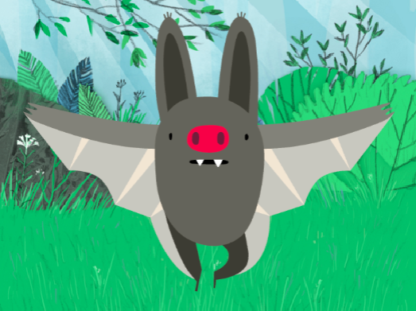
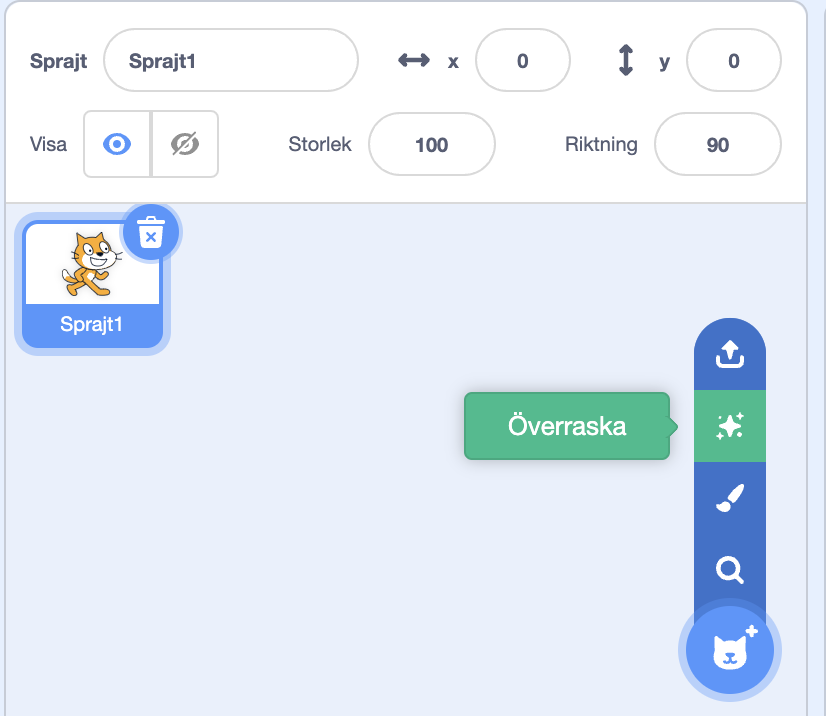
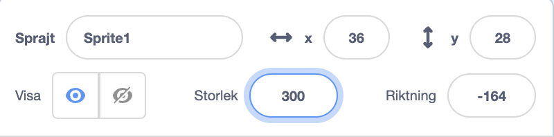

## Din karaktär

Använd dina designförmågor för att lägga till en karaktärssprajt och lämplig bakgrund. 

{:width="300px"}    

**Design** innebär att bestämma hur ett projekt ska se ut och att fatta beslut om vad det ska göra. 

### Öppna startprojektet

--- task ---

Öppna startprojektet [Roliga ögon](https://scratch.mit.edu/projects/582221984/editor){:target="_blank"}. Scratch kommer att öppnas i en annan flik i webbläsaren.

[[[working-offline]]]

⏱️ Inte mycket tid? Du kan utgå från ett av [exemplen](https://scratch.mit.edu/studios/29029028){:target="_blank"}.

--- /task ---

### Välj din sprajt och bakgrund

--- task ---

**Välj:** Lägg till en **sprajt** och en **bakgrund** till ditt "roliga ögon"-projekt.

+ Hur ser din karaktär ut? En person 🧜🏽‍♀️, ett djur 🐶 eller ett föremål 🧸.
+ Var vill du att din karaktär ska bo? Någonstans vettigt 🏠 eller roligt🎪.

[[[generic-scratch3-sprite-from-library]]]

[[[generic-scratch3-backdrop-from-library]]]

[[[scratch3-backdrops-and-sprites-using-shapes]]]

--- collapse ---
---
title: Få en överraskningssprajt
---

Är du osäker på vilken sprajt du ska välja? Gå till **"Välj en sprajt"** -menyn och välj alternativet **Överraskning** för att lägga till en överraskningssprajt till ditt projekt.

--- /collapse ---

**Tips:** Om du skapar din egen sprajt i målarredigeraren, **lägg inte till ögon än då de måste vara separata sprajter.**

--- /task ---

### Ändra storlek på din sprajt

--- task ---

I sprajtrutan ändrar du talet i egenskapen **Storlek** till något som får din karaktär att fylla scenen.

{:width="500px"}

--- /task ---

--- task ---

Kolla på scenen. Du kommer att se din stora karaktär och den valda bakgrunden.

{:width="500px"}

--- /task ---
