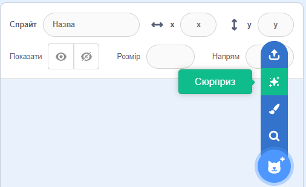
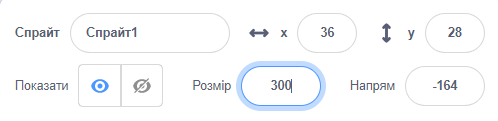

## Твій персонаж

Використовуй свої навички дизайнера, щоб додати спрайт персонажа та відповідний фон. 

{:width="300px"}    

**Дизайн** - це прийняття рішення про те, як буде виглядати проєкт, і прийняття рішень про те, що він буде робити. 

### Відкрий початковий проєкт

--- task ---

Відкрий [Стартовий проєкт Дурненькі очі](https://scratch.mit.edu/projects/582221984/editor){:target="_blank"}. Scratch відкриється в іншій вкладці браузера.

[[[working-offline]]]

⏱️ Недостатньо часу? Ти можеш почати з одного з [прикладів](https://scratch.mit.edu/studios/29029028){:target="_blank"}.

--- /task ---

### Вибери спрайт та фон

--- task ---

**Вибір:** Додай **спрайт** та **тло** для твого проєкту Дурнуваті очі.

+ Як виглядає твій персонаж? Людина 🧜🏽, тварина 🐶 або предмет 🧸.
+ Де ти хочеш, щоб жив твій персонаж? Десь розсудливо 🏠, або безглуздо 🎪.

[[[generic-scratch3-sprite-from-library]]]

[[[generic-scratch3-backdrop-from-library]]]

[[[scratch3-backdrops-and-sprites-using-shapes]]]

--- collapse ---
---
title: Отримай спрайт-сюрприз
---

Не знаєш, який спрайт вибрати? Перейди в меню **Обрати спрайт** та вибери опцію **Сюрприз**, щоб додати спрайт-сюрприз до твого проєкту.

--- /collapse ---

**Порада** Якщо ти створюєш свій спрайт у редакторі Малювання, **поки що не додавай очі, тому що вони мають бути окремими спрайтами.**

--- /task ---

### Зміна розміру спрайта

--- task ---

На панелі Спрайтів, змінюй число у полі **Розмір** на число, яке змусить твого персонажа зайняти всю Сцену.

{:width="500px"}

--- /task ---

--- task ---

Подивись на Сцену. Ти побачиш свого великого персонажа та обране тло.

{:width="500px"}

--- /task ---
