## Створення дурненьких очей

<div style="display: flex; flex-wrap: wrap">
<div style="flex-basis: 200px; flex-grow: 1; margin-right: 15px;">
Створи дурнуваті очі! Кожне око має бути окремим спрайтом, щоб воно окремо рухалося.

</div>
<div>


{:width="300px"}  

</div>
</div>

### Намалюй очне яблуко

--- task ---

Використовуй опцію **Малювати**, щоб створити новий **спрайт**.

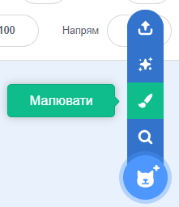

Відкриється редактор Малювання, який дозволить тобі створити образ спрайта **Очне яблуко**.

--- /task ---

Дуже важливо, щоб:
- Чорна зіниця та кольорова оболонка спрямовані на праву сторону образа **Очного яблука**
- Образ **Очне яблуко** знаходиться в центрі

--- task ---

**Вибір:** Намалювати очне яблуко **або** почати з круглого спрайта.


--- collapse ---
---
title: Намалюй очне яблуко в редакторі Малювання
---

Вибери інструмент **Коло**.

Щоб намалювати ідеальне коло, натисни та утримуй клавішу <kbd>Shift</kbd> на клавіатурі під час малювання інструментом **Коло**. Якщо ти користуєшся планшетом, постарайся максимально точно намалювати ідеальне коло.

У цьому прикладі ми задаємо **Межу** назад та колір **Заповнення** очного яблука до білого:

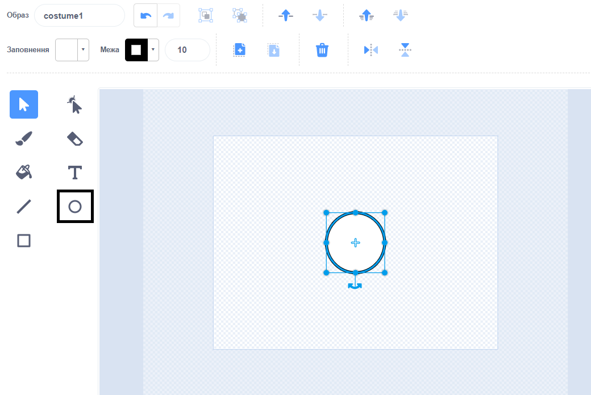

Використовуй палітру вибору кольорів **Заповнення** та **Межа**, щоб обрати кольори. Щоб зробити чорний колір, посунь повзунки **Насиченість** та **Яскравість** до `0`. Щоб зробити білий колір, посунь повзунки **Насиченість** до `0` та **Яскравість** до `100`.

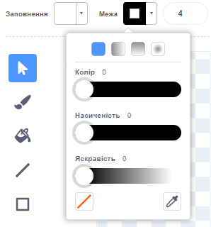 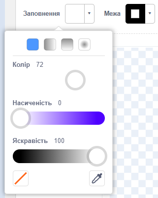

Переконайся, що очне яблуко розташоване по центру - перемісти його так, щоб синій хрестик на образі збігся з сірим прицілом у редакторі Малювання.


Намалюй ідеальне коло меншого розміру та розташуй його з правого боку від очного яблука:

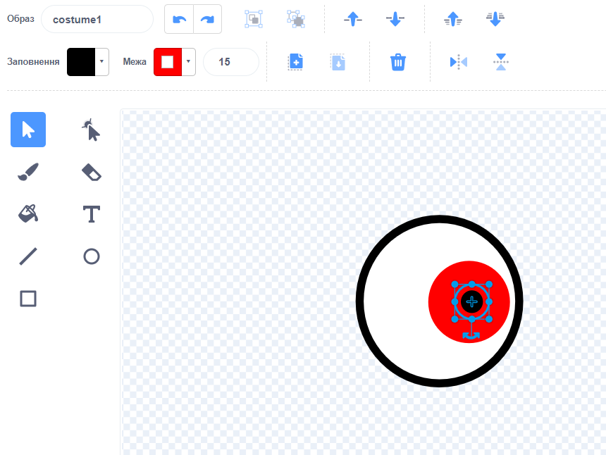

Ти також можеш намалювати коло всередині кола, або використовувати кольори, щоб отримати різні ефекти.

--- /collapse ---

--- collapse ---
---
title: Перетвори круглий образ на очне яблуко
---

У Scratch вже є образи, які ти можеш редагувати, щоб отримати дурнуваті очі для свого персонажа.


Натисни на іконку **Обрати образ**, щоб переглянути бібліотеку образів Scratch.

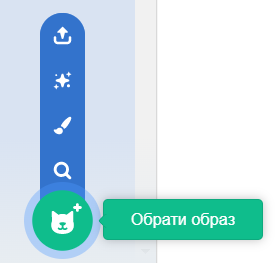

Натисни на образ, який ти хочеш додати до свого спрайта.

Для редагування образу використовуй редактор Малювання. Ти можеш додати кружечки, вибравши колір **Заповнення** або видалити частини образа, щоб перетворити його на дурнувате око.

Переконайся, що очне яблуко розташоване по центру - перемісти його так, щоб синій хрестик на образі збігся з сірим прицілом у редакторі Малювання.

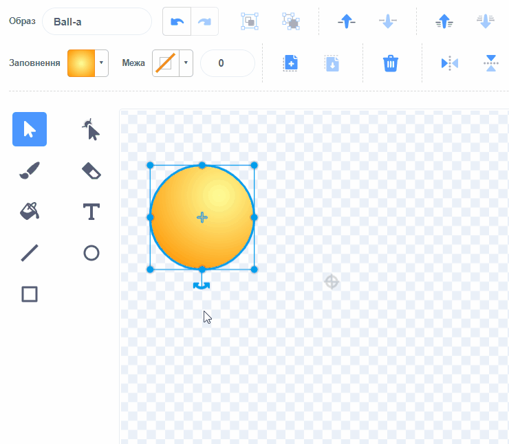

**Порада** Чорну зіницю та кольорову оболонку ока потрібно розташувати на правій стороні образу так, щоб **Очне яблуко** слідкувало за курсором миші.

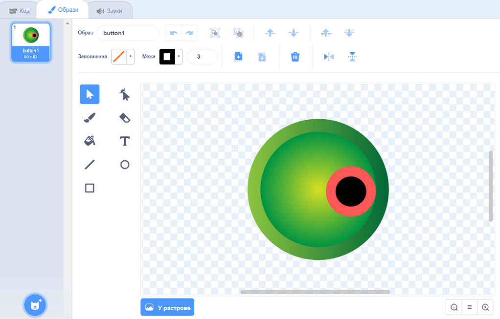

--- /collapse ---

--- /task ---

--- task ---

Назви свій спрайт `Очне яблуко` на панелі Спрайт.

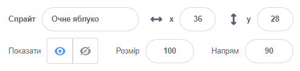

--- /task ---

--- task ---

Перетягни спрайт **Очне яблуко**, щоб розташувати його на Сцені та змінити його розмір залежно від твого персонажа.

--- /task ---

А тепер зроби так, щоб очне яблуко дивилося на `вказівник`{:class="block3motion"}. Таким чином, користувач зможе взаємодіяти з твоїм проєктом.

<p style="border-left: solid; border-width:10px; border-color: #0faeb0; background-color: aliceblue; padding: 10px;">
<span style="color: #0faeb0">**Користувач**</span> - це особа, яка користується проєктом (а не тільки створює його), а <span style="color: #0faeb0">**взаємодія з користувачем**</span> - це те, як проєкт реагує на дії користувача, наприклад, переміщення миші або натискання на екран. 
</p>

### Додай код до очного яблука

--- task ---

Зміни скрипт до блока `стиль обертання`{:class="block3motion"} на `навколо`{:class="block3motion"}, щоб змусити очне яблуко `слідкувати за курсором миші`{:class="block3motion"} `завжди`{:class="block3control"}.

--- collapse ---
---
title: Змусити спрайт слідкувати за курсором миші
---

```blocks3
when flag clicked
set rotation style [all around v]
forever
point towards (mouse-pointer v)
end
```

--- /collapse ---

--- /task ---

### Додай ще одне око

--- task ---

Щоб додати ще одне око, клацни правою кнопкою миші (або на планшеті торкнись й утримуй) на спрайт **Очне яблуко** у списку Спрайтів та вибери **дублювати**.


[[[scratch3-duplicate-sprite]]]

--- /task ---

### Випробуй свої дурненькі очі

--- task ---

**Тест:** Натисни на зелений прапорець та протестуй свій проєкт. Чи слідкують очі за курсором миші, коли ти її пересуваєш?

**Порада** Не обов'язково наводити курсор миші тільки на Сцену. Очі будуть слідкувати за курсором миші, навіть якщо ти будеш продовжувати кодування у Scratch.

--- /task ---

--- task ---

**Налагодження:** Можливо, у твоєму проєкті знайдуться помилки, які потрібно буде виправити. Ось деякі поширені помилки:

--- collapse ---
---
title: Очі не рухаються
---

Переконайся, що додано до спрайта **Очне яблуко** та **зелений прапорець був натиснутий**. Твій код не запуститься, якщо ти не натиснеш на зелений прапорець.

--- /collapse ---

--- collapse ---
---
title: Очі відводяться від миші
---

У образі **Очне яблуко**, перевір, щоб зіниця ока була з правого боку (за синім хрестиком посередині образа).

Спрайти **Очне яблуко** мають `стиль обертання`{:class="block3motion"} `навколо`{:class="block3motion"}, щоб очі могли обертатись у будь-якому напрямку.

Коли **Очне яблуко** обертається та `слідкує за`{:class="block3motion"} `вказівником`{:class="block3motion"}, зіниці будуть розташовані ближче до вказівника миші.

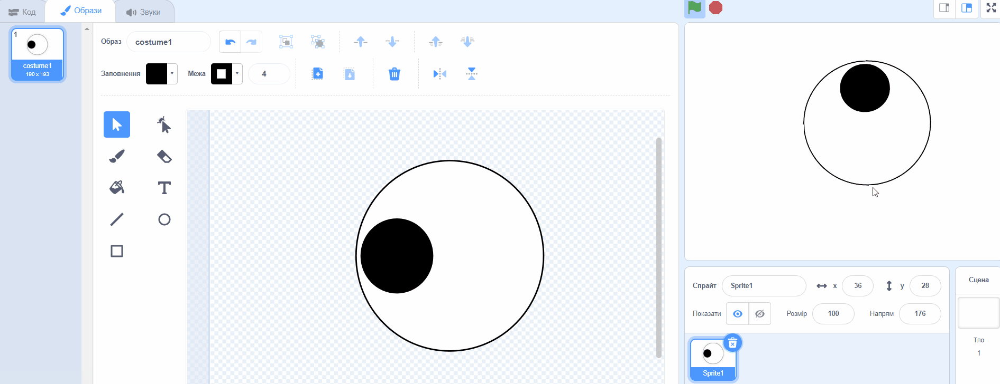

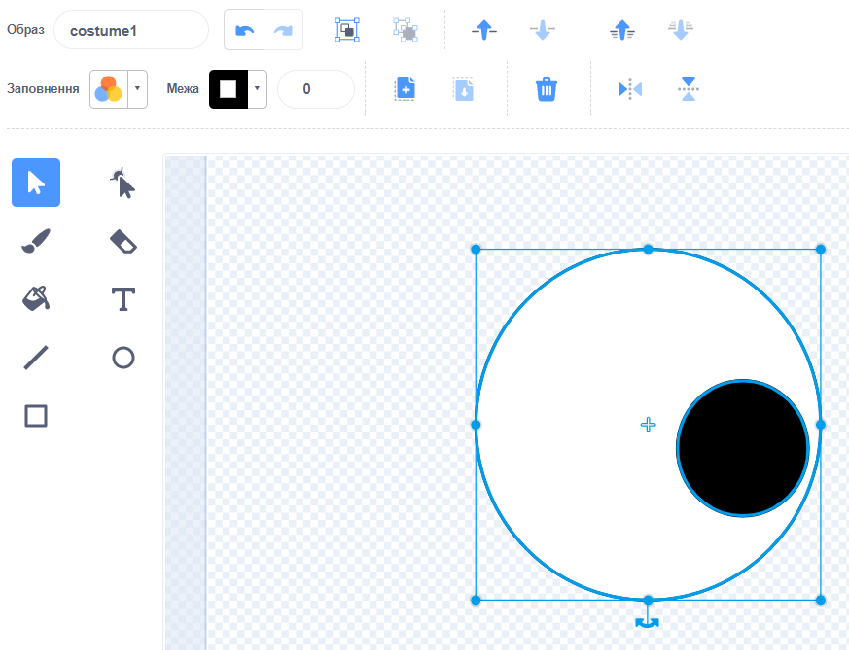

--- /collapse ---

--- collapse ---
---
title: Очі скачуть по сцені
---

Переконайся, що образи **Очне яблуко** знаходяться в центрі. Щоб розмістити образ по центру, перетягни його так, щоб синій хрестик на образі збігся з сірим прицілом у редакторі Малювання.

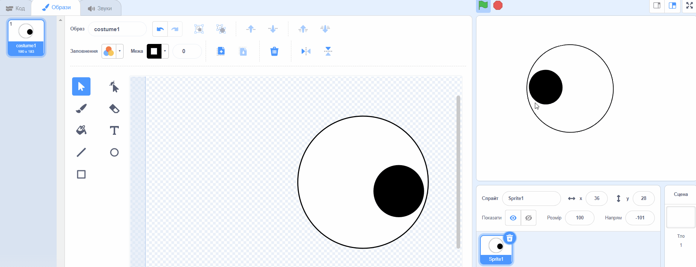


--- /collapse ---

--- collapse ---
---
title: Персонаж знаходиться перед очима
---

Коли ти перетягуєш спрайт, щоб розмістити його на Сцені, він буде розміщений попереду інших спрайтів.

Щоб змусити твій спрайт **персонажа** стояти `позаду`{:class="block3looks"}, використовуй:

```blocks3
when green flag clicked
forever
go to [back v] layer // позаду всіх інших спрайтів
```

--- /collapse ---

--- collapse ---
---
title: Персонаж та очі слідкують за курсором миші
---

Ти додаєш очі як образи для твого **персонажа**, а не як образи для окремих спрайтів? Ти можеш це виправити.

Один зі способів виправити це - продублювати спрайт **персонажа** та змінити назву копії на `Очне яблуко`. Після цього видали образи **Очне яблуко** від спрайта **персонажа**, та видали образ **персонажа** від спрайта **Очне яблуко**. Потім, ти можеш продублювати спрайт **Очне яблуко** та назвати копію `Очне яблуко 2`.

Код `слідувати за`{:class="block3motion"} `вказівником`{:class="block3motion"} має бути на спрайтах **Очне яблуко**, а не на спрайті **персонажа**.

--- /collapse ---

--- collapse ---
---
title: Персонаж слідкує за вказівником миші (а очі - ні)
---

Тобі потрібно додати блок `слідувати за`{:class="block3motion"} до індивідуального спрайта **Очне яблуко**, а не до спрайта **персонажа**!

Щоб скопіювати код, ти можеш перетягнути код з області Коду до твого **персонажа** **Очне яблуко** у списку Спрайтів.

Також потрібно буде видалити скрипт зі спрайта **персонажа**. Щоб зробити це, перетягни скрипт в меню Блоки.

--- /collapse ---

Можливо, ти знайдеш помилку, яка не вказана тут. Чи зможеш ти самостійно її виправити?

Нам подобається дізнаватись про твої помилки та про те, як їх вдалося виправити. Скористайся кнопкою **Надіслати відгук** внизу цієї сторінки та напиши нам, якщо у твоєму проєкті було виявлено іншу помилку.

--- /task ---
