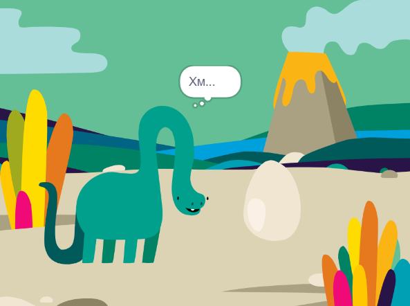

## Challenge: створіть власну групу

Якщо ти йдеш по проєктах [Знайомство зі Scratch](https://projects.raspberrypi.org/uk-UA/pathways/scratch-intro), можеш перейти до [Сюрпризу! проект aнімація](https://projects.raspberrypi.org/uk-UA/projects/surprise-animation). У цьому проєкті ти будеш робити анімацію історії з сюрпризом.

--- print-only ---

--- /print-only ---

--- no-print ---

Натисни на зелений прапорець, щоб подивитись анімацію:

  <iframe allowtransparency="true" width="485" height="402" src="https://scratch.mit.edu/projects/embed/495932563/?autostart=false" frameborder="0"></iframe>

--- /no-print ---

Якщо ти хочеш більш цікаво вивчати Scratch, можеш спробувати будь-який з [цих проєктів](https://projects.raspberrypi.org/uk-UA/projects?software%5B%5D=scratch&curriculum%5B%5D=%201).
